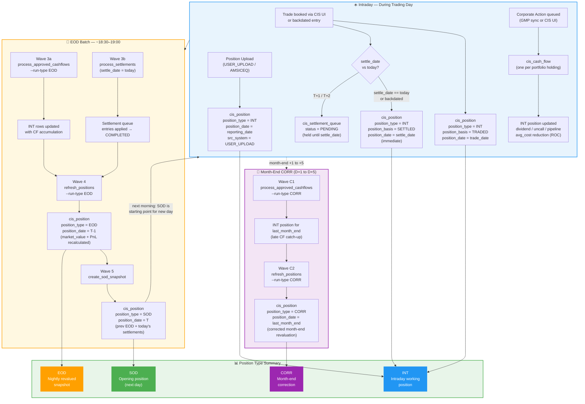
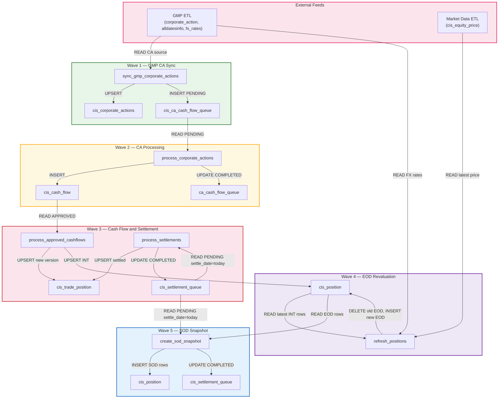

# CIS Trade Hive — EOD & CORR Process Flow Diagrams

**Version:** 1.0  
**Updated:** 2026-07-07  
**Audience:** Business Analysts / System Analysts / Operations  
**Render with:** GitHub, Confluence Mermaid plugin, draw.io (import `.mmd`), or [mermaid.live](https://mermaid.live)

---

## Diagram 1 — EOD Sequence (Full Pipeline)

Shows the complete nightly EOD run from GMP ETL completion through to SOD snapshot.  
Each actor represents a system component. Arrows show data flow and dependencies.

```mermaid
sequenceDiagram
    autonumber

    participant GMP as GMP ETL
    participant ALT as alldatesinfo
    participant CAT as cis_corporate_actions
    participant CAQ as ca_cash_flow_queue
    participant CF as cis_cash_flow
    participant SQ as cis_settlement_queue
    participant CTP as cis_trade_position
    participant CP as cis_position
    participant PRC as Price and FX

    Note over GMP,PRC: WAVE 0 - Pre-flight 17:45
    GMP->>ALT: ETL done, prev_day=T-1, contextual_today=T
    Note over GMP,PRC: CIS_PREFLIGHT_CHECK - verify Impala connection
    Note over PRC: CIS_VERIFY_PRICES - assert prices and FX loaded for T-1

    Note over GMP,PRC: WAVE 1 - GMP CA Sync 18:00
    GMP->>CAT: UPSERT corporate actions (src=GMP, status=VALIDATED)
    CAT->>CAQ: INSERT PENDING entries for DIVIDEND, INTEREST, COUPON, ROC, SPLIT

    Note over GMP,PRC: WAVE 2 - CA Cash Flow Processing 18:15
    CAQ->>CAQ: PENDING to PROCESSING
    CAQ->>CP: lookup portfolios holding security on ex-date
    CP-->>CAQ: portfolio list and quantities
    CAQ->>CF: INSERT one cash_flow row per portfolio (amount = qty x price_per_share)
    CAQ->>CAQ: PROCESSING to COMPLETED (FAILED retried up to 3x)

    Note over GMP,PRC: WAVE 3a - Cash Flow Application 18:30
    CF->>CF: SELECT APPROVED where payment_date <= T-1 and position_updated=false
    CF->>CTP: lookup open SETTLED position (is_latest=true)
    CTP-->>CF: current qty, avg_cost, accumulated fields
    CF->>CTP: mark old version is_latest=false
    CF->>CTP: UPSERT new version, accumulate dividend, uncall, pipeline, provision
    CF->>CP: UPSERT INT row (basis=SETTLED, position_date=payment_date)
    CF->>CF: UPDATE position_updated=true

    Note over GMP,PRC: WAVE 3b - Settlement Processing 18:30 parallel
    SQ->>SQ: SELECT PENDING where settle_date = contextual_today
    SQ->>CTP: UPSERT settled position versions
    SQ->>SQ: UPDATE status to COMPLETED

    Note over GMP,PRC: WAVE 4 - EOD Position Revaluation 18:45
    CP->>CP: SELECT latest INT row per portfolio and security and basis
    PRC-->>CP: latest closing price from cis_equity_price
    PRC-->>CP: FX spot rate FC to LC

    alt Case A - REVALUED portfolio, normal security
        CP->>CP: market_value_fc = qty x price, cost_lc = cost_fc x fx_rate MTM override
    else Case B - NON-REVALUED portfolio
        CP->>CP: market_value_fc = qty x price, cost_lc carried forward unchanged
    else Case C - Equity-method ASSOC or SUBSI
        CP->>CP: market_value_fc = qty x price, unrealized_pnl = 0
    else Case D - No price available
        CP->>CP: market_value_fc carried forward, market_value_lc = fc x fx_rate
    end

    CP->>CP: DELETE old EOD row, INSERT new EOD row (position_type=EOD, position_date=T-1)
    Note right of CP: dividend, uncall, pipeline, provision, realized_pnl carried forward

    Note over GMP,PRC: WAVE 5 - SOD Snapshot 19:00
    CP->>CP: SELECT all EOD rows where position_date = T-1
    SQ->>CP: SELECT PENDING settlement entries where settle_date = today

    alt BUY settles today
        CP->>CP: new_qty = old + trade_qty, new_avg_cost recalculated
    else SELL partial settles today
        CP->>CP: new_qty = old - trade_qty, realized_pnl accumulated
    else SELL full close settles today
        CP->>CP: qty to 0, cost to 0, realized_pnl accumulated
    end

    CP->>CP: INSERT SOD rows (position_type=SOD, position_date=today)
    SQ->>SQ: UPDATE processed entries to COMPLETED
```

---

## Diagram 2 — CORR (Month-End Correction) Sequence

Runs D+1 to D+5 after month-end. Replays cash flow application and revaluation for `last_month_end`.

```mermaid
sequenceDiagram
    autonumber

    participant ALT as alldatesinfo
    participant CF as cis_cash_flow
    participant CTP as cis_trade_position
    participant CP as cis_position
    participant PRC as Price and FX

    Note over ALT,PRC: CORR Wave C1 - Cash Flow Application 18:30
    ALT-->>CF: Read contextual_today and reporting_date as YYYYMMDD integers

    alt contextual_today month differs from reporting_date month
        Note over CF: last_month_end = reporting_date (it IS the month-end)
    else same month
        Note over CF: last_month_end = first_of_ref_month minus 1 day
    end

    CF->>CF: SELECT APPROVED where payment_date <= last_month_end and position_updated=false
    CF->>CTP: lookup open SETTLED position for last_month_end
    CTP-->>CF: current qty, avg_cost, accumulated fields
    CF->>CTP: mark old version is_latest=false
    CF->>CTP: UPSERT new version with accumulated CF fields
    CF->>CP: UPSERT INT row (position_type=INT, position_date=last_month_end)
    CF->>CF: UPDATE position_updated=true

    Note over ALT,PRC: CORR Wave C2 - Position Revaluation 18:45
    CP->>CP: SELECT latest INT rows for position_date = last_month_end
    PRC-->>CP: closing price for last_month_end
    PRC-->>CP: FX spot rate for last_month_end
    CP->>CP: Apply revaluation Cases A, B, C, D (same logic as EOD Wave 4)
    CP->>CP: DELETE existing CORR row for same portfolio and security and basis and date
    CP->>CP: INSERT new CORR row (position_type=CORR, position_date=last_month_end)
    Note right of CP: CORR and EOD rows coexist for the same date
```

---

## Diagram 3 — Position Lifecycle (Full Day)

Shows how a single position evolves from trade entry through the full intraday and overnight cycle.



---

## Diagram 4 — Data Flow (Tables)

Shows which management command reads/writes each Kudu table. Flow is top-to-bottom by EOD wave.



---

## Position Type Reference (Quick Card)

| `position_type` | Written by | `position_date` | Description |
|---|---|---|---|
| `INT` | `position_service` (trades), `upload_service`, `process_approved_cashflows` | trade_date / settle_date / reporting_date / payment_date | Intraday working position — accumulates all CF/CA updates |
| `EOD` | `refresh_positions --run-type EOD` | T-1 (`reporting_date`) | Nightly revalued snapshot — market_value + PnL recalculated |
| `SOD` | `create_sod_snapshot` | T (`contextual_today`) | Opening snapshot = prev EOD + settled T+1/T+2 trades applied |
| `CORR` | `refresh_positions --run-type CORR` | `last_month_end` | Month-end corrected revaluation (D+1 to D+5) |

---

## EOD Job Schedule Reference

| Time | Job (Control-M) | Wave | Command |
|---|---|---|---|
| 17:30 | GMP_ETL_COMPLETE | — | External dependency |
| 17:45 | CIS_PREFLIGHT_CHECK | 0 | `python manage.py test_hive` |
| 17:50 | CIS_VERIFY_PRICES | 0 | impala-shell price/FX count checks |
| 18:00 | CIS_SYNC_GMP_CA | 1 | `sync_gmp_corporate_actions` |
| 18:15 | CIS_PROCESS_CA | 2 | `process_corporate_actions` |
| 18:30 | CIS_PROCESS_CASHFLOWS | 3 | `process_approved_cashflows --run-type EOD` |
| 18:30 | CIS_PROCESS_SETTLEMENTS | 3 ‖ | `process_settlements` (parallel) |
| 18:45 | CIS_REFRESH_POSITIONS | 4 | `refresh_positions --run-type EOD` |
| 19:00 | CIS_CREATE_SOD_SNAPSHOT | 5 | `create_sod_snapshot` |

**CORR (month-end D+1 to D+5):**

| Time | Job | Wave | Command |
|---|---|---|---|
| 18:30 | CIS_CORR_PROCESS_CASHFLOWS | C1 | `process_approved_cashflows --run-type CORR` |
| 18:45 | CIS_CORR_REFRESH_POSITIONS | C2 | `refresh_positions --run-type CORR` |
