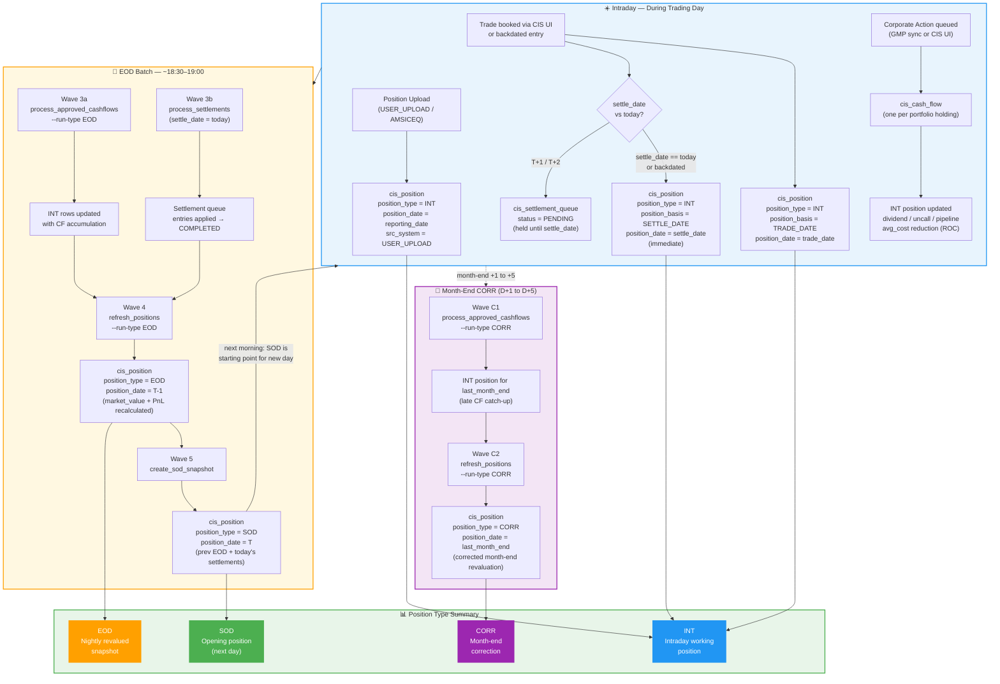

# CIS Trade Hive — EOD & CORR Process Flow Diagrams

**Version:** 1.0  
**Updated:** 2026-07-07  
**Audience:** Business Analysts / System Analysts / Operations  
**Render with:** GitHub, Confluence Mermaid plugin, draw.io (import `.mmd`), or [mermaid.live](https://mermaid.live)

---

## Diagram 1 — EOD Sequence (Full Pipeline)

Shows the complete nightly EOD run from GMP ETL completion through to SOD snapshot.  
Each actor represents a system component. Arrows show data flow and dependencies.

```mermaid
sequenceDiagram
    autonumber

    participant GMP   as GMP ETL (External)
    participant ALT   as alldatesinfo
    participant CA_Q  as cis_ca_cash_flow_queue
    participant CA_T  as cis_corporate_actions
    participant CF    as cis_cash_flow
    participant SQ    as cis_settlement_queue
    participant CTP   as cis_trade_position
    participant CP    as cis_position (Golden Copy)
    participant PRC   as cis_equity_price / FX Rates

    Note over GMP,PRC: ── WAVE 0: Pre-flight (17:45) ──────────────────────────────────────

    GMP->>ALT: ETL complete — alldatesinfo updated (prev_day=T-1, contextual_today=T)
    ALT-->>GMP: ack
    Note over GMP,PRC: CIS_PREFLIGHT_CHECK: verify Impala connection
    Note over PRC: CIS_VERIFY_PRICES: assert cis_equity_price + FX rates loaded for T-1

    Note over GMP,PRC: ── WAVE 1: GMP CA Sync (18:00) ──────────────────────────────────────

    GMP->>CA_T: gmp_cis_sfa_dly_corporate_action → UPSERT cis_corporate_actions<br/>(src_system=GMP, status=VALIDATED — bypasses four-eyes)
    CA_T->>CA_Q: INSERT PENDING entries for DIVIDEND / INTEREST / COUPON / ROC / BONUS / SPLIT / RIGHTS types

    Note over GMP,PRC: ── WAVE 2: CA Cash Flow Processing (18:15) ───────────────────────────

    CA_Q->>CA_Q: status PENDING → PROCESSING
    CA_Q->>CP: lookup portfolios holding the security on ex-date
    CP-->>CA_Q: portfolio list + quantities
    CA_Q->>CF: INSERT one cis_cash_flow row per portfolio × security<br/>(ca_type → cash_flow_type; amount = qty × price_per_share)
    CA_Q->>CA_Q: status PROCESSING → COMPLETED<br/>(FAILED → retry up to 3×)

    Note over GMP,PRC: ── WAVE 3a: Cash Flow Application (18:30) ────────────────────────────

    CF->>CF: SELECT APPROVED, payment_date ≤ T-1, position_updated=false
    CF->>CTP: lookup open SETTLE_DATE position (latest version, is_latest=true)
    CTP-->>CF: current qty, avg_cost, accumulated fields
    CF->>CTP: mark old version is_latest=false
    CF->>CTP: UPSERT new version row (CF fields accumulated:<br/>dividend / uncall / pipeline / provision / realized_pnl / avg_cost reduction)
    CF->>CP: UPSERT cis_position (position_type=INT, position_basis=SETTLE_DATE,<br/>position_date=payment_date, src_system=CIS)
    CF->>CF: UPDATE position_updated=true (idempotency flag)

    Note over GMP,PRC: ── WAVE 3b: Settlement Processing (18:30, parallel) ──────────────────

    SQ->>SQ: SELECT PENDING where settle_date = T (contextual_today)
    SQ->>CTP: UPSERT settled position versions
    SQ->>SQ: UPDATE status → COMPLETED

    Note over GMP,PRC: ── WAVE 4: EOD Position Revaluation (18:45) ──────────────────────────

    CP->>CP: SELECT latest INT row per portfolio / security / basis / date<br/>(all src_systems: CIS, GMP, AMSICEQ, USER_UPLOAD)
    PRC-->>CP: latest closing price (cis_equity_price, ordered by price_date DESC)
    PRC-->>CP: FX spot rate (gmp_cis_sta_dly_fx_rates, FC→LC pair)

    alt REVALUED portfolio, normal security (Case A)
        CP->>CP: market_value_fc = qty × price<br/>market_value_lc = market_value_fc × fx_rate<br/>cost_lc = cost_fc × fx_rate (MTM override)<br/>unrealized_pnl = market_value − cost
    else NON-REVALUED portfolio (Case B)
        CP->>CP: market_value_fc = qty × price<br/>market_value_lc = market_value_fc × fx_rate<br/>cost_lc carried forward (no MTM override)<br/>unrealized_pnl = market_value − cost
    else Equity-method security ASSOC / SUBSI (Case C)
        CP->>CP: market_value_fc = qty × price<br/>unrealized_pnl_fc = 0, unrealized_pnl_lc = 0<br/>net_book_value = cost − provision
    else No price available (Case D)
        CP->>CP: market_value_fc carried forward<br/>market_value_lc = market_value_fc × fx_rate
    end

    CP->>CP: DELETE existing EOD row for same (portfolio, security, basis, date)<br/>INSERT new EOD row (position_type=EOD, position_date=T-1)
    Note right of CP: Accumulated fields carried forward unchanged:<br/>dividend / uncall / pipeline / provision / realized_pnl

    Note over GMP,PRC: ── WAVE 5: SOD Snapshot (19:00) ──────────────────────────────────────

    CP->>CP: SELECT all EOD rows where position_date = prev_day (T-1)
    SQ->>CP: SELECT PENDING settlement queue entries where settle_date = contextual_today

    alt Settled trade is a BUY
        CP->>CP: new_qty = old_qty + trade_qty<br/>new_cost_fc = old_cost_fc + (qty × price + charges)<br/>new_avg_fc = new_cost_fc / new_qty<br/>CA/CF fields carried unchanged
    else Settled trade is a SELL (partial)
        CP->>CP: new_qty = old_qty − trade_qty<br/>avg_cost unchanged<br/>realized_pnl accumulated<br/>market_value prorated by new_qty/old_qty
    else Settled trade is a SELL (full close)
        CP->>CP: qty → 0, cost → 0, market_value → 0<br/>realized_pnl accumulated<br/>uncall / pipeline / provision carried
    end

    CP->>CP: INSERT SOD rows (position_type=SOD, position_date=contextual_today)
    SQ->>SQ: UPDATE processed entries → COMPLETED
```

---

## Diagram 2 — CORR (Month-End Correction) Sequence

Runs D+1 to D+5 after month-end. Replays cash flow application and revaluation for `last_month_end`.

```mermaid
sequenceDiagram
    autonumber

    participant ALT  as alldatesinfo
    participant CF   as cis_cash_flow
    participant CTP  as cis_trade_position
    participant CP   as cis_position (Golden Copy)
    participant PRC  as cis_equity_price / FX Rates

    Note over ALT,PRC: ── CORR Wave C1: Cash Flow Application (18:30) ─────────────────────

    ALT-->>CF: contextual_today = first-of-month date (e.g. 2026-07-01)<br/>reporting_date = last-month-end (e.g. 2026-06-30)<br/>last_month_end computed as: first_of_ref_month − 1 day

    Note over ALT,PRC: Date rule — contextual_today and reporting_date in different months?
    alt Different months (contextual_today month ≠ reporting_date month)
        Note over CF: last_month_end = reporting_date itself<br/>(reporting_date IS the month-end)
    else Same month
        Note over CF: last_month_end = last calendar day of month before reporting_date
    end

    CF->>CF: SELECT APPROVED cash flows<br/>payment_date ≤ last_month_end AND position_updated=false
    CF->>CTP: lookup open SETTLE_DATE position for last_month_end
    CTP-->>CF: current accumulated fields
    CF->>CTP: mark old version is_latest=false
    CF->>CTP: UPSERT new version (CF fields accumulated)
    CF->>CP: UPSERT cis_position (position_type=INT, position_date=last_month_end)
    CF->>CF: UPDATE position_updated=true

    Note over ALT,PRC: ── CORR Wave C2: Position Revaluation (18:45) ──────────────────────

    CP->>CP: SELECT latest INT rows for position_date = last_month_end
    PRC-->>CP: closing price for last_month_end date
    PRC-->>CP: FX spot rate for last_month_end date

    CP->>CP: Apply revaluation cases A / B / C / D<br/>(same logic as EOD Wave 4)

    CP->>CP: DELETE existing CORR row for same (portfolio, security, basis, date)<br/>INSERT new CORR row (position_type=CORR, position_date=last_month_end)

    Note right of CP: CORR rows are separate from EOD rows.<br/>Both exist in cis_position for the same date.<br/>CORR = corrected month-end view.<br/>EOD = regular nightly revaluation.
```

---

## Diagram 3 — Position Lifecycle (Full Day)

Shows how a single position evolves from trade entry through the full intraday and overnight cycle.



---

## Diagram 4 — Data Flow (Tables)

Shows which management command reads/writes each table.

```mermaid
flowchart LR
    subgraph EXT["External Feeds"]
        GMP_ETL["GMP ETL\ngmp_cis_sfa_dly_corporate_action\ngmp_cis_sta_dly_alldatesinfo\ngmp_cis_sta_dly_fx_rates"]
        PRICE_FEED["Market Data ETL\ncis_equity_price"]
    end

    subgraph CMD["Management Commands"]
        SYNC["sync_gmp_corporate_actions"]
        PCA["process_corporate_actions"]
        PAC["process_approved_cashflows"]
        PS["process_settlements"]
        RP["refresh_positions"]
        SOD["create_sod_snapshot"]
    end

    subgraph TABLES["Kudu Tables — gmp_cis"]
        CA_T["cis_corporate_actions"]
        CA_Q["cis_ca_cash_flow_queue"]
        CF_T["cis_cash_flow"]
        SQ_T["cis_settlement_queue"]
        CTP["cis_trade_position"]
        CP["cis_position\n(Golden Copy)"]
    end

    GMP_ETL -->|"READ CA source"| SYNC
    SYNC -->|"UPSERT"| CA_T
    SYNC -->|"INSERT PENDING"| CA_Q

    CA_Q -->|"READ PENDING"| PCA
    PCA -->|"INSERT"| CF_T
    PCA -->|"UPDATE → COMPLETED"| CA_Q

    CF_T -->|"READ APPROVED"| PAC
    PAC -->|"UPSERT new version"| CTP
    PAC -->|"UPSERT INT"| CP
    PAC -->|"UPDATE position_updated=true"| CF_T

    SQ_T -->|"READ PENDING settle_date=today"| PS
    PS -->|"UPSERT settled versions"| CTP
    PS -->|"UPDATE → COMPLETED"| SQ_T

    CP -->|"READ latest INT rows"| RP
    PRICE_FEED -->|"READ latest price"| RP
    GMP_ETL -->|"READ FX rates"| RP
    RP -->|"DELETE old EOD/CORR\nINSERT new EOD/CORR"| CP

    CP -->|"READ EOD rows prev_day"| SOD
    SQ_T -->|"READ PENDING settle_date=today"| SOD
    SOD -->|"INSERT SOD rows"| CP
    SOD -->|"UPDATE → COMPLETED"| SQ_T

    style EXT fill:#fce4ec,stroke:#E91E63,stroke-width:2px
    style CMD fill:#e3f2fd,stroke:#1565C0,stroke-width:2px
    style TABLES fill:#e8f5e9,stroke:#2E7D32,stroke-width:2px
```



---

## Position Type Reference (Quick Card)

| `position_type` | Written by | `position_date` | Description |
|---|---|---|---|
| `INT` | `position_service` (trades), `upload_service`, `process_approved_cashflows` | trade_date / settle_date / reporting_date / payment_date | Intraday working position — accumulates all CF/CA updates |
| `EOD` | `refresh_positions --run-type EOD` | T-1 (`reporting_date`) | Nightly revalued snapshot — market_value + PnL recalculated |
| `SOD` | `create_sod_snapshot` | T (`contextual_today`) | Opening snapshot = prev EOD + settled T+1/T+2 trades applied |
| `CORR` | `refresh_positions --run-type CORR` | `last_month_end` | Month-end corrected revaluation (D+1 to D+5) |

---

## EOD Job Schedule Reference

| Time | Job (Control-M) | Wave | Command |
|---|---|---|---|
| 17:30 | GMP_ETL_COMPLETE | — | External dependency |
| 17:45 | CIS_PREFLIGHT_CHECK | 0 | `python manage.py test_hive` |
| 17:50 | CIS_VERIFY_PRICES | 0 | impala-shell price/FX count checks |
| 18:00 | CIS_SYNC_GMP_CA | 1 | `sync_gmp_corporate_actions` |
| 18:15 | CIS_PROCESS_CA | 2 | `process_corporate_actions` |
| 18:30 | CIS_PROCESS_CASHFLOWS | 3 | `process_approved_cashflows --run-type EOD` |
| 18:30 | CIS_PROCESS_SETTLEMENTS | 3 ‖ | `process_settlements` (parallel) |
| 18:45 | CIS_REFRESH_POSITIONS | 4 | `refresh_positions --run-type EOD` |
| 19:00 | CIS_CREATE_SOD_SNAPSHOT | 5 | `create_sod_snapshot` |

**CORR (month-end D+1 to D+5):**

| Time | Job | Wave | Command |
|---|---|---|---|
| 18:30 | CIS_CORR_PROCESS_CASHFLOWS | C1 | `process_approved_cashflows --run-type CORR` |
| 18:45 | CIS_CORR_REFRESH_POSITIONS | C2 | `refresh_positions --run-type CORR` |
