# CIS Trade Hive — Class Diagram

System Design Document (SDM) artifact. Reflects the SOLID layering used
throughout `cis_trade_hive/`: **Views → Services → Repositories →
`ImpalaConnectionManager`** (Kudu/Impala). Diagram groups classes by Django
app; cross-app dependencies are shown explicitly.

```mermaid
classDiagram
    direction LR

    %% ===================== CORE =====================
    class ImpalaConnectionManager {
        +get_connection()
        +get_cursor()
        +execute_query(query) List~dict~
        +execute_write(query) bool
        +execute_write_async(query, callback)
    }

    class AuditLogKuduRepository {
        +log_action(entity_type, action, user, changes)
        +get_audit_trail(entity_type, entity_id)
    }

    class ACLService {
        +get_user_permissions(user)
        +has_permission(user, module, action) bool
        +check_permission(user, module, action)
        +get_user_groups(user)
    }

    %% ===================== TRADE APP =====================
    class TradeValidationRepository {
        +validate_trade_references(portfolio, security, counterparty, dates)
        +get_portfolio_details(name)
        +get_security_details(name)
        +validate_portfolio(name)
        +validate_security(name)
        +validate_counterparty(name)
    }

    class TradeKuduRepository {
        +validate_trade_data(trade_data)
        +get_all_trades_multi_filter(filters)
        +get_trade_by_id(trade_id)
        +insert_trade(trade_data, created_by)
        +insert_trade_fast(trade_data, created_by)
        +update_trade(trade_id, trade_data, updated_by)
        +submit_for_validation(trade_id, user)
        +validate_trade(trade_id, user)
        +reject_trade(trade_id, user)
        +cancel_trade(trade_id, user)
        +settle_trade(trade_id, user)
        +get_position(portfolio, security, basis)
        +insert_trade_history(trade_id, action, changes)
        +get_trade_statistics()
    }

    class MulticurrencyService {
        +get_fx_rate(from_ccy, to_ccy, rate_date) Decimal
        +get_fx_rates_batch(pairs) dict
        +calculate_position_values(position, fx_rate)
        +calculate_realized_pnl_multicurrency(...)
    }

    class PositionIdService {
        <<module>>
        +position_id(portfolio, security, basis, date, src) int
    }

    class PositionService {
        +calculate_position(portfolio, security, trade_type, qty, price, charges)
        -_process_buy(current, ...)
        -_process_sell(current, ...)
        -_save_position(position_data, updated_by)
        -_sync_to_cis_position(position_data)
        +get_position(portfolio, security)
        +validate_trade_for_position(trade_type, qty, price)
    }

    class SettlementService {
        +process_trade_settlement(trade_id, portfolio, security, ...)
        +process_pending_settlements(settle_date)
        -_process_immediate_settlement(...)
        -_queue_for_settlement(...)
        -_process_backdated_settlement(...)
        -_recalculate_position_chain(portfolio, security, from_date)
        +validate_backdated_settlement(settle_date)
        +get_settlement_statistics()
    }

    class PositionQueueService {
        +enqueue_position_calculation(trade_id, portfolio, security, ...)
        +start_worker()
        +stop_worker()
        -_worker_loop()
        -_process_item(item)
        +get_pending_items(limit)
        +process_immediately(trade_id, ...)
    }

    class CashFlowRepository {
        +get_all(filters)
        +insert(cf_data, created_by)
        +update(cash_flow_id, cf_data)
        +update_status(cash_flow_id, status)
        +soft_delete(cash_flow_id)
        +restore(cash_flow_id)
        +insert_history(cash_flow_id, action)
        +generate_cash_flow_number()
    }

    class CashFlowService {
        +list_all(filters)
        +create(cf_data, user)
        +update(cash_flow_id, cf_data, user)
        +approve(cash_flow_id, user)
        +reject(cash_flow_id, user)
        +delete(cash_flow_id, user)
        +restore(cash_flow_id, user)
    }

    class TradeDropdownService {
        +get_all_dropdown_options()
        +get_trade_types()
        +get_statuses()
        +get_portfolios()
        +get_securities_by_currency(ccy)
        +get_counterparties()
        +get_broker_charges()
        +calculate_trade_charges(trade_data)
    }

    %% ===================== PORTFOLIO APP =====================
    class PortfolioHiveRepository {
        +get_all_portfolios(filters)
        +get_portfolio_by_code(code)
        +insert_portfolio(data, created_by)
        +update_portfolio(code, data)
        +submit_for_validation(code, user)
        +validate_portfolio(code, user)
        +settle_portfolio(code, user)
        +get_portfolio_statistics()
    }

    class PortfolioService {
        <<static>>
        +create_portfolio(data, user)
        +update_portfolio(code, data, user)
        +submit_for_approval(code, user)
        +approve_portfolio(code, user)
        +reject_portfolio(code, user)
        +close_portfolio(code, user)
        +reactivate_portfolio(code, user)
        +can_user_edit(user, portfolio) bool
        +can_user_approve(user, portfolio) bool
    }

    %% ===================== SECURITY APP =====================
    class SecurityHiveRepository {
        +get_all_securities(filters)
        +get_security_by_id(id)
        +get_security_by_name(name)
        +get_security_by_isin(isin)
        +insert_security(data, created_by)
        +update_security(id, data)
        +update_security_status(id, status)
        +insert_security_history(id, action)
    }

    class SecurityService {
        +create_security(data, user)
        +update_security(id, data, user)
        +validate_security(id, user)
        +can_user_edit(user) bool
        +can_user_validate(user) bool
    }

    %% ===================== UDF APP =====================
    class UDFFieldRepository {
        +get_object_types()
        +get_fields_by_entity(object_type, entity_id)
        +get_field_values(object_type)
        +create(field_data, user)
        +update(udf_id, field_data)
        +soft_delete(udf_id)
        +restore(udf_id)
    }

    class UDFFieldService {
        +get_object_types()
        +get_fields_by_entity(object_type, entity_id)
        +create_field(field_data, user)
        +update_field(udf_id, field_data, user)
        +delete_field(udf_id, user)
        +restore_field(udf_id, user)
        +validate_field_data(field_data)
    }

    %% ===================== REFERENCE DATA APP =====================
    class CaCashFlowQueueRepository {
        +insert(queue_data)
        +get_by_id(queue_id)
        +mark_processing(queue_id)
        +mark_completed(queue_id, count, amount)
        +mark_failed(queue_id, error)
        +get_pending(limit)
    }

    class CACashFlowService {
        +queue_ca_for_processing(ca_id, ca_data, user)
        +process_ca_cash_flows(queue_id, dry_run)
        +get_holdings_for_ca(security_name, as_of_date)
        +create_cash_flow_from_ca(ca_id, portfolio, security, ...)
        -_process_position_adjustment_ca(queue_entry) "BONUS/SPLIT/RIGHTS"
        -_process_cf_position_overwrite(queue_entry) "CF-PIPELINE/PROVISION/..."
        +process_pending_cas(batch_size)
    }

    class CorporateActionRepository {
        +get_all(filters)
        +insert(ca_data, created_by)
        +update(ca_id, ca_data)
        +update_status(ca_id, status)
        +generate_ca_number()
    }

    class CorporateActionService {
        +list_all(filters)
        +create(ca_data, user)
        +update(ca_id, ca_data, user)
        +validate(ca_id, user)
        +reject(ca_id, user)
        +delete(ca_id, user)
        +get_statistics()
    }

    %% ===================== RELATIONSHIPS =====================
    TradeKuduRepository --> TradeValidationRepository : validates via
    TradeKuduRepository --> AuditLogKuduRepository : logs
    TradeKuduRepository --> ImpalaConnectionManager : queries

    PositionService --> MulticurrencyService : FX lookups
    PositionService --> PositionIdService : deterministic IDs
    PositionService --> ImpalaConnectionManager : reads/writes

    SettlementService --> PositionService : calculates AVP
    SettlementService --> PositionQueueService : lazy-loaded
    PositionQueueService --> PositionService : delegates calculation

    CashFlowService --> CashFlowRepository : persists
    CashFlowService --> TradeValidationRepository : validates
    CashFlowService --> AuditLogKuduRepository : logs

    TradeDropdownService --> TradeValidationRepository : entity lookups
    TradeDropdownService --> UDFFieldRepository : UDF dropdown values

    PortfolioService --> PortfolioHiveRepository : persists
    PortfolioService --> AuditLogKuduRepository : logs
    PortfolioService --> ACLService : authorization

    SecurityService --> SecurityHiveRepository : persists
    SecurityService --> AuditLogKuduRepository : logs

    UDFFieldService --> UDFFieldRepository : persists
    UDFFieldService --> AuditLogKuduRepository : logs

    CorporateActionService --> CorporateActionRepository : persists
    CorporateActionService --> CACashFlowService : triggers CF generation
    CorporateActionService --> AuditLogKuduRepository : logs

    CACashFlowService --> CaCashFlowQueueRepository : queue state
    CACashFlowService --> CashFlowRepository : creates cash flows
    CACashFlowService --> MulticurrencyService : FX conversion
    CACashFlowService --> PositionIdService : deterministic IDs

    PortfolioHiveRepository --> ImpalaConnectionManager : queries
    SecurityHiveRepository --> ImpalaConnectionManager : queries
    UDFFieldRepository --> ImpalaConnectionManager : queries
    CorporateActionRepository --> ImpalaConnectionManager : queries
    CaCashFlowQueueRepository --> ImpalaConnectionManager : queries
    CashFlowRepository --> ImpalaConnectionManager : queries
    AuditLogKuduRepository --> ImpalaConnectionManager : queries
```

## Layering conventions

| Layer | Responsibility | Naming |
|---|---|---|
| **Views** (not shown) | HTTP request/response, form handling, template context | `views.py` |
| **Services** | Business logic, workflow rules (Four-Eyes), cross-entity orchestration | `*_service.py` |
| **Repositories** | Raw Kudu/Impala SQL construction and execution | `*_kudu_repository.py` / `*_hive_repository.py` |
| **Connection Manager** | Pooled Impala connections, query caching, async writes | `core/repositories/impala_connection.py` |

- Repositories never call other repositories directly; cross-entity reads
  (e.g. `TradeKuduRepository` needing portfolio currency) go through
  `TradeValidationRepository` or a direct scoped query — kept intentionally
  thin.
- Services may call sibling services (e.g. `CorporateActionService` →
  `CACashFlowService`), but always within the same request/transaction
  boundary — there is no distributed transaction coordinator; Kudu writes are
  idempotent (`UPSERT`) by design to tolerate partial failure and retry.
- `edge_jobs_py36/` (not shown above) is a parallel, Django-free fork of the
  `Service`/`Repository` classes with the same responsibilities, used by
  scripts running on an older Python 3.6 cluster runtime — see
  `cis_trade_hive/CLAUDE.md`.
