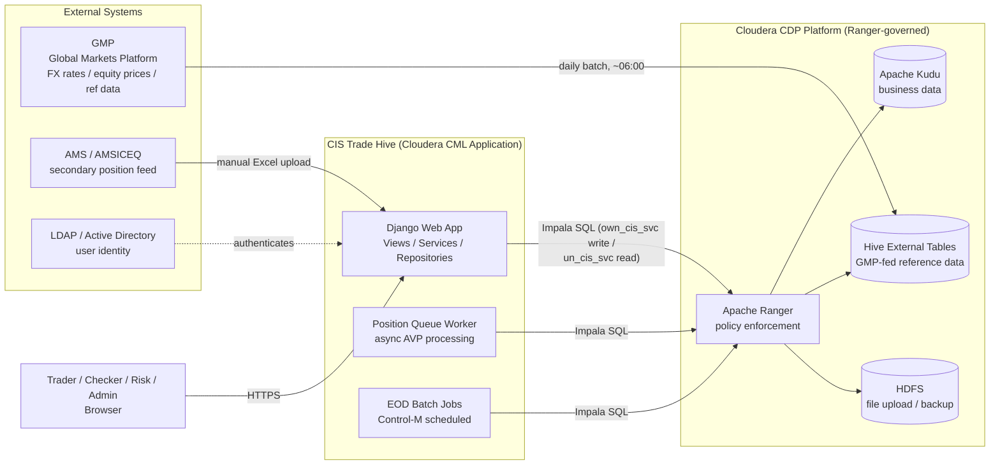
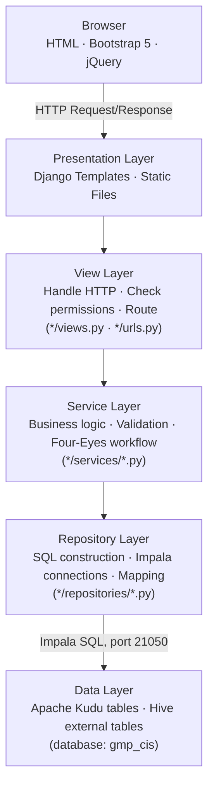
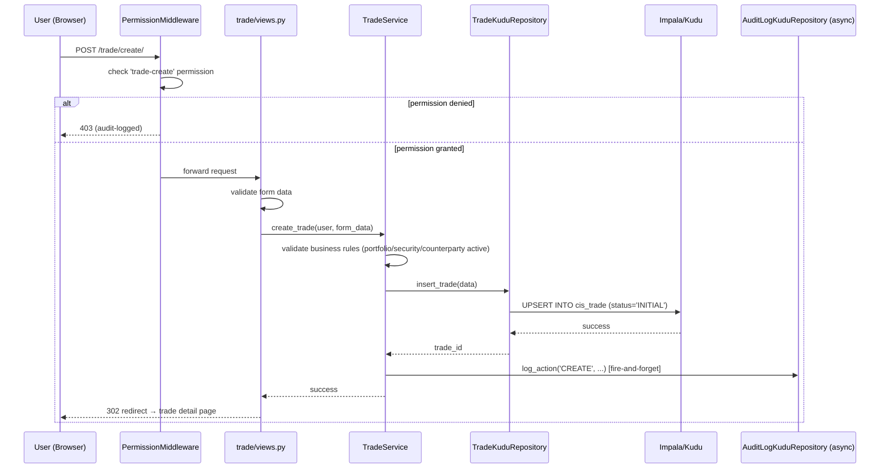

# Master Design Specs — Portia Replacement
## Sections 1–2

Companion to `SDM_Sections_3_to_8.md`, `SDM_ER_Diagram.md`, and
`SDM_Class_Diagram.md`. Sourced from `cis_trade_hive/docs/confluence/`
(an 18-page internal architecture doc set already maintained in-repo) and
`cis_trade_hive/CLAUDE.md`.

---

## 1 Introduction

**CIS Trade Hive** (CIS = Capital & Investment Services) is the system used
to manage investment trades end-to-end — from trade entry, through
compliance (maker-checker) approval, to settlement, position-keeping, and
reporting.

The bank's proprietary equities business was previously supported by the
legacy **IOS Portia** platform, which had become obsolete and no longer met
modern technology, integration, and reporting requirements. This
replacement initiative leverages the existing **Global Markets Platform
(GMP)** for products already approved by Global Markets — primarily listed
equities — with CIS Trade Hive as the new front-to-back application layer,
built on **Apache Kudu** (via Impala) hosted on the bank's **Cloudera CDP**
platform, replacing Portia's data and processing layer.

At a glance:
- A **trader (maker)** enters a trade or portfolio.
- A **checker** reviews and approves it — no one may approve their own
  work (**Four-Eyes / maker-checker** principle).
- The system automatically calculates each portfolio's **position**
  (Average Price Position — AVP: quantity held, weighted average cost).
- **Market data** (FX rates, equity prices, reference data) flows in daily
  from the upstream **GMP** system.
- Every action is written to an immutable **audit log**.
- The application is browser-based — no client install required.

### Modules in Scope

| Module | What it manages |
|---|---|
| Portfolio | Investment portfolios — create, approve, track |
| Trade | Buy/sell trades — enter, validate, settle |
| Position (AVP) | Automatic weighted-average-cost position per portfolio/security |
| Market Data | Daily FX rates and equity prices from GMP |
| Securities | Security master data (ISIN, currency, type) |
| Counterparties | Brokers and counterparties used in trades |
| Corporate Actions | Dividends, splits, rights issues affecting positions |
| Cash Flow | Cash movements linked to trades and corporate actions |
| UDF | User-defined custom fields on trades and portfolios |
| File Upload | Bulk data ingestion (CSV/Parquet/Excel) |
| Audit Log | Complete, immutable change history |
| RBAC | Role-based access control |

### 1.1 Assumptions, Constraints and Dependencies

**Assumptions**
- Products in initial scope are limited to those already approved by
  Global Markets — primarily listed equities.
- Users authenticate via the bank's existing LDAP/Active Directory
  infrastructure, consistent with other Cloudera CML-hosted applications.
- GMP remains the upstream source-of-truth for market data (FX rates,
  equity prices) and select reference data; CIS does not originate this
  data itself.

**Constraints**
- **No relational-DB/ORM option for business data**: all trade, portfolio,
  position, and reference data must be modelled and queried as
  Kudu/Impala tables — there is no fallback to a conventional RDBMS for
  business entities (Django's own DB is used only for framework concerns:
  `auth`, `sessions`, `contenttypes`).
- **Kudu is append/UPSERT-only**: there is no native row-level UPDATE
  semantics beyond UPSERT-on-primary-key; versioned entities (positions,
  trade history) are modelled as new rows rather than in-place mutation.
  This constrains schema design and increases storage growth over time
  (see Section 7.8, Archive and Purge).
- **No end-user direct cluster access**: per the bank's CDP/Ranger
  security model, all Impala/Hive/HDFS access is routed through two
  shared Linux service accounts (`own_cis_svc` write, `un_cis_svc`
  read-only) — Ranger enforces access at the service-account level, not
  per individual CIS user. CIS's own RBAC (Section 5.1) is therefore a
  **separate, additional access-control layer on top of** Ranger, not a
  replacement for it.
- **A Python 3.6-compatible fork exists** (`edge_jobs_py36/`) for select
  batch scripts that must run on an older cluster runtime component; any
  fix to a script with a counterpart in this fork must be mirrored, or the
  two copies silently drift.

**Dependencies**
- **GMP (Global Markets Platform)**: upstream source for FX rates, equity
  prices, and select reference data, fed daily (~6:00 AM) into Hive
  external tables that CIS reads but never writes to.
- **Cloudera CDP platform** (Kudu, Impala, Hive, HDFS, Ranger, CML): CIS
  is hosted as a **Cloudera CML Application**, not a standalone server —
  CML injects the listening port at runtime and the app has no independent
  hosting path outside this platform.
- **Kerberos (GSSAPI)** ticket-based authentication for all non-LOCAL
  environments — CIS cannot reach its own data in SIT/UAT/PROD/DR without
  a valid service-account Kerberos ticket.
- **AMS/AMSICEQ** upstream feed for certain position/holdings data (Excel
  upload path — see `upload_amsiceq_positions.py`), a secondary
  data-ingestion dependency alongside GMP.

---

## 2 Architecture Design

### 2.1 Application Interaction Diagram



### 2.2 Application Architecture Diagram

Strict layered architecture — every layer has exactly one job:



Request lifecycle example — creating a trade:



### 2.3 Component Description

| Component (Django App) | Purpose | Key Tables |
|---|---|---|
| `core` | Auth, audit, ACL, middleware, Impala connection pool | `cis_audit_log`, `cis_user*`, `cis_group*` |
| `portfolio` | Portfolio management + maker-checker | `cis_portfolio`, `cis_portfolio_history` |
| `trade` | Trade lifecycle, AVP position engine, settlement, position queue | `cis_trade`, `cis_trade_history`, `cis_trade_position`, `cis_position_queue` |
| `market_data` | FX rates, equity prices (read from GMP) | `gmp_cis_sta_dly_fx_rates`, `gmp_cis_sta_dly_equity_price` |
| `reference_data` | Currency, country, calendar, corporate actions | `gmp_cis_sta_dly_currency/country/calendar`, `cis_corporate_actions` |
| `security` | Security master data | `cis_security`, `cis_security_history` |
| `udf` | User-defined custom fields | `cis_udf_definition`, `cis_udf_value`, `cis_udf_option` |
| `upload` | File upload and Hive external table creation | `cis_file_upload` |
| `lookup` | Lookup/dropdown tables (broker, GL codes, etc.) | `cis_trade_charge_lut` |

Full class-level detail: `SDM_Class_Diagram.md`. Full table-level detail:
`SDM_ER_Diagram.md`.

### 2.4 Application Structure

```
cis_trade_hive/
├── config/                  # Django settings, URLs, WSGI, per-env config
│   ├── settings.py
│   ├── urls.py
│   ├── environments.py      # Per-environment Impala/Hive connection config
│   └── cml_app.py           # Cloudera CML-specific bootstrap (port injection, etc.)
│
├── core/                    # Foundation — used by every app
│   ├── audit/                        # Kudu-based async audit logging
│   ├── repositories/
│   │   ├── impala_connection.py      # Connection pool (primary read/write path)
│   │   ├── hive_connection.py        # Hive ACID writes (managed tables)
│   │   ├── hybrid_connection.py      # Routes Kudu→Impala, Hive-managed→Hive
│   │   ├── acl_repository.py         # RBAC v1
│   │   └── acl_repository_v2.py      # RBAC v2 (multi-group)
│   ├── services/
│   │   ├── acl_service.py
│   │   └── system_date_service.py
│   └── middleware/
│       ├── permission_middleware.py  # URL-level permission enforcement
│       ├── performance_middleware.py
│       └── audit_middleware.py
│
├── portfolio/ / security/ / reference_data/ / market_data/ / udf/ / upload/ / lookup/
│   └── (each: repositories/, services/, views.py, urls.py, models.py)
│
├── trade/                   # Largest app — trade + position + cash flow
│   ├── repositories/  (trade_kudu_repository.py, position_repository.py, cash_flow_repository.py)
│   ├── services/      (position_service.py, settlement_service.py, position_queue_service.py, cash_flow_service.py)
│   ├── management/commands/  (process_settlements.py, refresh_positions.py, run_trade_event_worker.py, ...)
│   └── views.py / views_position.py / views_cash_flow.py
│
├── edge_jobs_py36/           # Python 3.6-compatible fork of select batch scripts
├── templates/                # All HTML templates
├── static/                   # CSS, JS, images — no CDN, all served locally
├── sql/ddl/                  # Kudu/Hive DDL scripts (numbered sequence, 108 files)
└── scripts/                  # PySpark migration + backup/restore + CML startup scripts
```

**Hosting model**: CIS runs as a **Cloudera CML Application**
(`scripts/cml_startup.sh` starts two processes together on the CML-injected
port: the Django server and the **Position Queue Worker** background
thread pool). This is a single-instance-per-environment hosting model,
not a load-balanced multi-instance web farm — see Section 8.3 for the
resiliency implication.

---

*Companion documents: `SDM_ER_Diagram.md` (data model), `SDM_Class_Diagram.md`
(class/service model), `SDM_Sections_3_to_8.md` (Sections 3–8).*
