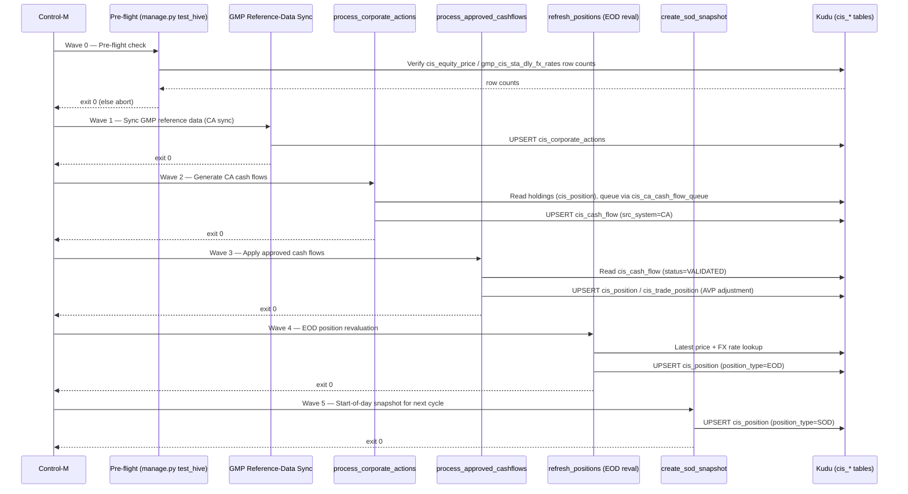

# Master Design Specs — Portia Replacement
## Sections 3–8

Draft content sourced directly from the `cis_trade_hive` codebase. Items that
cannot be evidenced in-repo are marked **[TBC]** rather than invented —
confirm with the relevant owner (Infra/Security/Ops) before finalizing.

---

## 3 Application Design

### 3.1 Application Type – Object Oriented

CIS Trade Hive is a Django 5.2.9 monolith following a strict **SOLID
layered** design:

```
Views (HTTP) → Services (business logic / Four-Eyes workflow)
             → Repositories (raw Impala SQL against Kudu)
             → ImpalaConnectionManager (pooled connections)
```

~33 repository files span `trade/`, `portfolio/`, `security/`,
`reference_data/`, `core/audit/`, `udf/`, and `lookup/`. Repositories never
call each other directly; cross-entity lookups go through a dedicated
validation repository. Services may call sibling services (e.g.
`CorporateActionService → CACashFlowService`) within the same request.

A parallel Django-free fork of the same Service/Repository pairs lives in
`edge_jobs_py36/` for scripts running on an older Python 3.6 cluster
runtime (see `cis_trade_hive/CLAUDE.md`).

#### 3.1.1 Class Diagram

See **`SDM_Class_Diagram.md`** (companion file) for the full Mermaid class
diagram covering all layers and cross-service dependencies.

#### 3.1.2 Event Sequence Diagram

The canonical multi-step sequence in the system is the **EOD batch run**
(6 waves, each gated on the prior wave's exit code — see
`docs/CONTROL_M_EOD_JOBS.md`):



See `docs/EOD_SEQUENCE_DIAGRAM.md` and `docs/CONTROL_M_EOD_JOBS.md` for the
authoritative, fully-detailed version of this flow.

#### 3.1.3 Component Design

Component boundaries follow the Django app structure:

| Component (App) | Responsibility | Key Classes |
|---|---|---|
| `core` | Auth, ACL, audit, middleware, Impala connection pool | `ImpalaConnectionManager`, `ACLService`, `AuditLogKuduRepository` |
| `portfolio` | Portfolio master data, Four-Eyes workflow | `PortfolioService`, `PortfolioHiveRepository` |
| `trade` | Trade capture, AVP position engine, settlement, cash flow | `TradeKuduRepository`, `PositionService`, `SettlementService`, `PositionQueueService`, `CashFlowService` |
| `security` | Security master data | `SecurityService`, `SecurityHiveRepository` |
| `reference_data` | Currencies, countries, counterparties, corporate actions | `CorporateActionService`, `CACashFlowService` |
| `udf` | User-Defined Fields (generic entity extension) | `UDFFieldService`, `UDFFieldRepository` |
| `market_data` | FX rates, market data | `MulticurrencyService` |

Full method-level detail is in `SDM_Class_Diagram.md`.

### 3.2 Application Type – Host Processing

The EOD/batch layer is implemented as Django **management commands**
(`manage.py <command>`), scheduled by Control-M rather than run
interactively — functionally equivalent to host/batch processing jobs,
though the runtime is Python/Django, not a mainframe.

#### 3.2.1 Data Flow

There are no flat-file interfaces in the batch layer — all data flow is
**Kudu table → Python business logic → Kudu table**:

```
GMP source tables (gmp_cis_sta_dly_*)
        │  (scheduled sync)
        ▼
cis_corporate_actions / cis_equity_price / gmp_cis_sta_dly_fx_rates
        │
        ▼
process_corporate_actions.py  ──► cis_ca_cash_flow_queue ──► cis_cash_flow
        │
        ▼
process_approved_cashflows.py ──► cis_position / cis_trade_position (AVP adjust)
        │
        ▼
refresh_positions.py (EOD reval) ──► cis_position (position_type=EOD)
        │
        ▼
create_sod_snapshot.py ──► cis_position (position_type=SOD, next cycle's opening balance)
```

#### 3.2.2 Program Flow

See `docs/CONTROL_M_EOD_JOBS.md` and `docs/EOD_PROCESSING_GUIDE.md` for the
full program flow, retry/failure handling per wave, and job dependency
chain. Each management command:
1. Validates pre-conditions (source data present for the processing date).
2. Executes idempotent `UPSERT` writes (safe to re-run a wave).
3. Logs progress and returns a non-zero exit code on failure, which halts
   the Control-M chain for that day.

### 3.3 Application Type – EAI

**Not applicable.** There is no ESB, message broker (Kafka/RabbitMQ/MQ), or
integration-bus middleware in this codebase. Integration with upstream
GMP/AMS systems is **point-to-point batch data exchange** — GMP/AMS feed
land directly into shared Kudu/Hive tables (`gmp_cis_sta_dly_*`), which the
Django app's scheduled jobs read on a fixed cadence. No further EAI
architecture/flow diagrams apply.

### 3.4 Application Type – Model Driven

**Not applicable.** Business logic is hand-written Python executing raw
Impala SQL against Kudu tables (see repository layer, Section 3.1). Django's
ORM is used only for framework concerns (`django.contrib.auth`, `sessions`,
`contenttypes`, `messages`) — it does **not** back any domain model, so there
is no model-driven code-generation framework or application/grouping model
definition to document here.

---

## 4 Data Design

### 4.1 Overview

All business data (trade, portfolio, position, security, cash flow,
corporate action, reference data) is stored in **Apache Kudu**, accessed via
**Impala** (PyHive 0.7.0 client). Django's own database (used only for
`auth`/`sessions`/`contenttypes`) is a separate, conventional RDBMS
connection and out of scope for the business data model below.

#### 4.1.1 Impact Assessment Considerations

- Kudu tables are **append/UPSERT-only** — there is no in-place row
  mutation for versioned entities; changes are modelled as new rows with a
  `version_id`/`is_latest` flag (`cis_trade_position`, `cis_trade_history`).
  Any schema change to these tables must account for existing historical
  versions.
- **Dual-write pattern**: every CIS-originated position change writes to
  both `cis_trade_position` (CIS-only working ledger) and `cis_position`
  (golden copy merging CIS/GMP/AMS_STREET/USER_UPLOAD). A schema or logic
  change to one side must be mirrored to the other, or the two will drift.
- The **`edge_jobs_py36/` fork** duplicates several repository/service
  classes for the Python 3.6 cluster runtime — any DDL or business-logic
  change to a table touched by both the main app and a fork counterpart
  must be applied to both (see `cis_trade_hive/CLAUDE.md`).
- **Known data-integrity risk**: `position_id` for `cis_position` (PK =
  `position_id` alone) is generated two different ways in the codebase.
  Most paths compute it deterministically (MD5/`fnv_hash` of
  `portfolio|security|basis|date|src_system`), so a repeated write
  correctly UPDATEs the same row. Two code paths instead generate a fresh
  timestamp+UUID id with no natural-key lookup, producing a **duplicate
  row instead of an update** if re-run for the same position:
  `upload_amsiceq_positions.py` (Excel upload utility — live risk if
  re-run) and `refresh_positions.py`'s `_insert_eod_position()` (marked
  legacy/unused but not yet confirmed dead). A live duplicate was
  confirmed in `cis_position` for one portfolio/security/basis combination
  as of 2026-09-17; manual data cleanup was still outstanding at that time
  (`docs/confluence/12_sre_support_handover.md` §6).

#### 4.1.2 Inventory of Physical/Logical Files

No flat-file interfaces exist in the current design (see 3.2.1) — all
persistence is via Kudu tables, enumerated in Section 4.2.

### 4.2 Inventory of Tables/Views

DDL source of truth: `cis_trade_hive/sql/ddl/` — **108 files**, one
numbered file per logical table group (`NN_description.sql`), e.g.
`00_all_kudu_tables_docker.sql` (full local-dev schema, all tables),
`01_core_tables.sql`, `02_portfolio_tables.sql`, `05_acl_tables_kudu.sql`,
`06_trade_tables_kudu.sql`, `13_avp_tables_kudu.sql`,
`14_corporate_actions_kudu.sql`, `15_cash_flow_kudu.sql`,
`16_ca_cash_flow_queue.sql`, `17_trade_event_queue_kudu.sql`,
`50_rbac_tables_kudu.sql`, `51_security_udf_fields.sql`, etc.

#### 4.2.1 Key Tables

| Table | Purpose |
|---|---|
| `cis_portfolio` | Portfolio master, Four-Eyes status |
| `cis_security` | Security master data |
| `cis_party` | Counterparty / broker / custodian master |
| `cis_trade` | Trade capture, Four-Eyes status |
| `cis_trade_history` | Trade audit trail (versioned) |
| `cis_trade_position` | Versioned AVP working ledger (CIS-only) |
| `cis_position` | Golden/consolidated position copy (all sources) |
| `cis_position_queue` / `cis_settlement_queue` | Async AVP calculation queues |
| `cis_cash_flow` | Dividend/interest/ROC/capital-distribution cash flows |
| `cis_corporate_actions` | CA master (dividends, splits, bonus, rights) |
| `cis_ca_cash_flow_queue` | Per-holding fan-out queue for CA→cash-flow generation |
| `cis_udf_field` | Generic key/value entity extension |
| `cis_user` / `cis_user_group` / `cis_group_permissions` | RBAC |
| `cis_audit_log` | Full audit trail (see Section 6.1) |

Full column-level detail for each table: `sql/ddl/<NN_*.sql>`.

#### 4.2.2 Physical Data Model

See **`SDM_ER_Diagram.md`** (companion file) for the full Mermaid ER
diagram, including per-table column lists and cross-table relationships
(logical only — Kudu does not enforce foreign keys).

#### 4.2.3 Table/File/Record Definition

Representative record layout — **`cis_audit_log`** (full audit trail, see
Section 6.1 for design rationale): `audit_id`, `audit_timestamp`,
`user_id`, `username`, `user_email`, `action_type`, `action_category`,
`action_description`, `entity_type`, `entity_id`, `entity_name`,
`field_name`, `old_value`, `new_value`, `request_method`, `request_path`,
`request_params`, `status`, `status_code`, `error_message`,
`error_traceback`, `session_id`, `ip_address` (plus further columns —
confirm exact full list against `sql/ddl/` before sign-off).

Every other table's definitive record layout is its DDL file under
`sql/ddl/`; this document does not duplicate all 108 definitions inline.

#### 4.2.4 Join Condition

Principal join keys (all logical, not FK-enforced by Kudu):

- `cis_trade.portfolio_short_name = cis_portfolio.name`
- `cis_trade.security_label = cis_security.security_name`
- `cis_trade.counterparty = cis_party.party_short_name`
- `cis_trade_position.trade_id = cis_trade.trade_id`
- `cis_position` / `cis_trade_position` keyed on
  `(portfolio, security_label, position_basis, position_date)` — the
  natural key hashed into a deterministic `position_id`
  (`position_id_service.position_id()`)
- `cis_cash_flow.ca_id = cis_corporate_actions.ca_id` (nullable — only set
  when `src_system = 'CA'`)
- `cis_group_permissions.group_id = cis_group.group_id`,
  `cis_user_group.user_id = cis_user.user_id`

---

## 5 Application Security Requirements

### 5.1 User Administration

RBAC model: `cis_user → cis_user_group → cis_group → cis_group_permissions`
(Kudu tables, `sql/ddl/50_rbac_tables_kudu.sql`). Permission grants carry
per-module `can_view`/`can_create`/`can_edit`/`can_delete`/`can_approve`
flags, enforced by `ACLService` (`core/services/acl_service.py`,
300s per-user cache — see `cis_trade_hive/CLAUDE.md`). See
`docs/RBAC_MIGRATION_PLAN.md` and `docs/GRANULAR_PERMISSION_PLAN.md` for
migration history and the granular-permission design.

### 5.2 Authentication

Two independent authentication layers:

1. **Application login** — `django.contrib.auth`, backed by Django's own
   user store (separate from the Kudu-backed `cis_user` RBAC table).
2. **Data-layer authentication (Impala/Kudu)** — environment-driven, set in
   `config/environments.py`:
   - `LOCAL`: `NOSASL` (no auth — Docker dev only)
   - `SIT` / `UAT` / `PROD` / `DR`: `GSSAPI` (Kerberos) against the Cloudera
     CML cluster, with SSL enabled.

   > ⚠️ **Open item to flag for security sign-off** (documented internally
   > as a critical known issue, `docs/confluence/12_sre_support_handover.md`
   > §6): `LoginView.post` (`core/views/auth_views.py`) currently checks
   > only whether the submitted LANID exists/is enabled — it does not
   > verify a password. Because the app is a CML Application with users
   > added as LDAP collaborators and LANIDs are visible internally, this
   > allows logging in as another user if their LANID is known. A fix is
   > **agreed but not yet implemented**: drop the free-text login form and
   > trust CML's own LDAP/SSO gate by reading the authenticated LANID from
   > the trusted header CML's proxy injects per request (blocked on live
   > CML environment access to confirm the exact header name). **This must
   > be resolved and verified before Section 5.2 is represented as
   > production-ready.**

### 5.3 Session Management (Web based)

`django.contrib.sessions` with `SessionMiddleware` active
(`config/settings.py`). **No custom session hardening was found** in
`settings.py` — no `SESSION_COOKIE_SECURE`, `SESSION_COOKIE_HTTPONLY`
override, `SESSION_EXPIRE_AT_BROWSER_CLOSE`, or `SESSION_COOKIE_AGE`
override; Django framework defaults are in effect. **[TBC]** — confirm
whether this is an intentional decision or a gap to close before go-live
(recommend explicit `SESSION_COOKIE_SECURE=True`,
`SESSION_COOKIE_HTTPONLY=True`, and an explicit idle-timeout for a banking
application).

### 5.4 Access Controls

Centralized, deny-by-default URL-level enforcement via
`core/middleware/permission_middleware.py` (`PermissionMiddleware`, last in
the middleware chain, runs after `SessionMiddleware`), driven by
`core/permissions_map.py`'s `URL_PERMISSION_MAP` / `EXEMPT_URL_NAMES` /
`DEFAULT_DENY`. Decision flow:

1. No URL resolver match → pass through.
2. URL is in `EXEMPT_URL_NAMES` (e.g. login page) → pass through.
3. User not authenticated → redirect to login.
4. `SKIP_PERMISSION_CHECKS=True` (dev-only flag) → bypass.
5. URL not present in the map → **403 if `DEFAULT_DENY`**, else pass.
6. Otherwise evaluate the mapped `(permission, mode)` tuple, or a
   per-HTTP-method permission dict.
7. AJAX/API requests receive a JSON 403 (not an HTML redirect).
8. **Every denial is audit-logged** (async) to `cis_audit_log`.

### 5.5 Access Controls (Application Privileges)

Privileges are module-scoped (Portfolio, Trade, Security, UDF, Corporate
Action, Cash Flow, ...) with five actions each: view/create/edit/delete/
approve. The **approve** privilege is distinct from create/edit to enforce
the **Four-Eyes (maker-checker)** principle — the same user cannot both
create/modify and approve the same record (enforced in code, e.g.
`TradeKuduRepository.validate_trade()` raises on
`created_by == validated_by`).

### 5.6 Access Controls (Web Application Technologies)

`django.middleware.security.SecurityMiddleware` and
`django.middleware.clickjacking.XFrameOptionsMiddleware` are active
(clickjacking protection, security headers). CSRF protection is enabled via
`CsrfViewMiddleware`, with `CSRF_COOKIE_SECURE = not DEBUG`. Static assets
are served via `WhiteNoiseMiddleware` (no separate CDN/reverse-proxy static
tier documented).

**RESOLVED**: when `DEBUG=False` (`config/settings.py`), the following are
explicitly set: `SECURE_PROXY_SSL_HEADER = ('HTTP_X_FORWARDED_PROTO',
'https')` (required because CML terminates TLS at its proxy and forwards
plain HTTP to the app on loopback), `SECURE_SSL_REDIRECT = True`,
`SECURE_HSTS_SECONDS = 31536000` (1 year), `SECURE_HSTS_INCLUDE_SUBDOMAINS
= True`, `SECURE_HSTS_PRELOAD = True`, `SECURE_BROWSER_XSS_FILTER = True`,
`SECURE_CONTENT_TYPE_NOSNIFF = True`, `X_FRAME_OPTIONS = 'DENY'`.

### 5.7 Data Protection (Cryptography Control)

- Impala/Kudu connections to SIT/UAT/PROD/DR use SSL (`USE_SSL=True` per
  `config/environments.py`) with Kerberos (`GSSAPI`) authentication.
- `CSRF_COOKIE_SECURE = not DEBUG` is the only application-layer
  cryptography-adjacent setting found in `settings.py`.
- **No field-level encryption-at-rest** (e.g. for PII/account data) is
  configured in the application layer — this is a deliberate boundary, not
  a gap: the bank's **Cloudera CDP / Ranger** platform is the enforcement
  point for cluster-level access and encryption-at-rest policy
  (`docs/confluence/11_cdp_ranger_access_flow.md`), and CIS never accesses
  Kudu/Hive/HDFS directly — all access is routed through two shared Linux
  service accounts (`own_cis_svc` write, `un_cis_svc` read-only,
  Kerberos-keytab authenticated), with Ranger policies governing exactly
  what each account may read/write per database/table/HDFS path.
  Encryption-at-rest is therefore an **infrastructure/CDP-platform
  responsibility**, outside this application's own configuration surface.

### 5.8 Data Protection (Information Leakage)

Error responses in `DEBUG=False` (production) mode use Django's standard
generic error pages (no stack traces returned to the client). Audit log
entries capture `error_message`/`error_traceback` server-side only (see
Section 6.1) — never surfaced to the end user.

### 5.9 Data Protection (Exception Handling)

Repository/service methods follow a consistent pattern: catch exceptions,
log via `logger.error(...)`, and either raise a domain-specific
`ValueError`/`CommandError` (surfaced to the UI as a validation message) or
return a `(success, message)` tuple — raw exceptions/tracebacks are not
propagated to the browser.

### 5.10 Data Protection (Web Based application)

Django's built-in protections are relied upon: CSRF tokens on all
state-changing forms, Django template auto-escaping (XSS protection), and
the ORM/parameterization conventions for the Django-managed tables (`auth`,
`sessions`). **Note**: business-data Impala queries are built via
Python f-strings with manual `escape_value()`/`_escape()` helpers per
repository (Impala's C-style `\'` escaping, not parameterized queries,
since PyHive's driver does not support bound parameters for all statement
types used here) — every repository consistently escapes single quotes and
backslashes before interpolation. **[TBC]**: a dedicated SQL-injection
review of the escaping helpers is recommended given this pattern is
hand-rolled rather than using parameterized queries throughout.

### 5.11 Data Handling/Validation

Input validation occurs at two layers: Django forms/`django-crispy-forms`
at the UI layer, and dedicated validation repositories
(`TradeValidationRepository`, etc.) at the service layer before any Kudu
write — e.g. `validate_trade_data()` checks required fields, quantity/price
sign rules, and cross-currency FX-rate requirements before `insert_trade()`
is permitted to proceed.

---

## 6 Audit Trail/Application log management

### 6.1 Audit Trail

Fully designed and implemented — see `docs/AUDIT_LOGGING_PLAN.md` (593
lines) for the complete design. Key mechanisms:

- **Asynchronous, fire-and-forget writes**: the triggering business
  operation returns to the user immediately; the audit write is queued to
  a background thread pool (`AsyncAuditQueue`, 4 workers, max queue depth
  1000) so audit logging never blocks a user-facing request.
- **Circuit breaker** (`core/audit/circuit_breaker.py`): CLOSED / OPEN /
  HALF_OPEN states (`failure_threshold=5`, `recovery_timeout=60s`,
  `success_threshold=2`) — protects the application from cascading
  failures during known Kudu tablet leader-election/timeout events
  (60+ second stalls).
- **File-based fallback** (`core/audit/file_audit_logger.py`): when Kudu is
  unavailable, audit entries are written as JSON-lines to rotating files
  under `logs/audit_fallback/audit_fallback_<YYYYMMDD>.jsonl` (10MB
  rotation). This path is **confirmed live** — a real fallback file exists
  on disk from an actual run (`logs/audit_fallback/audit_fallback_20260923.jsonl`).
- **Automatic HTTP-level capture**: `AuditMiddleware`
  (`core/middleware/audit_middleware.py`) captures every `POST`/`PUT`/
  `PATCH`/`DELETE` request plus `/login/`/`/logout/`, excluding
  `/static/`, `/media/`, `/admin/jsi18n/`, `/__debug__/`; gated by
  `settings.AUDIT_LOG_ENABLED`.
- **Domain-level capture**: every mutating service method (create/update/
  approve/reject/delete/restore) also logs explicitly via
  `AuditLogKuduRepository`, recording action type, old/new values (JSON
  diff), user, IP, timestamp, and Four-Eyes approval status.
- **Storage**: `cis_audit_log` Kudu table — see Section 4.2.3 for the
  record layout.

  > **RESOLVED**: two audit write paths exist historically —
  > `AuditMiddleware` (`core/middleware/audit_middleware.py`) and the
  > domain-service path via `AuditLogKuduRepository`
  > (`core/audit/audit_kudu_repository.py`). Per
  > `docs/confluence/07_audit_logging.md`, `AuditMiddleware` is
  > **explicitly marked legacy/deprecated** — the canonical, queryable
  > audit store for compliance reporting is the Kudu `cis_audit_log` table
  > written via `AuditLogKuduRepository`'s async queue + worker pool.

### 6.2 Application Log Management Checklist (GSOC)

**RESOLVED — data retention policy** (`docs/confluence/04_etl_and_data_flows.md`,
`docs/confluence/07_audit_logging.md`):

| Data | Retention | Notes |
|---|---|---|
| Trades | 7 years | Regulatory requirement |
| Audit log | 7 years | All changes, all users; after 2 years, may be archived to cold HDFS storage but remains queryable |
| Positions | Forever | Needed for P&L history |
| Cash flows | 7 years | Regulatory |
| Market data | 10 years | Historical rates/prices |
| GMP trade ETL logs | 90 days | Operational logs only |

**Remaining checklist items — [TBC with Ops/GSOC team]:**

- [ ] Whether the documented retention policy above is enforced by an
      automated purge/archive job, or is policy-only today (no such job
      was found in-repo — see Section 7.8).
- [ ] Audit fallback file (`logs/audit_fallback/*.jsonl`, 10MB rotation
      per file) retention/cleanup — not currently defined.
- [ ] Circuit-breaker state transitions (OPEN events) alerted to
      monitoring/GSOC — no external alerting integration found (see 8.2).
- [ ] Application (non-audit) log level, format, and destination for
      PROD — standard Python `logging` is used throughout
      (`logger = logging.getLogger(__name__)` per module); on CML,
      Django/worker logs land in `/tmp/cis_django.log` and
      `/tmp/cis_position_worker.log` per
      `docs/confluence/12_sre_support_handover.md` — centralized log
      shipping/aggregation target beyond these local files is **[TBC]**.
- [ ] Log content review for sensitive-data leakage (PII, credentials) —
      not yet performed against this design.

---

## 7 Solution Design

### 7.1 Platform

#### 7.1.1 Overview

Django 5.2.9 monolith. Two serving modes are supported by the dependency
set:
- **WSGI** (synchronous): `gunicorn config.wsgi:application --bind
  0.0.0.0:8000 --workers 4 --threads 4`.
- **ASGI** (async, for WebSocket-based real-time notifications):
  `daphne`/`channels`/`channels-redis`/`uvicorn` are present in
  `requirements.txt`.

#### 7.1.2 Platform Component Diagrams

See `SDM_Class_Diagram.md` (application component/class view) and
`SDM_ER_Diagram.md` (data component view) as the platform component
diagrams for this submission. **[TBC]**: a physical deployment diagram
(load balancer → app servers → Kudu/Impala cluster → Redis) is not yet
produced — recommend adding one if required by the SDM template's
diagramming standard.

### 7.2 Infrastructure

#### 7.2.1 System Environments Profile

Defined in `config/environments.py`, keyed by `CIS_ENV` env var (default
`LOCAL`):

| Environment | `CIS_ENV` | Impala/Hive Host | Auth | Notes |
|---|---|---|---|---|
| Local dev | `LOCAL` | `localhost` | `NOSASL` | Docker Kudu/Impala container, dev only |
| SIT | `SIT` | `lxmrwtsgyodt1.sg.uobnet.com` | `GSSAPI` (Kerberos) | `TST.UOBNET.COM` domain |
| UAT | `UAT` | `lxmrwtsgvqk2.sg.uobnet.com` | `GSSAPI` (Kerberos) | `SG.UOBNET.COM` domain |
| PROD | `PROD` | `lxmrwtsgvqk2.sg.uobnet.com` | `GSSAPI` (Kerberos) | **Same host as UAT** — DB/schema separation only, not host separation; confirm this is intentional |
| DR | `DR` | `lxmrwtsgvqk2.sg.uobnet.com` | `GSSAPI` (Kerberos) | Disaster-recovery cluster |

(Source: `docs/confluence/12_sre_support_handover.md` §4, `config/environments.py`.)

Impala DB defaults to `gmp_cis`; Hive DB defaults to `mrw_ima` (non-LOCAL)
or `gmp_cis` (LOCAL). All values are env-var-overridable (`IMPALA_HOST`,
`IMPALA_PORT`, `IMPALA_DB`, `HIVE_HOST`, etc.); the Impala DB name alone
can also be retargeted without redeploying by editing
`config/database.txt` on the gateway host. Pool size: 10 per environment
config default, 35 in the connection-manager default (`CLAUDE.md`).
Timeout: 60s. Connectivity check: `python manage.py test_hive`; Kerberos
ticket check: `klist`.

**Access path**: no end user reaches Impala/Hive/HDFS directly. All access
is routed through two shared Linux service accounts — `own_cis_svc`
(write, Kerberos keytab) and `un_cis_svc` (read-only, Kerberos keytab) —
with **Apache Ranger** enforcing per-account access policy at the
database/table/HDFS-path level (`docs/confluence/11_cdp_ranger_access_flow.md`).
CIS's own RBAC (Section 5.1) is a separate, additional layer on top of
this — Ranger only sees the shared service account, never the individual
CIS user.

#### 7.2.2 Environment PROD

**[TBC]** — pull current PROD sizing (CPU/RAM/node count for app servers
and the Cloudera CML cluster) from the Infra team; not present in this
repository.

#### 7.2.3 Supporting Software

Pinned versions from `requirements.txt`:

| Package | Version | Purpose |
|---|---|---|
| Django | 5.2.9 | Web framework |
| PyHive | 0.7.0 | Impala client |
| thrift / thrift-sasl | 0.16.0 / 0.4.3 | PyHive transport + Kerberos SASL |
| djangorestframework | 3.16.1 | REST API layer |
| django-filter | 25.2 | List filtering |
| django-crispy-forms / crispy-bootstrap5 | 2.5 / 2025.6 | Form rendering |
| channels / channels-redis / daphne / uvicorn | 4.2.0 / 4.2.1 / 4.1.2 / 0.30.6 | WebSocket real-time notifications |
| redis | 5.2.1 | Channel layer backend |
| gunicorn | 22.0.0 | WSGI application server |
| whitenoise | 6.7.0 | Static file serving |
| pyarrow | ≥14.0.0 | Parquet support (upload/ETL) |
| openpyxl | — | Excel upload parsing |
| pytest / pytest-django / pytest-cov | 8.3.4 / 4.11.1 / 7.0.0 | Test framework |
| python-dotenv | 1.0.1 | `.env` config loading |

#### 7.2.4 Tools

**[TBC]** — CI/CD tooling, source control workflow, and deployment
pipeline are not documented in this repository; confirm with the DevOps
owner.

### 7.3 System Operations

#### 7.3.1 Batch Scheduling Architecture Components

EOD batch is orchestrated by **Control-M**, calling Django management
commands as OS-level jobs — see `docs/CONTROL_M_EOD_JOBS.md` for the full
6-wave job chain (documented in Section 3.1.2/3.2.2 above) and
`docs/CONTROL_M_DR_SYNC_JOB.md` for DR-sync scheduling.

#### 7.3.2 Control M

Each wave is a distinct Control-M job with a hard dependency on the prior
wave's successful exit code; a non-zero exit halts the chain for that
business date. **[TBC]** — exact job names/folder structure as registered
in the live Control-M instance should be pulled from `docs/CONTROL_M_EOD_JOBS.md`
verbatim for the final SDM (not reproduced here to avoid drift from the
authoritative doc).

#### 7.3.3 Report2Web/Datapost Printing

**[TBC]** — no Report2Web/Datapost integration found in this repository;
confirm whether this system has a reporting/print-distribution
requirement, or mark Not Applicable.

#### 7.3.4 Technical Monitoring Architecture Components

**[TBC]** — no APM/infrastructure monitoring integration (e.g. Dynatrace,
AppDynamics, Prometheus) found in-repo. Application-level health check
exists as `manage.py test_hive` (Impala connectivity check), used as the
EOD pre-flight gate (Wave 0). On the CML host, the running Django and
Position Queue Worker processes log to `/tmp/cis_django.log` and
`/tmp/cis_position_worker.log` respectively
(`docs/confluence/12_sre_support_handover.md` §3/§7) — support engineers
check both processes are alive there today; no automated process
supervision/restart or external monitoring dashboard was found.

#### 7.3.5 Service Monitoring Architecture Components

The audit-logging circuit breaker (Section 6.1) is the one explicit
in-app resilience/health signal found; **[TBC]** whether its OPEN/CLOSED
state is exposed to an external monitoring system. **Known gap**: no
automated watchdog exists for stuck file uploads (`upload` app) — a
stuck `ETL_RUNNING` status currently requires a manual DB check/reset
(`docs/confluence/12_sre_support_handover.md` §7).

### 7.4 Network

#### 7.4.1 Bandwidth/Sizing Requirement
**[TBC]** — not documented in-repo; pull from Infra/Network team.

#### 7.4.2 LAN Requirement
**[TBC]** — Impala connections require line-of-sight to the Cloudera CML
coordinator on port 21050 (per `config/environments.py`) from the
application servers in each environment.

#### 7.4.3 File Transfer
Not applicable in the current design — no flat-file interfaces (see
Section 3.2.1); all integration is via shared Kudu/Hive tables.

### 7.5 Performance

Documented, implemented optimizations (`docs/PERFORMANCE_OPTIMIZATIONS.md`):

1. **Async writes** — `ImpalaConnectionManager.execute_write_async()`
   (5-worker thread pool, automatic cleanup, synchronous fallback if the
   queue is full) used for history/audit writes, e.g.
   `TradeKuduRepository.insert_trade_history(..., async_write=True)`.
2. **Query result caching** — `QueryCache` class in
   `impala_connection.py`; dropdown endpoints (portfolios, securities,
   counterparties) cached with a 300s TTL; search/validation queries
   deliberately bypass the cache.
3. **Connection pooling** — up to 35 pooled Impala connections
   (`CLAUDE.md`).

Per `CLAUDE.md`: tested at 500 concurrent users, <1000ms average response
time.

### 7.6 Security

See Section 5 (Application Security Requirements) in full — this
sub-section is not duplicated here per the template's own cross-reference
convention.

### 7.7 Backup and Restore

Fully documented in `docs/Kudu_Backup_Restore_Guide.md`, implemented via
PySpark + `kudu-backup.jar`:

- **Full backup**: complete table snapshot.
- **Incremental backup**: timestamp-based, delta-only.
- **Restore**: full and incremental, including cross-cluster migration and
  checkpoint-resume; compression supported (Snappy/GZIP/LZ4).
- Real scripts: `scripts/kudu_full_backup.py`, `scripts/kudu_full_restore.py`,
  `scripts/kudu_incremental_backup.py` (fixed list of 21 `cis_*` tables),
  `scripts/kudu_incremental_restore.py`.
- A real DR restore drill was executed and documented
  (`docs/KUDU_DR_RESTORE_DRILL.md`, dated 2026-08-07), which found and
  fixed three bugs in `kudu_full_restore.py` (missing Hive/external-table
  restore, since fixed via `DESCRIBE FORMATTED` auto-detection).
- **Known limitation** (disclose honestly in the final SDM): incremental
  restore's point-in-time recovery is currently a **manual two-step
  process**, not fully automated.

### 7.8 Archive and Purge

**Retention policy is documented** (Section 6.2 table: trades/audit
log/cash flows 7 years, positions forever, market data 10 years, GMP ETL
logs 90 days). **[TBC — still open]**: no *automated* archive/purge job
implementing this policy was found for `cis_*` Kudu tables, or for the
audit fallback JSONL files beyond their 10MB per-file rotation size.
`cis_audit_log` and `cis_trade_history` grow unboundedly today under the
append-only/versioned design until such a job exists — recommend building
and scheduling one before citing the retention policy as enforced (as
opposed to merely documented) in the final SDM.

### 7.9 Support

An operational runbook exists —
`docs/confluence/12_sre_support_handover.md` — covering: hosting/CDP
platform quick-reference, environment quick-reference, the scheduled/batch
job list with per-job failure guidance, known open issues (Section 8
below cross-references the critical ones), and a symptom→first-check
table for common incidents (app unreachable, Impala connection failure,
permission denied, stuck upload, duplicate position rows). **[TBC — still
open]**: the runbook's own escalation section states *"Contacts /
escalation path: placeholder — fill in the actual on-call rotation, CDP
platform team contact, and Ranger/GIPS contact before publishing"* — this
must be completed with the Ops/Support team before go-live; no formal
L1/L2/L3 tiering was found documented.

---

## 8 Resiliency DESIGN

### 8.1 Design and Runtime Isolation

- The audit-logging subsystem is isolated from the main request/response
  path via async writes + circuit breaker (Section 6.1) — a Kudu outage on
  the audit path cannot block trade/position writes on the main path.
- `edge_jobs_py36/` batch scripts run as separate OS processes from the
  Django web application, isolating batch failures from the live UI.

### 8.2 Detection and Monitoring

The circuit breaker's CLOSED → OPEN transition (5 consecutive failures) is
the primary in-app failure-detection signal currently implemented.
**[TBC]** — no evidence of this being wired to an external alerting/paging
system; recommend confirming with Ops.

### 8.3 Redundancy and Failover

- **Data tier**: Kudu's native tablet replication provides redundancy at
  the storage layer (infrastructure-level, not application code).
- **DR**: a separate `DR` environment profile exists
  (`config/environments.py`), backed by the Kudu backup/restore tooling
  (Section 7.7) and `docs/CONTROL_M_DR_SYNC_JOB.md` for DR data
  synchronization scheduling.
- **Application tier redundancy**: CIS runs as a single **Cloudera CML
  Application instance per environment** (`scripts/cml_startup.sh` starts
  the Django server and the Position Queue Worker together on one
  CML-injected port) — this is **not** a load-balanced multi-instance web
  farm. **[TBC — flag for Infra]**: confirm whether CML provides any
  instance-level failover/restart for this single-instance model, or
  whether app-tier redundancy needs to be explicitly designed for
  production sign-off.

### 8.4 Recovery

Recovery procedure is defined and has been **live-tested**: see
`docs/KUDU_DR_RESTORE_DRILL.md` for the executed PROD→DR backup/restore
drill, including the known limitation that incremental point-in-time
recovery is a manual, two-step process (Section 7.7). Recommend running a
follow-up drill to validate the fixes made after the first drill before
citing this as fully proven in the final SDM.

### 8.5 Housekeeping

#### 8.5.1 (1) Database/File Maintenance
**[TBC]** — no scheduled Kudu compaction/maintenance job or DDL-driven
retention policy found in-repo beyond the backup scripts themselves.

#### 8.5.2 (2) Log Management
Only the audit fallback JSONL rotation (10MB per file, Section 6.1) is
currently implemented. Application (non-audit) log rotation/retention
policy for PROD is **[TBC]** — confirm with Ops.

---

## Summary of Open Items Requiring Follow-Up Before Sign-Off

*(Updated after a second research pass against `docs/confluence/` — items
marked RESOLVED are now evidenced in-repo; genuinely open items remain.)*

| # | Section | Item | Status |
|---|---|---|---|
| 1 | 5.2 | CML/LDAP authentication accepts any known LANID with no password check (`core/views/auth_views.py`, `LoginView.post`) | **STILL OPEN** — fix agreed, not implemented; blocked on live CML access. **Must be resolved and verified before sign-off.** |
| 2 | 5.3 | Session hardening (`SESSION_COOKIE_SECURE`, idle timeout) | **STILL OPEN** — no override found; confirm intentional or close gap |
| 3 | 5.6 | `SECURE_HSTS_SECONDS`, `SECURE_SSL_REDIRECT`, `X_FRAME_OPTIONS` for PROD | **RESOLVED** — all explicitly set in `config/settings.py` when `DEBUG=False` |
| 4 | 5.7 | Encryption-at-rest boundary (app vs. infra) | **RESOLVED** — explicitly an infrastructure/Ranger/CDP responsibility, not application-layer |
| 5 | 5.10 | SQL-injection review of hand-rolled `escape_value()` helpers | **STILL OPEN** — recommend a dedicated review |
| 6 | 6.1 | Reconcile the two audit-log write paths | **RESOLVED** — `AuditMiddleware` is documented legacy/deprecated; `cis_audit_log` via `AuditLogKuduRepository` is canonical |
| 7 | 6.2 | Log/data retention policy | **RESOLVED (policy)** — 7yr/10yr/90-day table documented in `docs/confluence/`. **STILL OPEN (enforcement)** — no automated purge job found |
| 8 | 7.2.2 | PROD environment sizing (CPU/RAM/node count) | **STILL OPEN** — pull from Infra |
| 9 | 7.2.4 | CI/CD tooling | **STILL OPEN** — no CI/CD config file found anywhere in the repo; pull from DevOps |
| 10 | 7.3.3–7.3.5 | Report2Web/Datapost, APM/technical monitoring | **STILL OPEN** — confirm applicability; only local log files + manual health checks found (`docs/confluence/12_sre_support_handover.md`) |
| 11 | 7.4.1 | Network bandwidth/sizing | **STILL OPEN** — pull from Network team |
| 12 | 7.8 | Archive/purge automation for unbounded-growth tables | **STILL OPEN (enforcement)** — retention policy documented (item 7) but no automated job found |
| 13 | 7.9 | Support model / escalation contacts | **STILL OPEN** — runbook exists (`docs/confluence/12_sre_support_handover.md`) but its own escalation section is an explicit placeholder |
| 14 | 8.2–8.3 | External alerting integration and app-tier redundancy | **PARTIALLY RESOLVED** — confirmed single-instance CML hosting model (no load-balanced farm); external alerting integration still **STILL OPEN** |
| 15 | 8.3/4.1.1 | `position_id` dual-generation-algorithm data-integrity risk (`upload_amsiceq_positions.py`, `refresh_positions.py._insert_eod_position()`) | **NEW — STILL OPEN** — live duplicate row confirmed 2026-09-17, manual cleanup outstanding |
| 16 | 5.2 (UAT) | Pending Settlement page blank in UAT despite matching data | **NEW — STILL OPEN** — two related bugs fixed, root cause not yet found (`docs/confluence/12_sre_support_handover.md` §6; also noted in `cis_trade_hive/CLAUDE.md`) |
| 17 | 7.7/8.4 | DR sync tooling — full backup/restore verified; Hive dynamic-partition restore fix, `--latest` auto-discovery, multi-table restore, `--auto-since` incremental discovery **not yet re-verified** on real clusters | **STILL OPEN** — treat any issue in those specific features as new, not regression |
