# CIS Trade Hive - Sequence Diagrams for Confluence

Copy and paste these diagrams into Confluence using the **Mermaid macro** or **Mermaid plugin**.

---

## 1. Trade Creation Flow

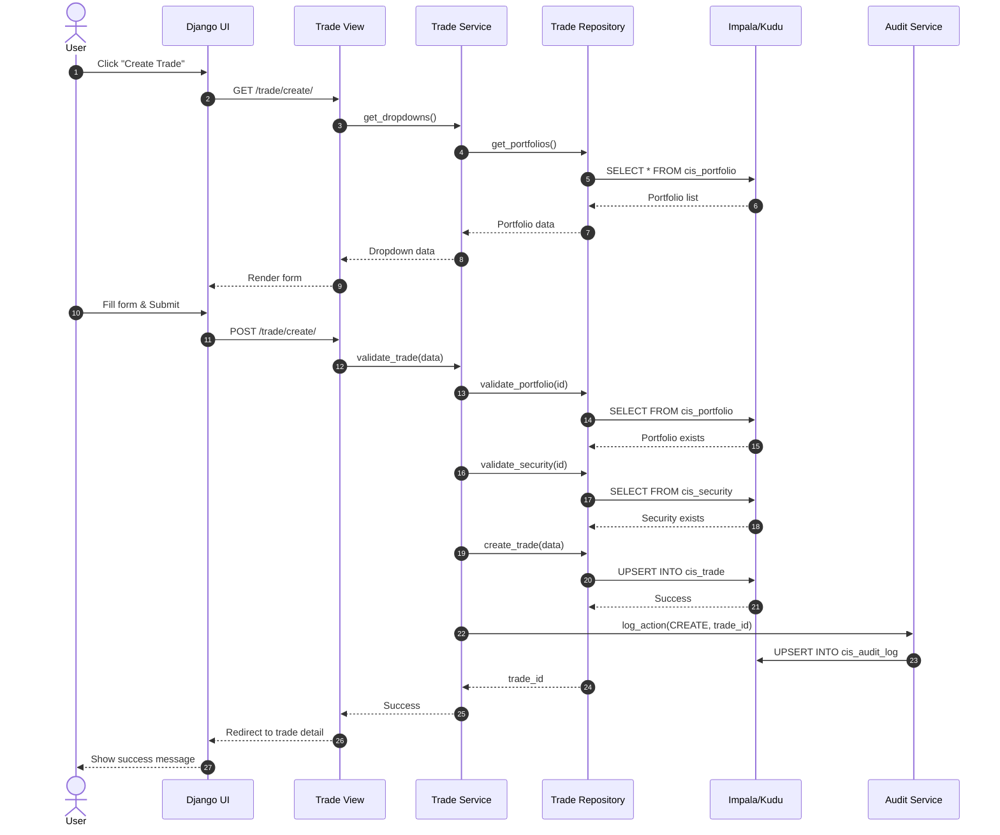

---

## 2. Maker-Checker Workflow (Four-Eyes Principle)

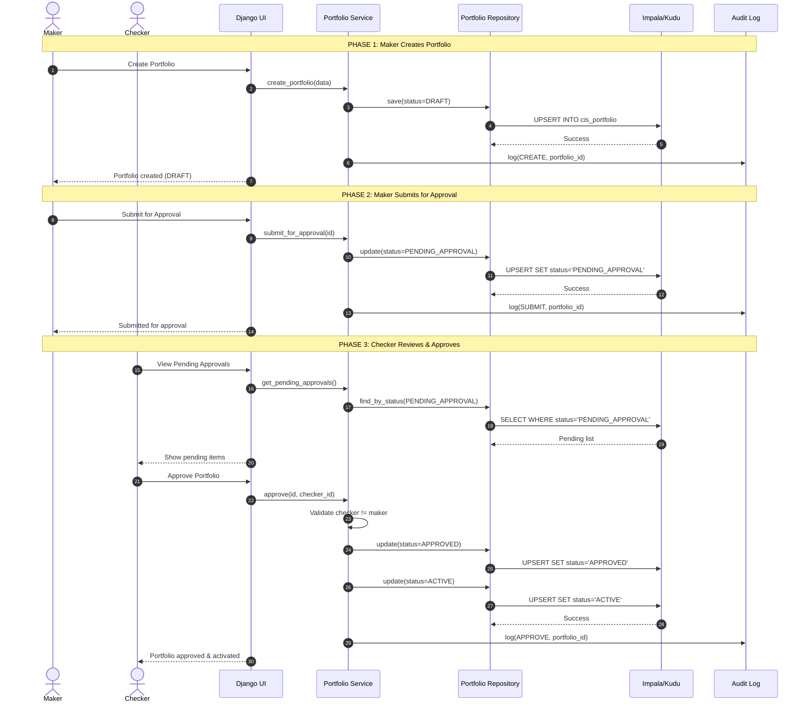

---

## 3. Hive REST Proxy Flow (CML Environment)

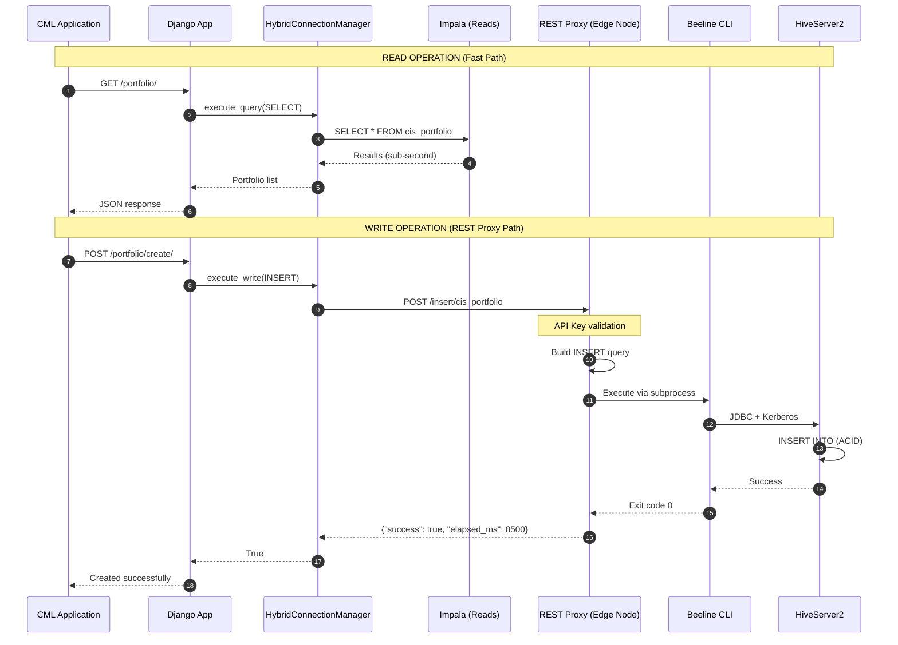

---

## 4. User Authentication & ACL Flow

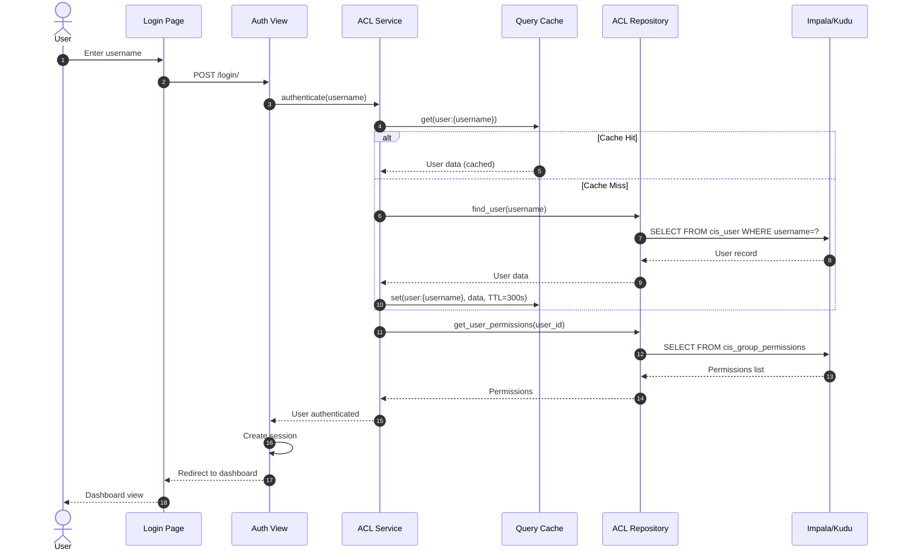

---

## 5. Audit Logging Flow (Async)

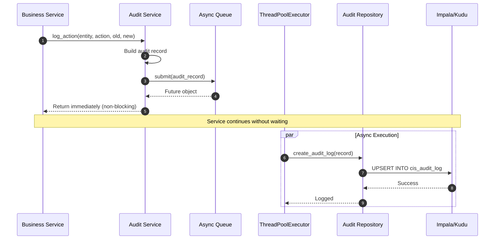

---

## 6. Trade Position Calculation Flow

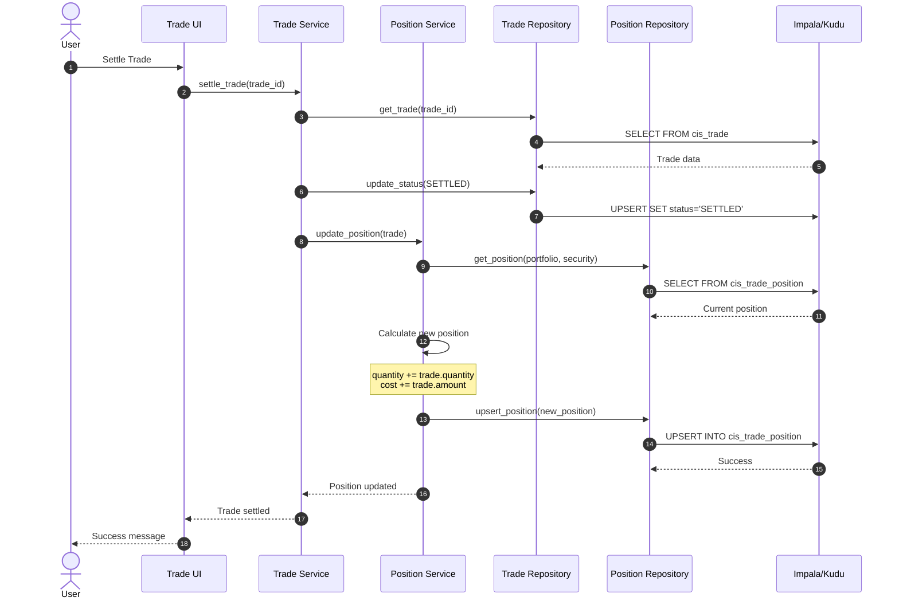

---

## 7. Market Data Update Flow (FX Rate)

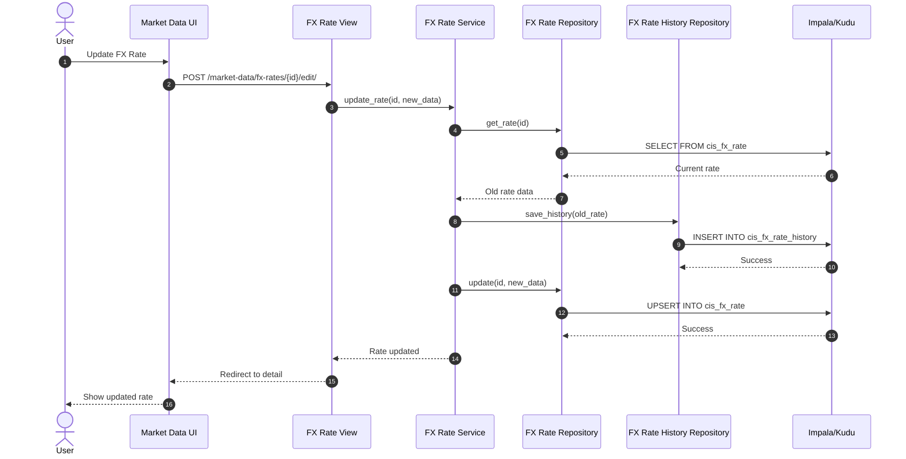

---

## 8. Connection Pool Management

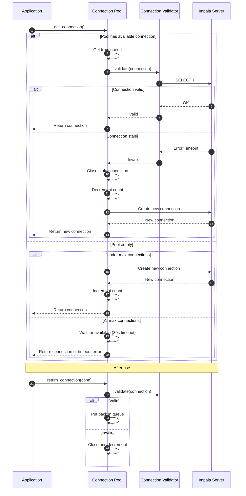

---

## How to Use in Confluence

### Option 1: Mermaid Macro (if installed)
1. Edit your Confluence page
2. Type `/mermaid` or insert "Mermaid" macro
3. Paste the diagram code (without the ```mermaid wrapper)
4. Save

### Option 2: Mermaid Plugin
1. Install "Mermaid Diagrams for Confluence" from Atlassian Marketplace
2. Add Mermaid macro to page
3. Paste diagram code

### Option 3: Export as Image
1. Go to https://mermaid.live/
2. Paste the diagram code
3. Download as PNG/SVG
4. Upload image to Confluence

### Option 4: Draw.io Integration
1. Use Confluence's built-in Draw.io integration
2. Create diagrams manually based on the flows above

---

## 9. Portfolio CRUD Flow

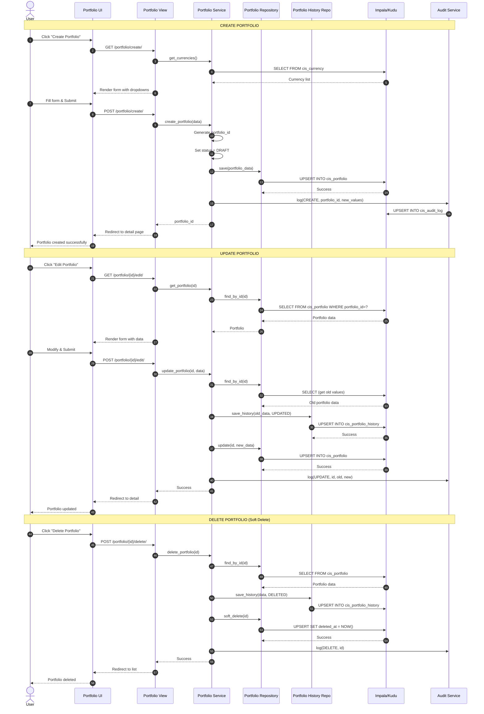

---

## 10. Security Master CRUD Flow

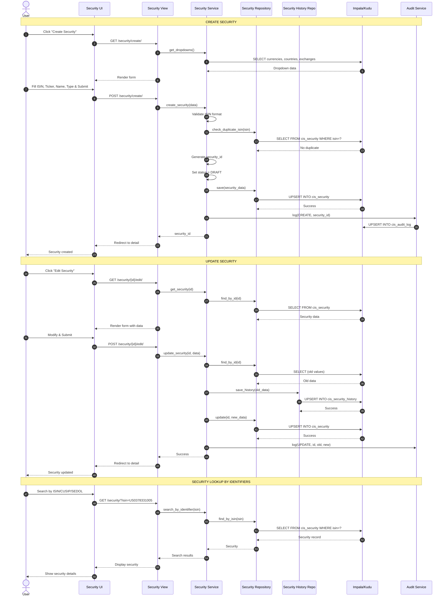

---

## 11. Counterparty (Party) CRUD Flow

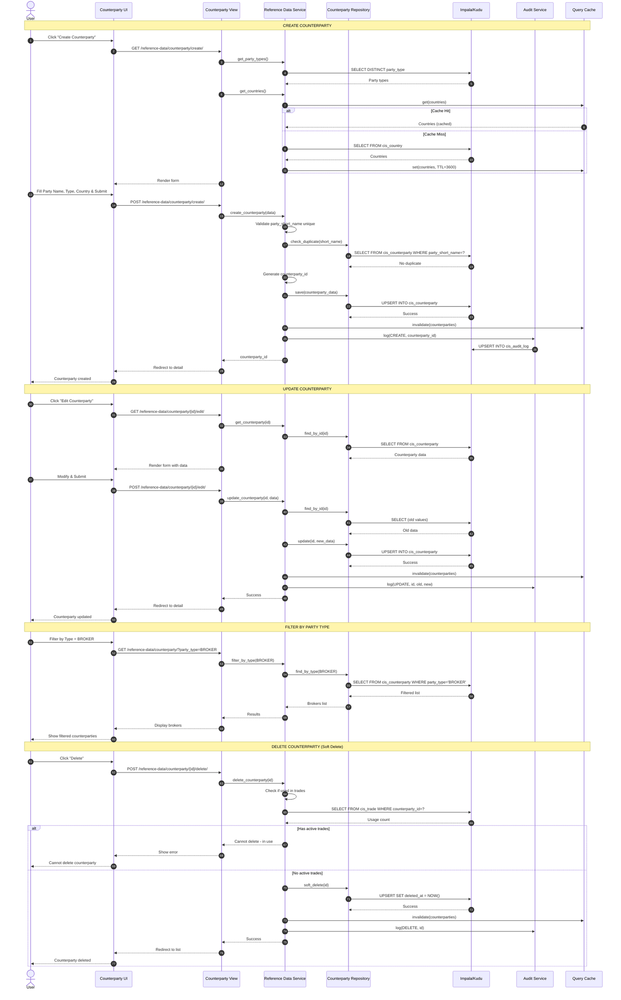

---

## 12. Equity Price CRUD Flow

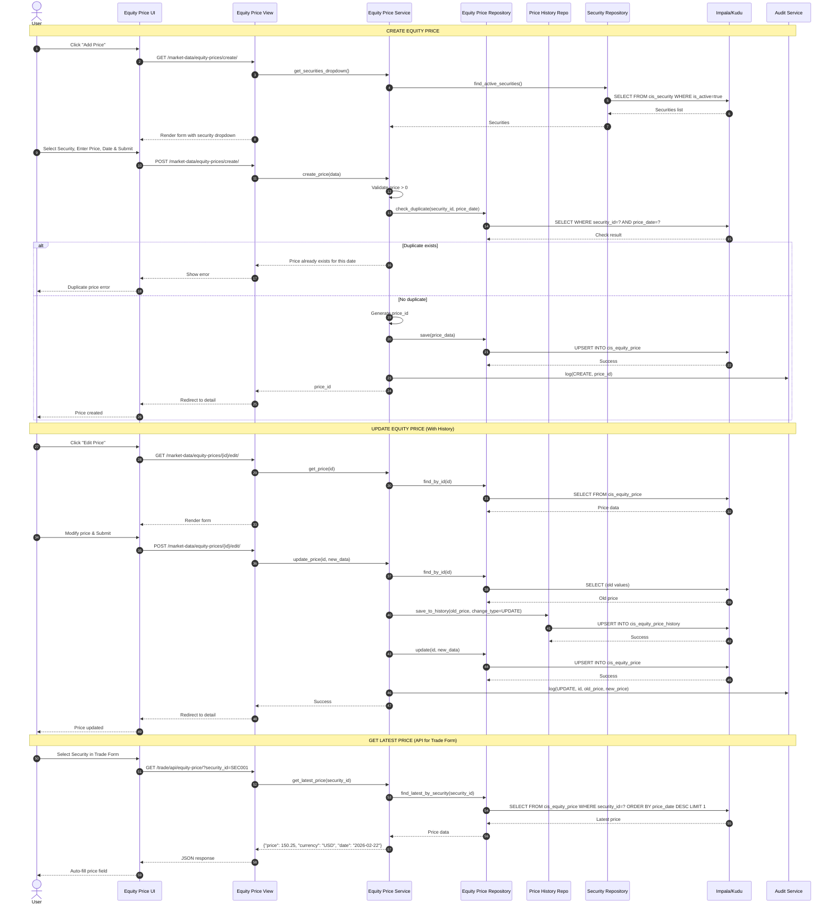

---

*Created for CIS Trade Hive Project*
*Date: February 2026*
