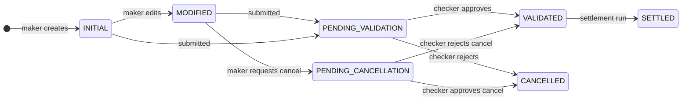

# CIS Trade Hive — Architecture Visual Summary

> Markdown companion to the interactive architecture page (Claude Docs artifact). Copy into Confluence
> as a page under **02 — System Architecture**, or keep standalone. For the animated/interactive version,
> see the linked artifact in the team's shared workspace.

CIS Trade Hive is a Django trade-management platform for portfolios, trades and positions under a
maker-checker control, running as a **Cloudera CML Application** with no relational database of its
own: every read and write is raw SQL against **Apache Kudu**, reached through **Impala** and **Hive**
under **Ranger**.

---

## 1. Request & write path

One request, traced end to end: the browser talks only to Django; Django never talks to Kudu directly —
every path runs through Impala (reads) or Hive (writes), and every one of those hops is gated by Ranger
against a shared service account, not the signed-in person.

```
Browser
  │ HTTPS
  ▼
┌─────────────────────────── Cloudera CML Application ───────────────────────────┐
│  Django views  →  Services (business logic, four-eyes)  →  Kudu repositories   │
│         │                        │ enqueues                                    │
│         │                        ▼                                             │
│         │              Position queue worker (async, 4 threads, 10s poll)      │
│         │                        │                                             │
│         ▼                        ▼                                             │
│   reads · Impala           writes · Hive ACID          scheduled batch jobs    │
└─────────────────┬───────────────────┬───────────────────────┬─────────────────┘
                   ▼                   ▼                       ▼
              ┌───────────────────────────────────────────────────┐
              │        Apache Ranger (own_cis_svc / un_cis_svc)    │
              │   sees the service account only, never the user    │
              └───────────────────────┬───────────────┬───────────┘
                                       ▼               ▼
                              Apache Kudu          HDFS (upload/export files)
                    cis_trade · cis_position · cis_portfolio · cis_audit_log
```

Every arrow into Ranger carries the app's own Kerberos ticket for a shared service account — CIS's own
RBAC (who a person is) is enforced one layer up, in the services above, not by Ranger.

---

## 2. Hosting & the CDP surface

| Component | Role |
|---|---|
| **Cloudera CML** | Application host. Injects `CDSW_APP_PORT` at boot; `scripts/cml_startup.sh` reads it and starts Django + the position worker together as one unit. |
| **Apache Kudu** | System of record for every table — trades, positions, portfolios, audit log. No SQLite, MySQL or Django ORM anywhere in the business path. |
| **Impala** | Read path. Fast SQL reads against Kudu. `NOSASL` locally, Kerberos (`GSSAPI`) in SIT/UAT/PROD/DR. |
| **Hive** | Write path. ACID INSERT/UPDATE/DELETE via `beeline`. Separate connection pool and DB name (`mrw_ima`) from Impala's. |
| **HDFS** | File layer backing the upload/export pipeline and the Kudu backup/restore tooling used for DR. |
| **Apache Ranger** | Single enforcement point. Gates every table/path by Linux service account (`own_cis_svc`, `un_cis_svc`) — never sees an individual CIS user. |

---

## 3. Environments

One switch decides everything: `CIS_ENV`, read in `config/environments.py`.

| `CIS_ENV` | Impala / Hive host | Auth | Notes |
|---|---|---|---|
| `LOCAL` | `localhost` | NOSASL | Docker Kudu/Impala container, no Kerberos. |
| `SIT` | `lxmrwtsgyodt1.sg.uobnet.com` | GSSAPI | TST.UOBNET.COM realm. |
| `UAT` | `lxmrwtsgvqk2.sg.uobnet.com` | GSSAPI | SG.UOBNET.COM realm. |
| `PROD` | `lxmrwtsgvqk2.sg.uobnet.com` | GSSAPI | Same host as UAT — separation is by DB/schema, confirm before assuming isolation. |
| `DR` | `lxmrwtsgvqk2.sg.uobnet.com` | GSSAPI | See known issues — sync tooling only partly re-verified. |

---

## 4. Four-eyes: the state every trade moves through

A maker cannot validate, settle or cancel-approve their own record — enforced by the `can_act` template
tag, not the view.



---

## 5. Django apps

Every app follows the same layering: `*_kudu_repository.py` → `*_service.py` → views → templates.

| App | Files | Responsibility |
|---|---|---|
| `core` | 71 | Connection pooling, auth, audit, RBAC, error views. |
| `trade` | 51 | Trade lifecycle, positions, settlements, cash flows — the busiest app. |
| `portfolio` | 20 | Portfolio master data, its own maker-checker flow. |
| `reference_data` | 33 | Corporate actions, counterparties, static reference tables. |
| `market_data` | 23 | Equity price ingestion, pricing UDFs. |
| `udf` | 27 | Custom Impala/Hive UDFs and their tables. |
| `security` | 16 | Security master/reference data. |
| `upload` | 13 | Excel/CSV ingestion into Kudu. |
| `query_builder` | 15 | Ad-hoc / reporting query construction. |
| `lookup` | 7 | Shared dropdown/lookup values. |

---

## 6. Scheduled & batch jobs

Run outside the request cycle. A Python-3.6 fork of several lives under `edge_jobs_py36/` for an older
cluster runtime — a fix in one copy needs checking against the other.

| Job | Does | Watch for |
|---|---|---|
| `process_approved_cashflows` | Applies approved corporate-action cash flows to positions. | stable |
| `refresh_positions` | EOD/CORR batch recompute; self-heals stale duplicate rows. | stable |
| `process_settlements` | Settlement-date processing (T+0/T+1/backdated). | stable |
| `position_worker` | Async position queue — started with Django by `cml_startup.sh`. | stable |
| `upload_amsiceq_positions` | One-off Excel position upload. | **no dedup — don't re-run** |
| `process_corporate_actions` | Ingest/sync corporate action events. | stable |

---

## 7. Known issues, as of September 2026

- **🔴 Critical — CML/LDAP login accepts any LANID, no password check.** `LoginView.post` never verifies
  a credential — anyone who knows a colleague's LANID can log in as them. Fix agreed (trust CML's own
  proxy header) but blocked on live CML access to confirm the header name.
- **🟡 Unresolved — Pending Settlement page blank in UAT.** Two real bugs fixed along the way; the page
  still shows 0 rows against a live retest. Root cause not yet found — don't re-derive from scratch.
- **🟡 Data integrity — `position_id` generated by two algorithms.** Most paths hash deterministically
  and UPDATE in place; `upload_amsiceq_positions.py` and a legacy path in `refresh_positions.py` still
  mint timestamp+UUID ids with no natural-key lookup — a live duplicate was confirmed and awaits manual
  cleanup.
- **🟢 Partially verified — DR backup/restore tooling.** Full backup/restore confirmed on real PROD/DR
  clusters. Dynamic-partition restore, `--latest` auto-discovery and multi-table support are shipped but
  not yet re-verified live.

---

Full 18-page reference: `cis_trade_hive/docs/confluence/` · Support runbook: `12_sre_support_handover.md`
