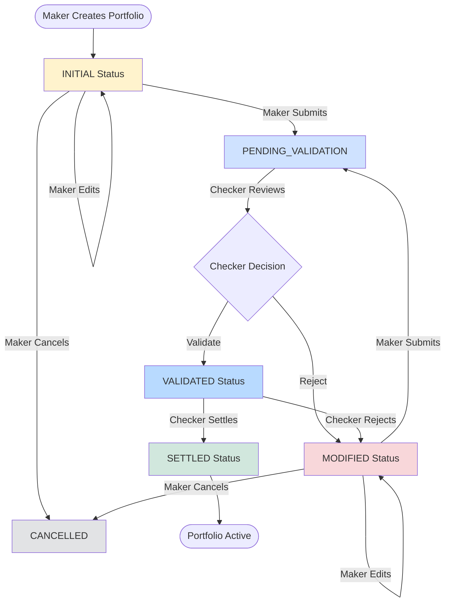
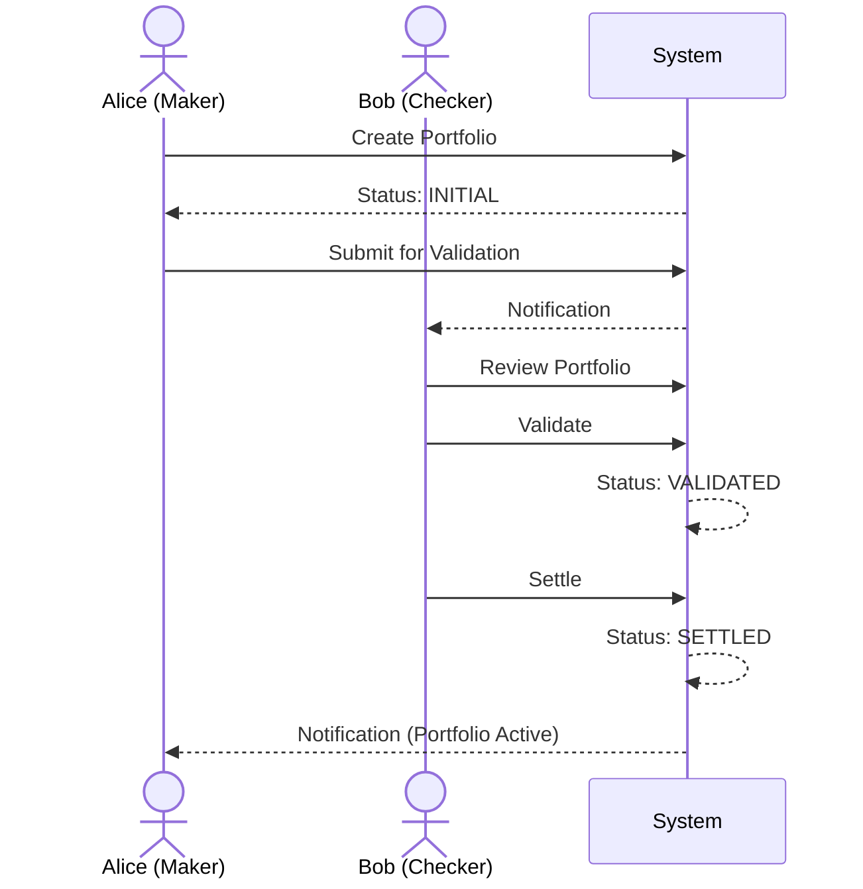
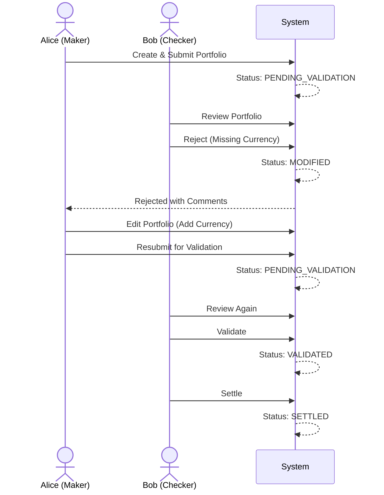
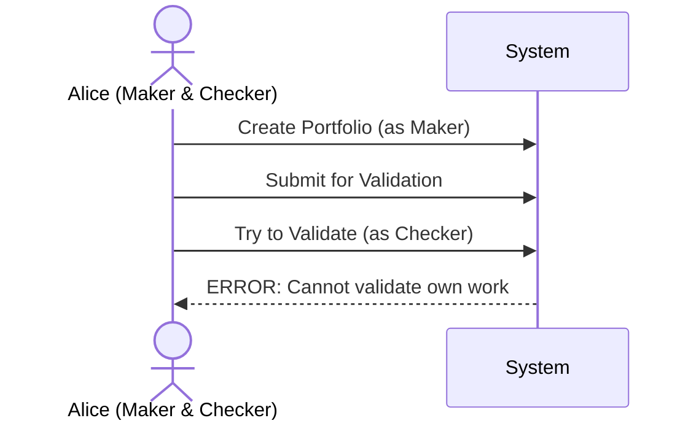

# Four-Eyes Workflow Guide

## What is the Four-Eyes Principle?

The **Four-Eyes Principle** (also known as **Maker-Checker** workflow) is a security and compliance mechanism that requires two different people to authorize critical operations. This prevents fraud, errors, and ensures data integrity.

!!! info "Key Rule"
    **No single person can both create AND approve a change.**

    - **Maker** = Creates/edits data
    - **Checker** = Reviews, validates, and settles

    The Maker and Checker must be **different people**.

---

## Why Four-Eyes?

### Benefits

:material-shield-check:{ .success } **Fraud Prevention** - No single person can make unauthorized changes

:material-bug-check:{ .success } **Error Detection** - Second pair of eyes catches mistakes

:material-file-check:{ .success } **Compliance** - Meets regulatory requirements for financial systems

:material-history:{ .success } **Audit Trail** - Complete record of who did what and when

---

## Roles and Responsibilities

### Maker Role

**Who**: Users in the **Makers** group

**Responsibilities**:
- Create new portfolios, UDFs, and other entities
- Edit existing items (in INITIAL or MODIFIED status only)
- Submit items for validation
- View their own submissions

**Cannot**:
- Validate their own work
- Settle any portfolio they created or edited
- Directly activate portfolios

**Typical Tasks**:
- :material-plus: Create new portfolio
- :material-pencil: Edit draft portfolio
- :material-send: Submit for validation
- :material-eye: View submission status

---

### Checker Role

**Who**: Users in the **Checkers** group

**Responsibilities**:
- Review pending submissions
- Validate submissions (first approval step)
- Settle validated portfolios (final approval step)
- Reject submissions with issues (must provide comments)
- Ensure data quality and compliance

**Cannot**:
- Validate portfolios they created
- Edit portfolios directly
- Submit portfolios for validation

**Typical Tasks**:
- :material-clipboard-check: Review pending validations
- :material-check: Validate submissions
- :material-check-all: Settle validated portfolios
- :material-close: Reject with comments
- :material-comment: Provide feedback

---

## The Workflow Process

### Complete Workflow Diagram

```mermaid
graph TD
    Start([Maker Creates Portfolio]) --> Initial[INITIAL Status]
    Initial --> |Maker Edits| Initial
    Initial --> |Maker Submits| Pending[PENDING_VALIDATION]
    Initial --> |Maker Cancels| Cancelled[CANCELLED]

    Pending --> |Checker Reviews| Decision{Checker Decision}

    Decision --> |Validate| Validated[VALIDATED Status]
    Decision --> |Reject| Modified[MODIFIED Status]

    Validated --> |Checker Settles| Settled[SETTLED Status]
    Validated --> |Checker Rejects| Modified

    Modified --> |Maker Edits| Modified
    Modified --> |Maker Submits| Pending
    Modified --> |Maker Cancels| Cancelled

    Settled --> End([Portfolio Active])

    style Initial fill:#fff3cd
    style Pending fill:#cfe2ff
    style Validated fill:#b8daff
    style Settled fill:#d1e7dd
    style Modified fill:#f8d7da
    style Cancelled fill:#e2e3e5
```

### Step-by-Step Process

#### Step 1: Maker Creates (INITIAL)

1. Maker logs into CisTrade
2. Navigates to Portfolios → Create New
3. Fills in all required fields
4. Clicks "Create Portfolio"
5. **Result**: Portfolio saved with status = **INITIAL**

!!! success "Initial Status"
    Portfolio is saved but not yet active. It remains in INITIAL until submitted for validation.

---

#### Step 2: Maker Edits (Optional)

1. Maker can edit INITIAL or MODIFIED portfolio as many times as needed
2. Make changes and click "Update Portfolio"
3. Status remains **INITIAL** or **MODIFIED**

!!! tip "Review Before Submitting"
    Take your time to review all details before submission. Once submitted, you cannot edit until it's validated/settled or rejected.

---

#### Step 3: Maker Submits for Validation

1. Maker opens the portfolio
2. Reviews all details one final time
3. Clicks **Submit for Validation**
4. Confirms the submission
5. **Result**: Portfolio status changes to **PENDING_VALIDATION**

!!! warning "Cannot Edit After Submission"
    Once submitted, the Maker cannot edit the portfolio until it's either:
    - Settled (becomes SETTLED - cannot edit)
    - Rejected (becomes MODIFIED - can edit and resubmit)

---

#### Step 4: Checker Validates

1. Checker navigates to **Pending Validations**
2. Sees list of all portfolios awaiting validation
3. Opens portfolio to review details
4. Checks for:
    - Correct data entry
    - Completeness
    - Business logic compliance
    - No duplicates
5. Clicks **Validate** button
6. **Result**: Portfolio status changes to **VALIDATED**

---

#### Step 5: Checker Settles

1. Checker reviews the validated portfolio
2. Confirms final approval
3. Clicks **Settle** button
4. **Result**: Portfolio status changes to **SETTLED**

!!! success "Portfolio Activated"
    The portfolio is now active and can be used for transactions.

---

#### Alternative: Checker Rejects

If issues are found during validation or before settlement:

=== "Reject During Validation"

    **When to Reject:**
    - Data errors found
    - Missing information
    - Policy violations
    - Duplicate portfolio
    - Invalid business case

    **How to Reject:**
    1. Click **Reject** button
    2. **Required**: Enter rejection comments explaining what needs to be fixed
    3. Click confirm
    4. **Result**: Portfolio status → **MODIFIED**

    !!! warning "Comments Required"
        You must provide detailed comments explaining why the portfolio was rejected. This helps the Maker fix the issues.

=== "Reject After Validation"

    Even after validation, the Checker can reject before settlement if issues are discovered:

    1. Review validated portfolio again
    2. Click **Reject** button
    3. Enter rejection reason
    4. **Result**: Portfolio status → **MODIFIED**

---

#### Step 6a: If Settled

1. Portfolio status = **SETTLED**
2. Maker receives notification
3. Portfolio can now be used
4. Portfolio cannot be edited

---

#### Step 6b: If Rejected

1. Portfolio status = **MODIFIED**
2. Maker receives notification with Checker's comments
3. Maker can:
    - Edit the portfolio to fix issues
    - Resubmit for validation
4. Workflow starts again from Step 3

---

## Workflow States

### State Transition Table

| Current Status | Who Can Act | Available Actions | Next Status |
|----------------|-------------|-------------------|-------------|
| **INITIAL** | Maker | Edit, Submit, Cancel | INITIAL (edit), PENDING_VALIDATION (submit), CANCELLED (cancel) |
| **PENDING_VALIDATION** | Checker | Validate, Reject | VALIDATED (validate), MODIFIED (reject) |
| **VALIDATED** | Checker | Settle, Reject | SETTLED (settle), MODIFIED (reject) |
| **MODIFIED** | Maker | Edit, Submit, Cancel | MODIFIED (edit), PENDING_VALIDATION (submit), CANCELLED (cancel) |
| **SETTLED** | - | None (final state) | - |
| **CANCELLED** | - | None (final state) | - |

---

## Two-Step Approval Process

### Why Two Steps?

The CisTrade Four-Eyes workflow implements a **two-step approval process**:

1. **Validation**: Checker confirms the data is accurate and complete
2. **Settlement**: Checker activates the portfolio for use

### Benefits of Two-Step Approval

- **Additional Control**: Provides a checkpoint between validation and activation
- **Flexibility**: Different Checkers can perform validation and settlement
- **Error Recovery**: Issues found after validation can still be rejected before settlement
- **Audit Clarity**: Clear distinction between "data approved" and "portfolio activated"

### Same or Different Checkers?

- The **same Checker** can perform both validation and settlement
- **Different Checkers** can split the responsibility
- System allows flexibility based on organizational needs

---

## Common Scenarios

### Scenario 1: First Time Submission - Approved

```mermaid
sequenceDiagram
    actor Alice as Alice (Maker)
    actor Bob as Bob (Checker)
    participant System

    Alice->>System: Create Portfolio
    System-->>Alice: Status: INITIAL
    Alice->>System: Submit for Validation
    System-->>Bob: Notification
    Bob->>System: Review Portfolio
    Bob->>System: Validate
    System-->>System: Status: VALIDATED
    Bob->>System: Settle
    System-->>System: Status: SETTLED
    System-->>Alice: Notification (Portfolio Active)
```

**Timeline**:
1. Monday 9:00 AM - Alice creates portfolio (INITIAL)
2. Monday 9:15 AM - Alice submits for validation (PENDING_VALIDATION)
3. Monday 10:00 AM - Bob validates (VALIDATED)
4. Monday 10:05 AM - Bob settles (SETTLED)
5. Portfolio is now active

---

### Scenario 2: Submission Rejected, Fixed, Re-approved

```mermaid
sequenceDiagram
    actor Alice as Alice (Maker)
    actor Bob as Bob (Checker)
    participant System

    Alice->>System: Create & Submit Portfolio
    System-->>System: Status: PENDING_VALIDATION
    Bob->>System: Review Portfolio
    Bob->>System: Reject (Missing Currency)
    System-->>System: Status: MODIFIED
    System-->>Alice: Rejected with Comments
    Alice->>System: Edit Portfolio (Add Currency)
    Alice->>System: Resubmit for Validation
    System-->>System: Status: PENDING_VALIDATION
    Bob->>System: Review Again
    Bob->>System: Validate
    System-->>System: Status: VALIDATED
    Bob->>System: Settle
    System-->>System: Status: SETTLED
```

**Timeline**:
1. Monday 9:00 AM - Alice creates and submits portfolio
2. Monday 10:00 AM - Bob rejects (missing currency field) → MODIFIED
3. Monday 11:00 AM - Alice fixes and resubmits → PENDING_VALIDATION
4. Monday 2:00 PM - Bob validates → VALIDATED
5. Monday 2:05 PM - Bob settles → SETTLED

---

### Scenario 3: Cannot Self-Approve (Violation)

```mermaid
sequenceDiagram
    actor Alice as Alice (Maker & Checker)
    participant System

    Alice->>System: Create Portfolio (as Maker)
    Alice->>System: Submit for Validation
    Alice->>System: Try to Validate (as Checker)
    System-->>Alice: ERROR: Cannot validate own work
```

!!! danger "Four-Eyes Violation"
    The system prevents users from validating their own submissions, even if they have Checker permissions.

---

## Approval Queue Management

### For Checkers: Managing Pending Validations

#### View Pending Items

1. Click **Pending Validations** button (shows count badge)
2. See list of all items awaiting validation
3. Items sorted by submission date (oldest first)

#### Review Priority

!!! tip "Prioritization Tips"
    - Review oldest items first
    - Check urgent items (flagged by Makers)
    - Review high-value portfolios with extra care

#### Workflow Queue

Checkers have two queues to manage:
1. **Pending Validation**: Items awaiting initial validation
2. **Pending Settlement**: Validated items awaiting settlement

---

## Notifications and Alerts

### Maker Notifications

You receive notifications when:
- Your submission is **validated** (ready for settlement)
- Your submission is **settled** (now active)
- Your submission is **rejected** (with comments)
- Your submission is taking longer than expected

### Checker Notifications

You receive notifications when:
- New items are submitted for validation
- Items are awaiting validation for > 24 hours
- Validated items are awaiting settlement

---

## Best Practices

### For Makers

!!! tip "Maker Best Practices"
    - **Review before submitting** - Double-check all fields
    - **Provide clear descriptions** - Help Checkers understand your intent
    - **Fix rejections quickly** - Address Checker comments promptly
    - **Use INITIAL status** - Save work in progress, submit when complete
    - **Communicate with Checkers** - If urgent, notify them separately

### For Checkers

!!! tip "Checker Best Practices"
    - **Review promptly** - Don't let items sit in queue
    - **Provide detailed rejection comments** - Help Makers fix issues
    - **Check for duplicates** - Search before validating
    - **Validate business logic** - Ensure data makes sense
    - **Don't rubber-stamp** - Take time to review carefully
    - **Complete the workflow** - Remember to settle after validating

---

## Audit Trail

Every action in the Four-Eyes workflow is logged:

### What is Logged

| Action | Information Captured |
|--------|---------------------|
| Create | Who created, when, initial values |
| Edit | Who edited, when, what changed |
| Submit | Who submitted, when |
| Validate | Who validated, when, comments |
| Settle | Who settled, when |
| Reject | Who rejected, when, rejection reason |
| Cancel | Who cancelled, when, cancellation reason |

### Viewing Audit History

1. Open any portfolio detail page
2. Scroll to **Workflow Information** section
3. See complete history:
    - Created by (user, timestamp)
    - Updated by (user, timestamp)
    - Submitted by (user, timestamp)
    - Validated by (user, timestamp)
    - Settled by (user, timestamp)
    - Or Rejected by (user, timestamp, comments)

---

## Compliance and Regulations

### Why Four-Eyes is Required

CisTrade implements Four-Eyes workflow to comply with:

- **SOX (Sarbanes-Oxley)** - Financial controls and audit trails
- **Internal Audit Requirements** - Separation of duties
- **Risk Management** - Fraud prevention and error detection
- **Basel III** - Operational risk controls (for financial institutions)

### Evidence for Auditors

The system provides:
- Complete audit logs in Kudu database
- Timestamped actions with user identification
- Inability to self-approve (system-enforced)
- Immutable history (cannot be deleted or modified)
- Two-step approval process documentation

---

## Troubleshooting

### Problem: Cannot Find Validate Button

**Cause**: You may be viewing your own submission

**Solution**: Only **different users** can validate. If you created the portfolio, you cannot validate it. Ask a colleague who is a Checker to review.

---

### Problem: Submit Button Grayed Out

**Cause**: Portfolio may not be in INITIAL or MODIFIED status

**Solution**: Check portfolio status. Only INITIAL and MODIFIED portfolios can be submitted.

---

### Problem: Cannot Settle Portfolio

**Cause**: Portfolio has not been validated yet

**Solution**: The portfolio must be in VALIDATED status before it can be settled. Validate first, then settle.

---

### Problem: Rejection Comments Not Clear

**Cause**: Checker provided minimal feedback

**Solution**: Contact the Checker directly for clarification before editing and resubmitting.

---

### Problem: Urgent Approval Needed

**Solution**:
1. Submit the portfolio normally
2. Contact a Checker directly (email, phone, chat)
3. Ask them to review urgently
4. Provide business justification for urgency

!!! warning "No Express Lane"
    There is no way to bypass the Four-Eyes workflow, even for urgent items. Plan ahead and submit early.

---

## FAQs

??? question "Can I validate if I'm both a Maker and a Checker?"
    No. Even if you have both roles, you cannot validate or settle portfolios you created. The system enforces the Four-Eyes rule.

??? question "What if the Checker is on vacation?"
    Any Checker can validate and settle any pending item. If your usual Checker is unavailable, another Checker can approve.

??? question "Can I withdraw a submission?"
    No. Once submitted, the item must be either validated/settled or rejected by a Checker. Contact a Checker if you need to withdraw.

??? question "How long should approvals take?"
    Best practice: Checkers should review within 24 hours. Items pending > 48 hours should be escalated.

??? question "Can I see who validated my portfolio?"
    Yes. Open the portfolio detail page and check the **Workflow Information** section.

??? question "What happens if I reject without comments?"
    The system requires rejection comments. You cannot reject without providing a reason.

??? question "Can I edit a settled portfolio?"
    No. Once validated and settled, portfolios cannot be edited. You would need to cancel it (if possible) and create a new one with the changes.

??? question "Why are there two steps (Validate and Settle)?"
    The two-step process provides additional control. Validation confirms data accuracy, while settlement activates the portfolio. This allows catching issues even after initial approval.

??? question "Can different Checkers validate and settle?"
    Yes. The system allows flexibility - the same Checker can do both, or different Checkers can split the responsibility.

---

## Development Mode Note

!!! warning "DEV MODE - Four-Eyes Partially Disabled"
    The system is currently in **Development Mode** where:

    - All users can create portfolios
    - All users can validate (even their own - for testing)
    - Permission checks are bypassed

    **In Production**, the full Four-Eyes workflow will be enforced:
    - Only Makers can create
    - Only Checkers can validate and settle
    - Users cannot approve their own work (strictly enforced)

---

## Related Topics

- [Portfolio Management](portfolio-management.md) - How to create and manage portfolios
- [UDF Management](udf-management.md) - Four-Eyes for UDF definitions
- [Business Processes](../integration/business-processes.md) - Complete process flows

---

## Need Help?

!!! question "Questions?"
    - **In-App Help**: Click the Help (?) button
    - **Email**: [cistrade-support@yourcompany.com](mailto:cistrade-support@yourcompany.com)
    - **Escalation**: Contact your manager for urgent approvals

---

**Last Updated**: 2026-01-12
