# Four-Eyes Workflow Guide

## What is the Four-Eyes Principle?

The **Four-Eyes Principle** (also known as **Maker-Checker** workflow) is a security and compliance mechanism that requires two different people to authorize critical operations. This prevents fraud, errors, and ensures data integrity.

!!! info "Key Rule"
    **No single person can both create AND approve a change.**

    - **Maker** = Creates/edits data
    - **Checker** = Reviews and approves/rejects

    The Maker and Checker must be **different people**.

---

## Why Four-Eyes?

### Benefits

:material-shield-check:{ .success } **Fraud Prevention** - No single person can make unauthorized changes

:material-bug-check:{ .success } **Error Detection** - Second pair of eyes catches mistakes

:material-file-check:{ .success } **Compliance** - Meets regulatory requirements for financial systems

:material-history:{ .success } **Audit Trail** - Complete record of who did what and when

---

## Roles and Responsibilities

### Maker Role

**Who**: Users in the **Makers** group

**Responsibilities**:
- Create new portfolios, UDFs, and other entities
- Edit existing items (in Draft or Rejected status only)
- Submit items for approval
- View their own submissions

**Cannot**:
- Approve their own work
- Approve any portfolio they created or edited
- Directly activate portfolios

**Typical Tasks**:
- :material-plus: Create new portfolio
- :material-pencil: Edit draft portfolio
- :material-send: Submit for approval
- :material-eye: View submission status

---

### Checker Role

**Who**: Users in the **Checkers** group

**Responsibilities**:
- Review pending submissions
- Approve valid submissions
- Reject submissions with issues (must provide comments)
- Ensure data quality and compliance

**Cannot**:
- Approve portfolios they created
- Edit portfolios directly
- Submit portfolios for approval

**Typical Tasks**:
- :material-clipboard-check: Review pending approvals
- :material-check: Approve valid submissions
- :material-close: Reject with comments
- :material-comment: Provide feedback

---

## The Workflow Process

### Complete Workflow Diagram

### Step-by-Step Process

#### Step 1: Maker Creates (Draft)

1. Maker logs into CisTrade
2. Navigates to Portfolios → Create New
3. Fills in all required fields
4. Clicks "Create Portfolio"
5. **Result**: Portfolio saved with status = **Draft**

!!! success "Draft Saved"
    Portfolio is saved but not yet active. It remains in Draft until submitted for approval.

---

#### Step 2: Maker Edits (Optional)

1. Maker can edit Draft portfolio as many times as needed
2. Make changes and click "Update Portfolio"
3. Status remains **Draft**

!!! tip "Review Before Submitting"
    Take your time to review all details before submission. Once submitted, you cannot edit until it's approved or rejected.

---

#### Step 3: Maker Submits for Approval

1. Maker opens the Draft portfolio
2. Reviews all details one final time
3. Clicks **Submit for Approval**
4. Confirms the submission
5. **Result**: Portfolio status changes to **Pending Approval**

!!! warning "Cannot Edit After Submission"
    Once submitted, the Maker cannot edit the portfolio until it's either:
    - Approved (becomes Active - cannot edit)
    - Rejected (can edit and resubmit)

---

#### Step 4: Checker Reviews

1. Checker navigates to **Pending Approvals**
2. Sees list of all portfolios awaiting approval
3. Opens portfolio to review details
4. Checks for:
    - ✅ Correct data entry
    - ✅ Completeness
    - ✅ Business logic compliance
    - ✅ No duplicates

---

#### Step 5: Checker Decision

The Checker has two options:

=== "✅ Approve"

    **When to Approve:**
    - All data is correct
    - No policy violations
    - Portfolio serves a valid business purpose

    **How to Approve:**
    1. Click **Approve** button
    2. Optionally add approval comments
    3. Click confirm
    4. **Result**: Portfolio status → **Active**

    !!! success "Portfolio Activated"
        The portfolio is now active and can be used for transactions.

=== "❌ Reject"

    **When to Reject:**
    - Data errors found
    - Missing information
    - Policy violations
    - Duplicate portfolio
    - Invalid business case

    **How to Reject:**
    1. Click **Reject** button
    2. **Required**: Enter rejection comments explaining what needs to be fixed
    3. Click confirm
    4. **Result**: Portfolio status → **Rejected**

    !!! warning "Comments Required"
        You must provide detailed comments explaining why the portfolio was rejected. This helps the Maker fix the issues.

---

#### Step 6a: If Approved

1. Portfolio status = **Active**
2. Maker receives notification
3. Portfolio can now be used
4. Portfolio cannot be edited (unless closed and recreated)

---

#### Step 6b: If Rejected

1. Portfolio status = **Rejected**
2. Maker receives notification with Checker's comments
3. Maker can:
    - Edit the portfolio to fix issues
    - Resubmit for approval
4. Workflow starts again from Step 3

---

## Workflow States

### State Transition Table

| Current Status | Who Can Act | Available Actions | Next Status |
|----------------|-------------|-------------------|-------------|
| **Draft** | Maker | Edit, Submit | Draft (after edit), Pending Approval (after submit) |
| **Pending Approval** | Checker | Approve, Reject | Active (approve), Rejected (reject) |
| **Active** | Any authorized user | Close | Inactive |
| **Rejected** | Maker | Edit, Resubmit | Draft (after edit), Pending Approval (after resubmit) |
| **Inactive** | Any authorized user | Reactivate | Active |

---

## Common Scenarios

### Scenario 1: First Time Submission - Approved

**Timeline**:
1. Monday 9:00 AM - Alice creates portfolio
2. Monday 9:15 AM - Alice submits for approval
3. Monday 10:00 AM - Bob reviews and approves
4. Portfolio is now Active

---

### Scenario 2: Submission Rejected, Fixed, Re-approved

**Timeline**:
1. Monday 9:00 AM - Alice creates and submits portfolio
2. Monday 10:00 AM - Bob rejects (missing currency field)
3. Monday 11:00 AM - Alice fixes and resubmits
4. Monday 2:00 PM - Bob reviews and approves
5. Portfolio is now Active

---

### Scenario 3: Cannot Self-Approve (Violation)

```mermaid
sequenceDiagram
    actor Alice as Alice (Maker & Checker)
    participant System

    Alice->>System: Create Portfolio (as Maker)
    Alice->>System: Submit for Approval
    Alice->>System: Try to Approve (as Checker)
    System-->>Alice: ❌ ERROR: Cannot approve own work
```

!!! danger "Four-Eyes Violation"
    The system prevents users from approving their own submissions, even if they have Checker permissions.

---

## Approval Queue Management

### For Checkers: Managing Pending Approvals

#### View Pending Items

1. Click **Pending Approvals** button (shows count badge)
2. See list of all items awaiting approval
3. Items sorted by submission date (oldest first)

#### Review Priority

!!! tip "Prioritization Tips"
    - Review oldest items first
    - Check urgent items (flagged by Makers)
    - Review high-value portfolios with extra care

#### Batch Processing

While each item must be individually approved, you can:
- Sort by submitter to review all items from one Maker
- Filter by type (portfolio, UDF, etc.)
- Use search to find specific items

---

## Notifications and Alerts

### Maker Notifications

You receive notifications when:
- ✅ Your submission is **approved**
- ❌ Your submission is **rejected** (with comments)
- 🕒 Your submission is taking longer than expected

### Checker Notifications

You receive notifications when:
- 📥 New items are submitted for your approval
- ⚠️ Items are awaiting approval for > 24 hours

---

## Best Practices

### For Makers

!!! tip "Maker Best Practices"
    ✅ **Review before submitting** - Double-check all fields

    ✅ **Provide clear descriptions** - Help Checkers understand your intent

    ✅ **Fix rejections quickly** - Address Checker comments promptly

    ✅ **Use Draft status** - Save work in progress, submit when complete

    ✅ **Communicate with Checkers** - If urgent, notify them separately

### For Checkers

!!! tip "Checker Best Practices"
    ✅ **Review promptly** - Don't let items sit in queue

    ✅ **Provide detailed rejection comments** - Help Makers fix issues

    ✅ **Check for duplicates** - Search before approving

    ✅ **Validate business logic** - Ensure data makes sense

    ✅ **Don't rubber-stamp** - Take time to review carefully

---

## Audit Trail

Every action in the Four-Eyes workflow is logged:

### What is Logged

| Action | Information Captured |
|--------|---------------------|
| Create | Who created, when, initial values |
| Edit | Who edited, when, what changed |
| Submit | Who submitted, when |
| Approve | Who approved, when, comments |
| Reject | Who rejected, when, rejection reason |

### Viewing Audit History

1. Open any portfolio detail page
2. Scroll to **Workflow Information** section
3. See complete history:
    - Created by (user, timestamp)
    - Updated by (user, timestamp)
    - Submitted by (user, timestamp)
    - Approved/Rejected by (user, timestamp, comments)

---

## Compliance and Regulations

### Why Four-Eyes is Required

CisTrade implements Four-Eyes workflow to comply with:

- **SOX (Sarbanes-Oxley)** - Financial controls and audit trails
- **Internal Audit Requirements** - Separation of duties
- **Risk Management** - Fraud prevention and error detection
- **Basel III** - Operational risk controls (for financial institutions)

### Evidence for Auditors

The system provides:
- Complete audit logs in Kudu database
- Timestamped actions with user identification
- Inability to self-approve (system-enforced)
- Immutable history (cannot be deleted or modified)

---

## Troubleshooting

### Problem: Cannot Find Approve Button

**Cause**: You may be viewing your own submission

**Solution**: Only **different users** can approve. If you created the portfolio, you cannot approve it. Ask a colleague who is a Checker to review.

---

### Problem: Submit Button Grayed Out

**Cause**: Portfolio may not be in Draft status

**Solution**: Check portfolio status. Only Draft portfolios can be submitted. If Rejected, edit first, then submit.

---

### Problem: Rejection Comments Not Clear

**Cause**: Checker provided minimal feedback

**Solution**: Contact the Checker directly for clarification before editing and resubmitting.

---

### Problem: Urgent Approval Needed

**Solution**:
1. Submit the portfolio normally
2. Contact a Checker directly (email, phone, chat)
3. Ask them to review urgently
4. Provide business justification for urgency

!!! warning "No Express Lane"
    There is no way to bypass the Four-Eyes workflow, even for urgent items. Plan ahead and submit early.

---

## FAQs

??? question "Can I approve if I'm both a Maker and a Checker?"
    No. Even if you have both roles, you cannot approve portfolios you created. The system enforces the Four-Eyes rule.

??? question "What if the Checker is on vacation?"
    Any Checker can approve any pending item. If your usual Checker is unavailable, another Checker can approve.

??? question "Can I withdraw a submission?"
    Currently, no. Once submitted, the item must be either approved or rejected by a Checker. Contact a Checker if you need to withdraw.

??? question "How long should approvals take?"
    Best practice: Checkers should review within 24 hours. Items pending > 48 hours should be escalated.

??? question "Can I see who approved my portfolio?"
    Yes. Open the portfolio detail page and check the **Workflow Information** section.

??? question "What happens if I reject without comments?"
    The system requires rejection comments. You cannot reject without providing a reason.

??? question "Can I edit an approved portfolio?"
    No. Once approved and active, portfolios cannot be edited. You would need to close it and create a new one with the changes.

---

## Development Mode Note

!!! warning "DEV MODE - Four-Eyes Partially Disabled"
    The system is currently in **Development Mode** where:

    - All users can create portfolios
    - All users can approve (even their own - for testing)
    - Permission checks are bypassed

    **In Production**, the full Four-Eyes workflow will be enforced:
    - Only Makers can create
    - Only Checkers can approve
    - Users cannot approve their own work (strictly enforced)

---

## Related Topics

- [Portfolio Management](portfolio-management.md) - How to create and manage portfolios
- [UDF Management](udf-management.md) - Four-Eyes for UDF definitions
- [Business Processes](../integration/business-processes.md) - Complete process flows

---

## Need Help?

!!! question "Questions?"
    - **In-App Help**: Click the Help (?) button
    - **Email**: [cistrade-support@yourcompany.com](mailto:cistrade-support@yourcompany.com)
    - **Escalation**: Contact your manager for urgent approvals

---

**Last Updated**: 2025-12-27
