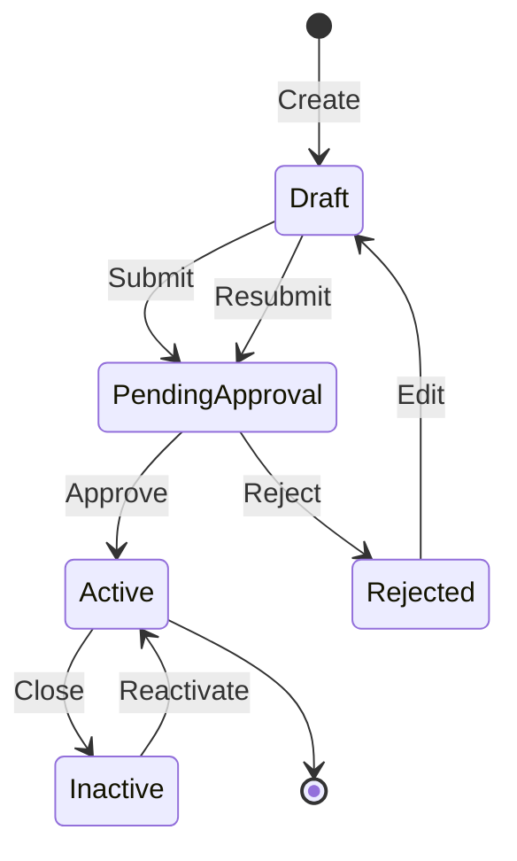
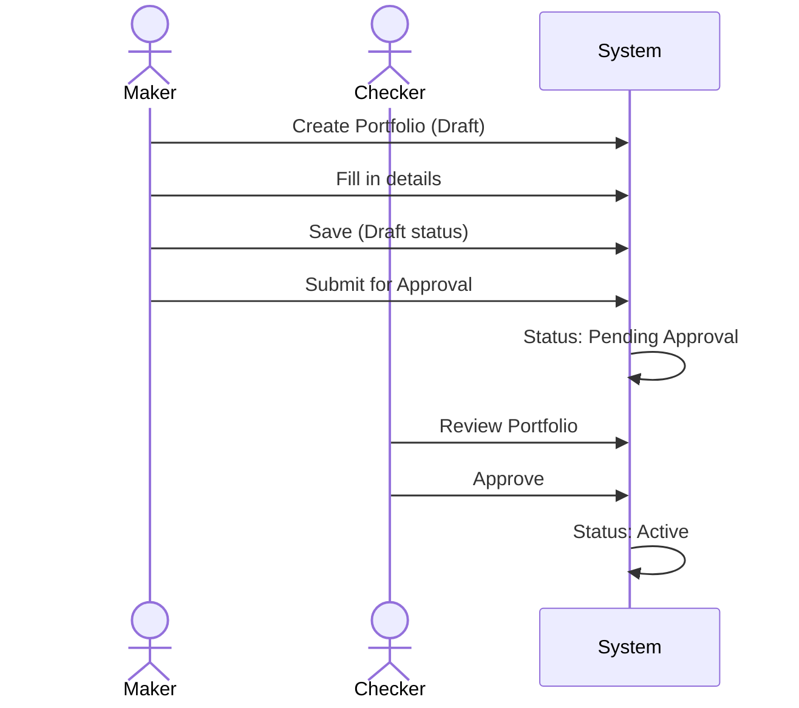

# Portfolio Management Guide

## Overview

The Portfolio module allows you to create, manage, and track portfolios throughout their lifecycle. All portfolio operations follow the **Four-Eyes principle** (Maker-Checker workflow) to ensure data integrity and compliance.

## Key Concepts

### Portfolio Statuses

| Status | Description | Next Actions |
|--------|-------------|--------------|
| **Draft** | Newly created, not yet submitted | Edit, Submit for Approval |
| **Pending Approval** | Awaiting checker approval | Approve, Reject (by Checker only) |
| **Active** | Approved and active | Close Portfolio |
| **Inactive** | Closed portfolio | Reactivate Portfolio |
| **Rejected** | Rejected by checker | Edit, Resubmit |

### Portfolio Lifecycle

---

## Creating a Portfolio

### Step 1: Navigate to Portfolio Module

1. Click **Portfolios** in the main navigation menu
2. Click the **Create New Portfolio** button

### Step 2: Fill in Basic Information

!!! info "Required Fields"
    Fields marked with * are mandatory

**Basic Information Section:**

| Field | Required | Description | Example |
|-------|----------|-------------|---------|
| Portfolio Code | ✅ Yes | Unique identifier (max 20 characters) | `PF001`, `EQUITY-USD` |
| Portfolio Name | ✅ Yes | Descriptive name (max 200 characters) | `US Equity Portfolio` |
| Description | ❌ No | Detailed description | `Portfolio for US equity holdings` |

**Financial Information Section:**

| Field | Required | Description | Example |
|-------|----------|-------------|---------|
| Currency | ✅ Yes | Base currency for the portfolio | `USD`, `EUR`, `SGD` |
| Portfolio Manager | ✅ Yes | Name of the portfolio manager | `John Smith` |
| Client | ❌ No | Client name | `ABC Corporation` |
| Cash Balance | ❌ No | Initial cash balance | `1000000.00` |

**Classification & Grouping:**

| Field | Description |
|-------|-------------|
| Cost Centre Code | For internal cost allocation |
| Corp Code | Corporate code |
| Account Group | Accounting classification |
| Portfolio Group | Portfolio grouping for reporting |
| Report Group | Reporting classification |
| Entity Group | Entity classification |
| Status | Active/Inactive (defaults to Active) |
| Revaluation Status | Revaluation classification |

### Step 3: Submit the Form

1. Review all entered information
2. Click **Create Portfolio** button
3. Portfolio is saved in **Draft** status

!!! success "Portfolio Created"
    You will see a success message: *"Portfolio created successfully in DRAFT status"*

    The portfolio is now in your drafts and ready to be submitted for approval.

---

## Editing a Portfolio

!!! warning "Edit Restrictions"
    You can only edit portfolios in **Draft** or **Rejected** status.

    Active and Pending Approval portfolios cannot be edited.

### How to Edit

1. Navigate to **Portfolios** list
2. Find the portfolio you want to edit
3. Click the **pencil icon** (Edit button)
4. Make your changes
5. Click **Update Portfolio**

---

## Submitting for Approval

Once you're satisfied with the portfolio details:

### Step 1: Open Portfolio Details

1. Go to **Portfolios** list
2. Click on the portfolio name or **eye icon** to view details

### Step 2: Submit

1. Click **Submit for Approval** button
2. Confirm the submission in the dialog
3. Portfolio status changes to **Pending Approval**

!!! info "Maker Role"
    As the **Maker**, you can only create and submit portfolios.

    You cannot approve your own work - a different user (Checker) must review and approve.

---

## Search and Filter

The Portfolio List page provides powerful search and filter capabilities:

### Search Box

Search across:
- Portfolio Code
- Portfolio Name
- Manager Name

Example: Type `USD` to find all USD-related portfolios

### Filters

**Status Filter:**
- Draft
- Pending Approval
- Active
- Inactive
- Rejected

**Currency Filter:**
- Enter currency code (e.g., `USD`, `EUR`)

**How to Use:**

1. Enter search term or select filters
2. Click **Search** button
3. Click **Clear** to reset filters

---

## Viewing Portfolio Details

### Portfolio Detail Page

Click on any portfolio to see:

- **Basic Information**: Code, name, description
- **Financial Details**: Currency, manager, client, cash balance
- **Classification**: All grouping and classification fields
- **Status Information**: Current status with visual badge
- **Workflow History**: Who created, submitted, approved/rejected

---

## Closing a Portfolio

!!! warning "Active Portfolios Only"
    You can only close portfolios in **Active** status.

### How to Close

1. Open the portfolio detail page
2. Click **Close Portfolio** button
3. In the modal dialog:
    - Enter reason for closure (optional but recommended)
    - Click **Close Portfolio** to confirm

4. Portfolio status changes to **Inactive**

!!! tip "Audit Trail"
    Providing a reason for closure helps maintain a clear audit trail.

### What Happens When Closed?

- Status changes to **Inactive**
- Portfolio appears grayed out in the list
- Cannot perform transactions on closed portfolios
- Can be reactivated if needed

---

## Reactivating a Portfolio

Closed portfolios can be reactivated:

### How to Reactivate

1. Open the inactive portfolio detail page
2. Click **Reactivate Portfolio** button
3. In the modal dialog:
    - Enter justification for reactivation (**required**)
    - Click **Reactivate Portfolio** to confirm

4. Portfolio status changes back to **Active**

!!! warning "Justification Required"
    Unlike closing, reactivation **requires** a justification comment for audit purposes.

---

## Exporting Portfolio Data

### CSV Export

1. Navigate to **Portfolios** list
2. Apply any filters if needed
3. Click **Download CSV** button
4. CSV file downloads with current filtered results

**CSV includes:**
- All visible portfolio columns
- Filtered and sorted as displayed
- Useful for reporting and analysis

---

## Common Scenarios

### Scenario 1: Creating Your First Portfolio

### Scenario 2: Handling Rejected Portfolio

1. Checker rejects your portfolio with comments
2. You receive notification (status: Rejected)
3. You edit the portfolio to address issues
4. You resubmit for approval
5. Checker approves
6. Portfolio becomes Active

### Scenario 3: Temporary Portfolio Closure

1. You need to temporarily close a portfolio
2. Click Close Portfolio, provide reason: "Month-end reconciliation"
3. Perform reconciliation
4. Reactivate portfolio with justification: "Reconciliation complete"

---

## Best Practices

!!! tip "Tips for Success"
    ✅ **Use clear portfolio codes** - Make them meaningful and consistent

    ✅ **Provide detailed descriptions** - Help others understand the portfolio purpose

    ✅ **Double-check before submitting** - Review all fields carefully

    ✅ **Provide closure reasons** - Always document why you're closing a portfolio

    ✅ **Use filters effectively** - Save time by filtering before searching

!!! warning "Common Mistakes to Avoid"
    ❌ Duplicate portfolio codes - Each must be unique

    ❌ Missing required fields - You can't save without them

    ❌ Trying to edit active portfolios - Only Draft/Rejected can be edited

    ❌ Closing without reason - Always document the business reason

---

## Troubleshooting

### Problem: Cannot Edit Portfolio

**Solution**: Check the portfolio status. Only **Draft** or **Rejected** portfolios can be edited.

If the portfolio is **Active**, you cannot edit it. You may need to:
- Create a new portfolio with the changes, or
- Contact your administrator for special handling

### Problem: Submit Button Not Visible

**Solution**: Ensure the portfolio is in **Draft** status. Portfolios in other statuses cannot be submitted.

### Problem: Portfolio Not Appearing in List

**Solution**:
1. Check your filter settings
2. Click **Clear** to reset all filters
3. Try searching by code or name

### Problem: Cannot Find Portfolio After Creation

**Solution**: The portfolio is in **Draft** status. Use the status filter to show only Draft portfolios.

---

## FAQs

??? question "Can I delete a portfolio?"
    No, portfolios cannot be deleted (hard delete). Instead, use **Close Portfolio** to mark it as inactive (soft delete). This maintains audit history.

??? question "Can I edit an active portfolio?"
    No, once approved and active, portfolios cannot be edited through the standard workflow. This ensures data integrity and maintains audit trails.

??? question "Who can approve my portfolio?"
    Only users in the **Checkers** group can approve portfolios. Additionally, the checker must be a different person from the maker (Four-Eyes principle).

??? question "Can I approve my own portfolio?"
    No, the Four-Eyes principle prevents users from approving their own work. A different user (Checker) must approve.

??? question "What happens if my portfolio is rejected?"
    The portfolio returns to **Rejected** status. You can edit it to address the checker's comments and resubmit for approval.

??? question "Can I cancel a pending approval?"
    Currently, the system does not support canceling pending approvals. Contact your administrator if you need to withdraw a submission.

??? question "How do I know who approved my portfolio?"
    View the portfolio detail page. The workflow section shows who created, submitted, and approved/rejected the portfolio with timestamps.

---

## Related Topics

- [Four-Eyes Workflow](four-eyes-workflow.md) - Understand the maker-checker process
- [UDF Management](udf-management.md) - Manage custom fields
- [FAQ](faq.md) - More frequently asked questions

---

## Need Help?

!!! question "Still Need Assistance?"
    - **In-App Help**: Click the Help (?) button
    - **Email Support**: [cistrade-support@yourcompany.com](mailto:cistrade-support@yourcompany.com)
    - **Technical Docs**: See [Architecture](../technical/architecture.md) for developers

---

**Last Updated**: 2025-12-27
