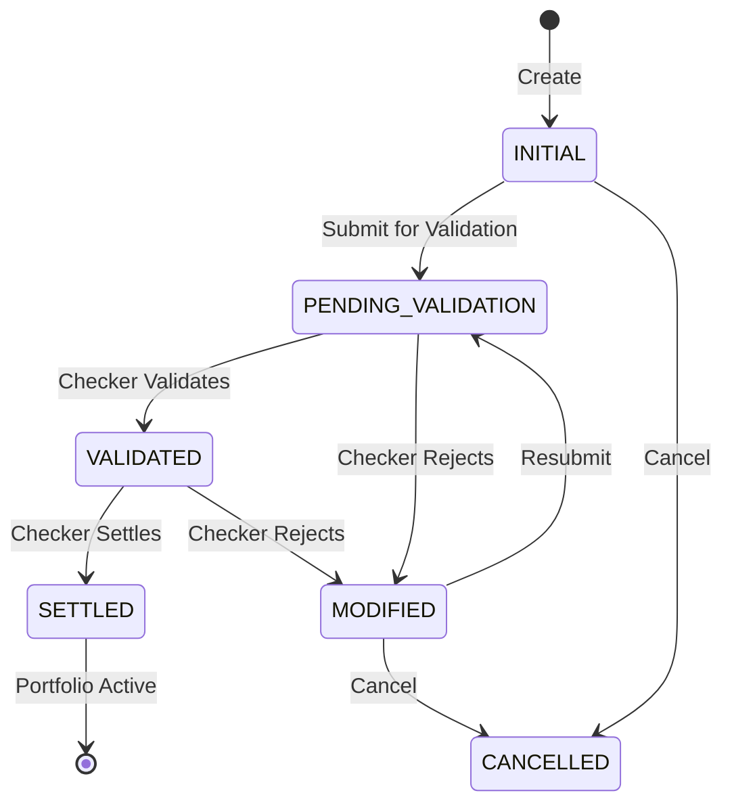
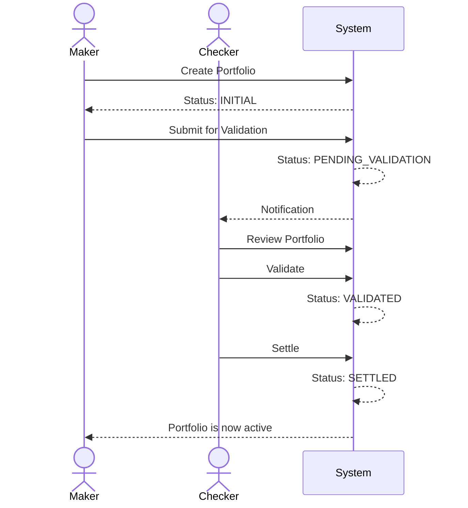

# Portfolio Management Guide

## Overview

The Portfolio module allows you to create, manage, and track portfolios throughout their lifecycle. All portfolio operations follow the **Four-Eyes principle** (Maker-Checker workflow) to ensure data integrity and compliance.

## Key Concepts

### Portfolio Statuses

| Status | Description | Next Actions |
|--------|-------------|--------------|
| **INITIAL** | Newly created, not yet submitted | Edit, Submit for Validation |
| **MODIFIED** | Edited after rejection or changes | Edit, Submit for Validation |
| **PENDING_VALIDATION** | Awaiting checker validation | Validate, Reject (by Checker only) |
| **VALIDATED** | Validated by checker, awaiting settlement | Settle (by Checker only) |
| **SETTLED** | Fully approved and active | Cancel Portfolio |
| **CANCELLED** | Cancelled portfolio | - |

### Portfolio Lifecycle

```mermaid
stateDiagram-v2
    [*] --> INITIAL: Create
    INITIAL --> PENDING_VALIDATION: Submit for Validation
    INITIAL --> CANCELLED: Cancel

    PENDING_VALIDATION --> VALIDATED: Checker Validates
    PENDING_VALIDATION --> MODIFIED: Checker Rejects

    VALIDATED --> SETTLED: Checker Settles
    VALIDATED --> MODIFIED: Checker Rejects

    MODIFIED --> PENDING_VALIDATION: Resubmit
    MODIFIED --> CANCELLED: Cancel

    SETTLED --> [*]: Portfolio Active
```

### Two-Step Approval Process

The Four-Eyes workflow uses a **two-step approval process**:

1. **Validation Step**: Checker reviews and validates the portfolio data
2. **Settlement Step**: Checker confirms and settles the portfolio to make it active

This two-step process provides an additional layer of control and ensures thorough review before activation.

---

## Creating a Portfolio

### Step 1: Navigate to Portfolio Module

1. Click **Portfolios** in the main navigation menu
2. Click the **Create New Portfolio** button

### Step 2: Fill in Basic Information

!!! info "Required Fields"
    Fields marked with * are mandatory

**Basic Information Section:**

| Field | Required | Description | Example |
|-------|----------|-------------|---------|
| Portfolio Name | Yes | Unique identifier (max 200 characters) | `UOB SINGAPORE TRADING` |
| Description | No | Detailed description | `Portfolio for Singapore equity holdings` |

**Financial Information Section:**

| Field | Required | Description | Example |
|-------|----------|-------------|---------|
| Currency | Yes | Base currency for the portfolio | `USD`, `EUR`, `SGD` |
| Portfolio Manager | Yes | Name of the portfolio manager | `John Smith` |
| Client | No | Client name | `ABC Corporation` |
| Cash Balance | No | Initial cash balance | `1000000.00` |

**Classification & Grouping:**

| Field | Description |
|-------|-------------|
| Cost Centre Code | For internal cost allocation |
| Corp Code | Corporate code |
| Account Group | Accounting classification |
| Portfolio Group | Portfolio grouping for reporting |
| Report Group | Reporting classification |
| Entity Group | Entity classification |
| Revaluation Status | Revaluation classification |

### Step 3: Submit the Form

1. Review all entered information
2. Click **Create Portfolio** button
3. Portfolio is saved in **INITIAL** status

!!! success "Portfolio Created"
    You will see a success message: *"Portfolio created successfully"*

    The portfolio is now in INITIAL status and ready to be submitted for validation.

---

## Editing a Portfolio

!!! warning "Edit Restrictions"
    You can only edit portfolios in **INITIAL** or **MODIFIED** status.

    PENDING_VALIDATION, VALIDATED, SETTLED, and CANCELLED portfolios cannot be edited.

### How to Edit

1. Navigate to **Portfolios** list
2. Find the portfolio you want to edit
3. Click the **pencil icon** (Edit button)
4. Make your changes
5. Click **Update Portfolio**

---

## Submitting for Validation

Once you're satisfied with the portfolio details:

### Step 1: Open Portfolio Details

1. Go to **Portfolios** list
2. Click on the portfolio name or **eye icon** to view details

### Step 2: Submit

1. Click **Submit for Validation** button
2. Confirm the submission in the dialog
3. Portfolio status changes to **PENDING_VALIDATION**

!!! info "Maker Role"
    As the **Maker**, you can only create and submit portfolios.

    You cannot validate your own work - a different user (Checker) must review and validate.

---

## Checker Workflow: Validate and Settle

### Step 1: Validate Portfolio

1. Checker navigates to **Pending Validations** queue
2. Reviews portfolio details thoroughly
3. Clicks **Validate** to approve the data
4. Portfolio status changes to **VALIDATED**

### Step 2: Settle Portfolio

1. After validation, Checker clicks **Settle** button
2. Confirms the settlement
3. Portfolio status changes to **SETTLED**
4. Portfolio is now active and can be used

!!! tip "Two-Step Process"
    The Validate and Settle steps can be performed by the same Checker or different Checkers, providing flexibility in the approval workflow.

### Rejecting a Portfolio

If issues are found during validation:

1. Checker clicks **Reject** button
2. Enters rejection reason (required)
3. Portfolio status changes to **MODIFIED**
4. Maker can edit and resubmit

---

## Search and Filter

The Portfolio List page provides powerful search and filter capabilities:

### Search Box

Search across:
- Portfolio Name
- Manager Name

Example: Type `USD` to find all USD-related portfolios

### Filters

**Status Filter:**
- INITIAL
- MODIFIED
- PENDING_VALIDATION
- VALIDATED
- SETTLED
- CANCELLED

**Currency Filter:**
- Enter currency code (e.g., `USD`, `EUR`)

**How to Use:**

1. Enter search term or select filters
2. Click **Search** button
3. Click **Clear** to reset filters

---

## Viewing Portfolio Details

### Portfolio Detail Page

Click on any portfolio to see:

- **Basic Information**: Name, description
- **Financial Details**: Currency, manager, client, cash balance
- **Classification**: All grouping and classification fields
- **Status Information**: Current status with visual badge
- **Workflow History**: Who created, submitted, validated, settled

---

## Cancelling a Portfolio

!!! warning "INITIAL and MODIFIED Portfolios Only"
    You can only cancel portfolios in **INITIAL** or **MODIFIED** status.

### How to Cancel

1. Open the portfolio detail page or edit page
2. Click **Cancel Portfolio** button
3. In the modal dialog:
    - Enter reason for cancellation (required)
    - Click **Cancel Portfolio** to confirm

4. Portfolio status changes to **CANCELLED**

!!! tip "Audit Trail"
    Providing a reason for cancellation helps maintain a clear audit trail.

### What Happens When Cancelled?

- Status changes to **CANCELLED**
- Portfolio appears grayed out in the list
- Cannot perform any further actions on cancelled portfolios
- Cannot be reactivated (create a new portfolio instead)

---

## Exporting Portfolio Data

### CSV Export

1. Navigate to **Portfolios** list
2. Apply any filters if needed
3. Click **Download CSV** button
4. CSV file downloads with current filtered results

**CSV includes:**
- All visible portfolio columns
- Filtered and sorted as displayed
- Useful for reporting and analysis

---

## Complete Workflow Example

### Scenario: Creating and Approving a Portfolio

```mermaid
sequenceDiagram
    actor Maker
    actor Checker
    participant System

    Maker->>System: Create Portfolio
    System-->>Maker: Status: INITIAL
    Maker->>System: Submit for Validation
    System-->>System: Status: PENDING_VALIDATION
    System-->>Checker: Notification
    Checker->>System: Review Portfolio
    Checker->>System: Validate
    System-->>System: Status: VALIDATED
    Checker->>System: Settle
    System-->>System: Status: SETTLED
    System-->>Maker: Portfolio is now active
```

### Scenario: Handling Rejected Portfolio

1. Checker rejects portfolio with comments
2. Portfolio status changes to **MODIFIED**
3. Maker edits the portfolio to address issues
4. Maker resubmits for validation
5. Checker validates
6. Checker settles
7. Portfolio becomes **SETTLED** (active)

---

## Best Practices

!!! tip "Tips for Success"
    - **Use clear portfolio names** - Make them meaningful and unique
    - **Provide detailed descriptions** - Help others understand the portfolio purpose
    - **Double-check before submitting** - Review all fields carefully
    - **Provide cancellation reasons** - Always document why you're cancelling a portfolio
    - **Use filters effectively** - Save time by filtering before searching

!!! warning "Common Mistakes to Avoid"
    - Duplicate portfolio names - Each must be unique
    - Missing required fields - You can't save without them
    - Trying to edit validated portfolios - Only INITIAL/MODIFIED can be edited
    - Cancelling without reason - Always document the business reason

---

## Troubleshooting

### Problem: Cannot Edit Portfolio

**Solution**: Check the portfolio status. Only **INITIAL** or **MODIFIED** portfolios can be edited.

If the portfolio is **VALIDATED** or **SETTLED**, you cannot edit it. You may need to:
- Create a new portfolio with the changes, or
- Contact your administrator for special handling

### Problem: Submit Button Not Visible

**Solution**: Ensure the portfolio is in **INITIAL** or **MODIFIED** status. Portfolios in other statuses cannot be submitted.

### Problem: Portfolio Not Appearing in List

**Solution**:
1. Check your filter settings
2. Click **Clear** to reset all filters
3. Try searching by name

### Problem: Cannot Find Portfolio After Creation

**Solution**: The portfolio is in **INITIAL** status. Use the status filter to show only INITIAL portfolios.

---

## FAQs

??? question "Can I delete a portfolio?"
    No, portfolios cannot be deleted (hard delete). Instead, use **Cancel Portfolio** to mark it as cancelled (soft delete). This maintains audit history.

??? question "Can I edit a settled portfolio?"
    No, once validated and settled, portfolios cannot be edited through the standard workflow. This ensures data integrity and maintains audit trails.

??? question "Who can validate my portfolio?"
    Only users in the **Checkers** group can validate portfolios. Additionally, the checker must be a different person from the maker (Four-Eyes principle).

??? question "Can I validate my own portfolio?"
    No, the Four-Eyes principle prevents users from validating their own work. A different user (Checker) must validate and settle.

??? question "What happens if my portfolio is rejected?"
    The portfolio returns to **MODIFIED** status. You can edit it to address the checker's comments and resubmit for validation.

??? question "Can I cancel a pending validation?"
    No, once submitted for validation, the portfolio must be either validated/settled or rejected by a Checker.

??? question "How do I know who validated my portfolio?"
    View the portfolio detail page. The workflow section shows who created, submitted, validated, and settled the portfolio with timestamps.

??? question "What's the difference between Validate and Settle?"
    **Validate** confirms the data is correct. **Settle** activates the portfolio for use. This two-step process provides additional control over the approval workflow.

---

## Related Topics

- [Four-Eyes Workflow](four-eyes-workflow.md) - Understand the maker-checker process
- [UDF Management](udf-management.md) - Manage custom fields
- [FAQ](faq.md) - More frequently asked questions

---

## Need Help?

!!! question "Still Need Assistance?"
    - **In-App Help**: Click the Help (?) button
    - **Email Support**: [cistrade-support@yourcompany.com](mailto:cistrade-support@yourcompany.com)
    - **Technical Docs**: See [Architecture](../technical/architecture.md) for developers

---

**Last Updated**: 2026-01-12
