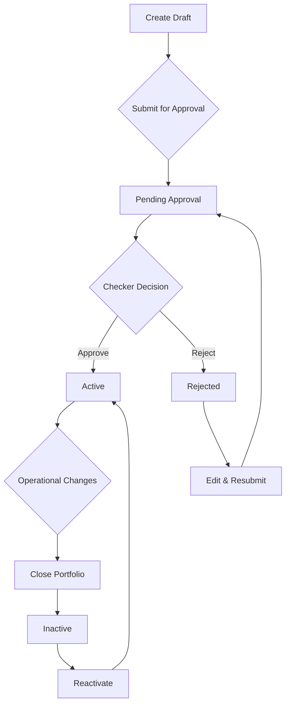

# Business Processes

End-to-end business workflows in CisTrade.

## Portfolio Lifecycle Management

### Complete Workflow



### Detailed Steps

**1. Portfolio Creation**
- Maker creates draft portfolio
- Enters required fields (Code, Name, Currency, Manager)
- Saves as Draft
- Audit log: CREATE action

**2. Submission for Approval**
- Maker reviews draft
- Submits for approval
- Status: Draft → Pending Approval
- Audit log: SUBMIT action
- Notification sent to Checkers

**3. Checker Review**
- Checker views pending approval queue
- Reviews portfolio details
- Decision: Approve or Reject

**4. Approval Path**
- Checker approves with comments
- Status: Pending → Active
- Audit log: APPROVE action
- Notification sent to Maker
- Portfolio now operational

**5. Rejection Path**
- Checker rejects with reason
- Status: Pending → Rejected
- Audit log: REJECT action
- Maker notified
- Maker can edit and resubmit

**6. Portfolio Closure**
- User closes active portfolio
- Status: Active → Closed
- Audit log: CLOSE action
- Optional reason provided

**7. Portfolio Reactivation**
- Checker reactivates closed portfolio
- Status: Closed → Active
- Audit log: REACTIVATE action
- Mandatory comments required

## UDF Management Process

### UDF Value Update Workflow

**1. Identify Need**
- Business identifies need for custom field
- Examples: Risk rating, compliance flag

**2. UDF Definition**
- Admin defines UDF master
- Sets data type, entity type
- Activates UDF

**3. Value Assignment**
- User assigns value to portfolio/trade
- Sets effective date
- Previous value auto-expired

**4. History Tracking**
- All changes recorded
- Timeline view available
- Audit trail maintained

## Market Data Integration

### FX Rate Update Process

**1. Automated Feed**
- Bloomberg/Reuters feeds update every 15-30 mins
- Rates fetched via API
- Validation checks applied

**2. Data Validation**
- Rate within expected range
- No sudden jumps (>5%)
- Source reliability check
- Timestamp recency

**3. Quality Checks**
- Automated alerts for anomalies
- Manual review for flagged rates
- Correction process for errors

**4. Portfolio Impact**
- Affected portfolios identified
- NAV recalculation triggered
- Valuation reports updated

## Compliance & Audit

### Four-Eyes Enforcement

**Rule**: All critical operations require two people

**Implementation**:
1. Maker creates/updates
2. System prevents self-approval
3. Checker from different user group approves
4. System validates segregation

**Audit Trail**:
- Who: User ID, name, email
- What: Action type, entity affected
- When: Timestamp
- Where: IP address, user agent
- Why: Comments/reason

### Reporting

**Daily Reports**:
- Portfolio summary
- Pending approvals
- Recent changes

**Monthly Reports**:
- Performance metrics
- Compliance audit
- User activity

**Quarterly Reports**:
- Portfolio valuation
- Risk analysis
- Trend reports

## Integration Points

### GMP System Integration

**Daily ETL Process**:
1. GMP exports reference data (currencies, countries, calendars, counterparties)
2. Files placed in shared location
3. Hive external tables point to files
4. CisTrade reads via Impala
5. No data duplication

**Data Flow**:
```
GMP System → CSV Files → Hive External Tables → Impala Queries → CisTrade
```

### ACL Integration

**Authentication Flow**:
1. User enters login ID
2. CisTrade queries ACL tables in Hive
3. User record retrieved
4. Group memberships loaded
5. Permissions resolved
6. Session created

**Permission Hierarchy**:
```
User → Group → Permissions → Access Level (READ/WRITE/READ_WRITE)
```

## Error Handling

### Standard Error Process

**1. Error Occurs**
- System detects error
- Error logged with full context
- User shown friendly message

**2. User Notification**
- Error message displayed
- Suggested actions provided
- Support contact information

**3. Support Resolution**
- Support team reviews logs
- Identifies root cause
- Implements fix
- User notified

## Change Management

### Production Changes

**1. Change Request**
- Business justification
- Impact assessment
- Approval required

**2. Testing**
- UAT in test environment
- Regression testing
- Performance testing

**3. Deployment**
- Scheduled maintenance window
- Backup taken
- Changes deployed
- Smoke testing

**4. Verification**
- Functionality confirmed
- Performance monitored
- Users notified

## Business Continuity

### Disaster Recovery

**RTO**: 4 hours (Recovery Time Objective)
**RPO**: 1 hour (Recovery Point Objective)

**Process**:
1. Incident declared
2. DR site activated
3. Data restored from backup
4. Services brought online
5. Users notified
6. Normal operations resumed

## Related Documentation

- [Four-Eyes Workflow](../business/four-eyes-workflow.md)
- [Data Flow](data-flow.md)
- [Business Rules](business-rules.md)
- [Workflow Diagrams](workflow-diagrams.md)
