# Workflow Diagrams

Visual representations of key workflows.

## Portfolio Lifecycle

## Four-Eyes Workflow

```mermaid
sequenceDiagram
    participant M as Maker
    participant S as System
    participant C as Checker

    M->>S: Create Portfolio (Draft)
    S-->>M: Saved
    M->>S: Submit for Approval
    S->>S: Validate (Maker ≠ Checker)
    S->>C: Notify Pending Approval
    C->>S: Review Portfolio
    alt Approve
        C->>S: Approve with Comments
        S->>S: Status = Active
        S-->>M: Notification (Approved)
    else Reject
        C->>S: Reject with Reason
        S->>S: Status = Rejected
        S-->>M: Notification (Rejected)
        M->>S: Edit & Resubmit
    end
```

## Authentication Flow

## Data Sync Flow

## FX Rate Update

## UDF Value Update

## Approval Decision Tree

## System Architecture

## Audit Logging Flow

## Report Generation

## Related Documentation

- [Business Processes](business-processes.md)
- [Data Flow](data-flow.md)
- [Architecture](../technical/architecture.md)
