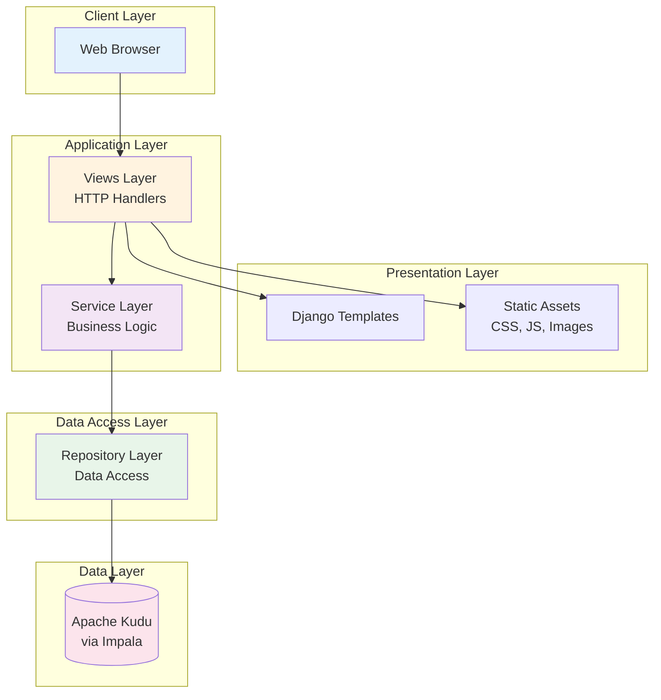
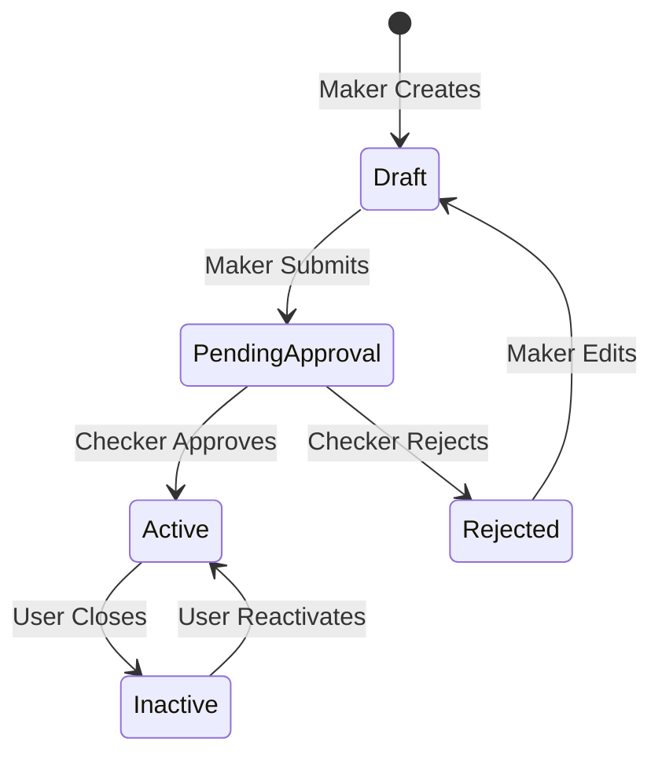
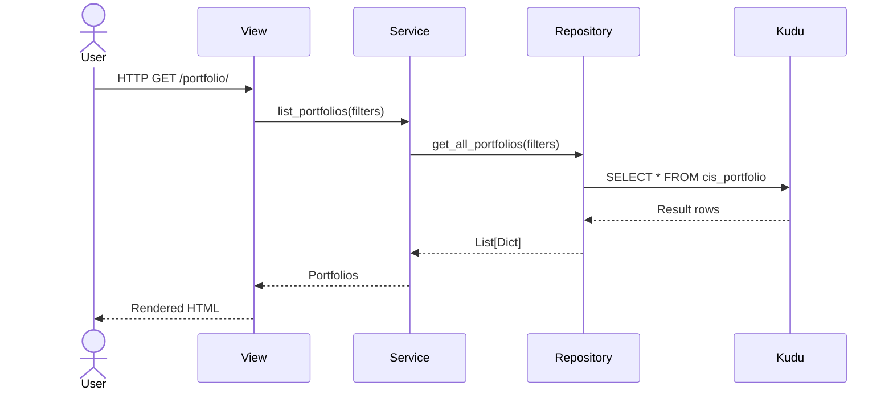
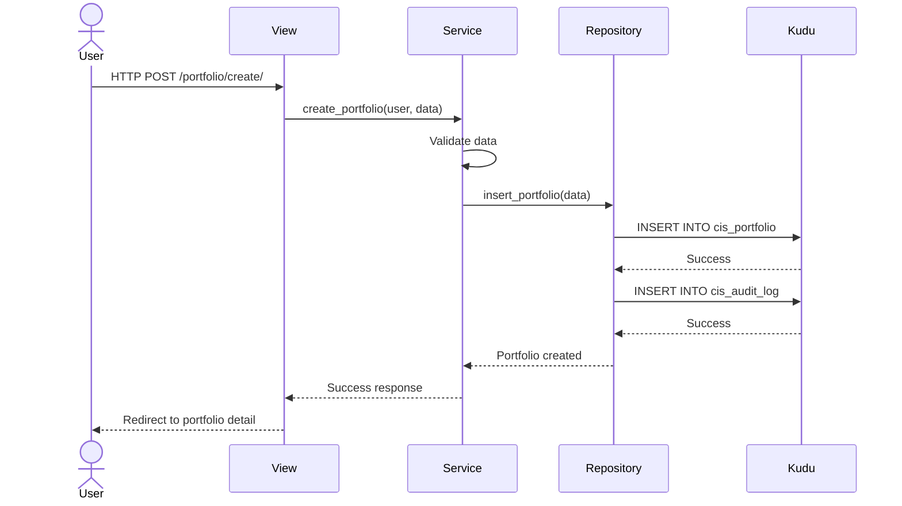
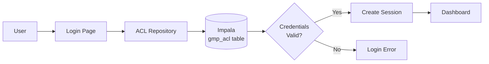
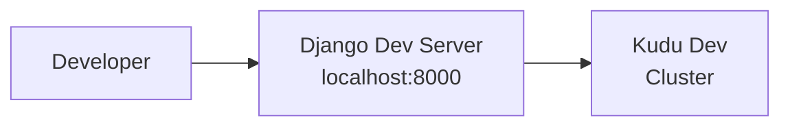
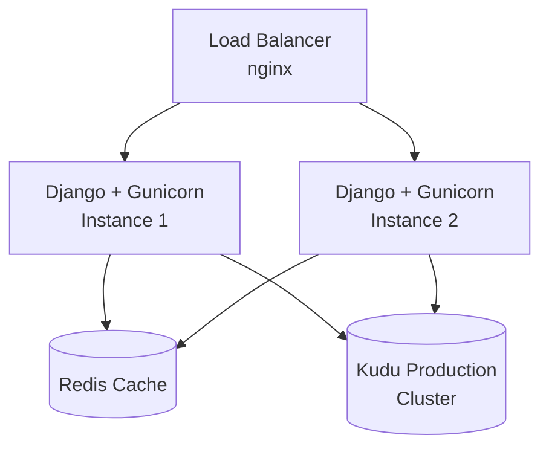

# CisTrade Architecture

## System Overview

CisTrade is a Django-based Trade Management System built with a clean architecture that emphasizes separation of concerns, maintainability, and performance. The system uses Apache Kudu/Impala as the primary data store instead of traditional relational databases.



---

## Technology Stack

### Backend

| Component | Technology | Version | Purpose |
|-----------|------------|---------|---------|
| **Framework** | Django | 5.2.9 | Web framework |
| **Language** | Python | 3.12 | Programming language |
| **Web Server** | Django Dev Server | Built-in | Development server |
| **WSGI** | Gunicorn | TBD | Production WSGI server |

### Database

| Component | Technology | Purpose |
|-----------|------------|---------|
| **Primary Database** | Apache Kudu | Fast analytics on fast data |
| **Query Engine** | Impala | SQL queries on Kudu |
| **Connection** | impyla | Python Impala client |
| **ORM** | None | Direct SQL via repository pattern |

### Frontend

| Component | Technology | Version | Purpose |
|-----------|------------|---------|---------|
| **CSS Framework** | Bootstrap | 5.x | UI components and layout |
| **Icons** | Bootstrap Icons | 1.x | Icon library |
| **JavaScript** | Vanilla JS | ES6+ | Client-side interactivity |
| **Template Engine** | Django Templates | Built-in | Server-side rendering |

---

## Architecture Patterns

### 1. Repository Pattern

The Repository pattern abstracts data access logic and provides a clean interface for the service layer.

**Purpose**:
- Separate data access from business logic
- Provide consistent interface for different data sources
- Enable testability through mocking

**Structure**:

```python
# Repository Interface (Abstract)
class BaseRepository:
    def get_all(self, **filters) -> List[Dict]
    def get_by_id(self, id: str) -> Optional[Dict]
    def create(self, data: Dict) -> bool
    def update(self, id: str, data: Dict) -> bool
    def delete(self, id: str) -> bool

# Concrete Implementation
class PortfolioHiveRepository(BaseRepository):
    """Repository for Portfolio data in Kudu/Impala."""

    def __init__(self):
        self.connection = ImpalaConnection()

    def get_all_portfolios(self, limit=100, **filters) -> List[Dict]:
        query = "SELECT * FROM gmp_cis.cis_portfolio"
        # Apply filters
        return self.execute_query(query)
```

**Benefits**:
- ✅ Easy to switch data sources
- ✅ Testable with mocks
- ✅ Single responsibility
- ✅ Query optimization in one place

---

### 2. Service Layer Pattern

The Service layer contains all business logic and orchestrates operations between repositories.

**Purpose**:
- Centralize business logic
- Coordinate multi-step operations
- Enforce business rules
- Handle transactions

**Structure**:

```python
class PortfolioService:
    """Service for Portfolio business logic."""

    @staticmethod
    def create_portfolio(user: User, data: Dict) -> Portfolio:
        # 1. Validate data
        # 2. Check business rules
        # 3. Call repository
        # 4. Log to audit
        # 5. Return result
        pass

    @staticmethod
    def submit_for_approval(portfolio, user: User) -> Portfolio:
        # 1. Validate status
        # 2. Update portfolio
        # 3. Create history record
        # 4. Log to audit
        pass
```

**Benefits**:
- ✅ Business logic in one place
- ✅ Reusable across views
- ✅ Easy to test
- ✅ Transaction management

---

### 3. Four-Eyes (Maker-Checker) Pattern

**Purpose**: Enforce separation of duties for critical operations

**Implementation**:



**Key Rules**:
- User cannot approve their own submission
- Approval requires Checker role
- Full audit trail for all transitions

---

### 4. Soft Delete Pattern

**Purpose**: Mark records as inactive instead of physical deletion

**Implementation**:

```python
# Instead of DELETE FROM table WHERE id = X
# We use UPDATE:
UPDATE cis_portfolio
SET status = 'Inactive',
    is_active = false,
    updated_by = 'username'
WHERE name = 'portfolio_code'
```

**Benefits**:
- ✅ Maintain audit history
- ✅ Enable reactivation
- ✅ Data recovery
- ✅ Compliance

---

## Layered Architecture

### Layer 1: Presentation Layer

**Components**:
- Django Templates (`.html` files)
- Static files (CSS, JavaScript, Images)
- Template tags and filters

**Responsibilities**:
- Render HTML
- Display data
- Capture user input
- Client-side validation

**Location**: `templates/`, `static/`

**Example**:
```html
<!-- templates/portfolio/portfolio_list.html -->


    <table>
        
            <tr><td>{{ portfolio.name }}</td></tr>
        
    </table>

```

---

### Layer 2: View Layer

**Components**:
- Django view functions
- URL routing
- Request/response handling

**Responsibilities**:
- Handle HTTP requests
- Call service layer
- Prepare context for templates
- Return HTTP responses

**Location**: `*/views.py`, `*/urls.py`

**Example**:
```python
# portfolio/views.py
def portfolio_list(request):
    # 1. Get query parameters
    search = request.GET.get('search', '')

    # 2. Call service layer
    portfolios = PortfolioService.list_portfolios(search=search)

    # 3. Prepare context
    context = {'portfolios': portfolios}

    # 4. Render template
    return render(request, 'portfolio/portfolio_list.html', context)
```

---

### Layer 3: Service Layer

**Components**:
- Service classes with static methods
- Business logic
- Workflow orchestration

**Responsibilities**:
- Validate business rules
- Coordinate repository calls
- Manage transactions
- Log audit events

**Location**: `*/services/*.py`

**Example**:
```python
# portfolio/services/portfolio_service.py
class PortfolioService:
    @staticmethod
    def submit_for_approval(portfolio: Portfolio, user: User):
        # Validate
        if portfolio.status != 'DRAFT':
            raise ValidationError("Only draft portfolios can be submitted")

        # Update in repository
        portfolio.status = 'PENDING_APPROVAL'
        portfolio.submitted_by = user
        portfolio.save()

        # Create history
        PortfolioHistory.objects.create(...)

        # Audit log
        audit_log_kudu_repository.log_action(...)

        return portfolio
```

---

### Layer 4: Repository Layer

**Components**:
- Repository classes
- SQL query builders
- Impala connection management

**Responsibilities**:
- Execute SQL queries
- Map results to dictionaries/objects
- Handle database errors
- Manage connections

**Location**: `*/repositories/*.py`

**Example**:
```python
# portfolio/repositories/portfolio_hive_repository.py
class PortfolioHiveRepository:
    def get_all_portfolios(self, limit=100, status=None):
        query = f"""
            SELECT name, description, currency, status, created_at
            FROM gmp_cis.cis_portfolio
        """
        if status:
            query += f" WHERE status = '{status}'"

        query += f" LIMIT {limit}"

        return self.execute_query(query)
```

---

### Layer 5: Data Layer

**Components**:
- Apache Kudu tables
- Impala query engine

**Responsibilities**:
- Store data
- Execute queries
- Maintain ACID properties
- Handle partitioning

**Tables**:
- `gmp_cis.cis_portfolio`
- `gmp_cis.cis_portfolio_history`
- `gmp_cis.cis_audit_log`
- `gmp_cis.cis_udf_master`
- `gmp_cis.cis_fx_rate`

---

## Data Flow

### Read Operation Flow



### Write Operation Flow



---

## Design Principles

### SOLID Principles

#### Single Responsibility Principle (SRP)
- Each class has one reason to change
- `PortfolioService` handles business logic only
- `PortfolioHiveRepository` handles data access only
- `portfolio_list()` view handles HTTP only

#### Open/Closed Principle (OCP)
- Service methods are extensible
- Can add new status transitions without modifying existing code
- Can add new repositories without changing services

#### Liskov Substitution Principle (LSP)
- Repository implementations are interchangeable
- Can swap `HiveRepository` with `PostgresRepository` without changing services

#### Interface Segregation Principle (ISP)
- Repositories expose only needed methods
- Services don't force views to depend on unnecessary methods

#### Dependency Inversion Principle (DIP)
- Service depends on Repository abstraction, not concrete implementation
- Easy to mock repositories for testing

---

## Security Architecture

### Authentication



**Authentication Flow**:
1. User enters username/password
2. `ACLRepository` queries Impala ACL table
3. Password validated
4. Session created
5. User permissions loaded

### Authorization

**Permission Model**:
- Module-based permissions (e.g., `cis-portfolio`, `cis-udf`)
- Operation-based access (READ, WRITE, DELETE, ADMIN)
- Stored in Impala ACL tables

**Four-Eyes Enforcement**:
```python
def can_approve(portfolio, user):
    # User must be Checker
    if not user.groups.filter(name='Checkers').exists():
        return False

    # User cannot approve own work
    if portfolio.created_by == user:
        return False

    return True
```

### Audit Trail

**What is Logged**:
- User ID, username, email
- Action type (CREATE, UPDATE, DELETE, APPROVE, REJECT)
- Entity type and ID
- Timestamp
- Request method
- Success/failure status

**Storage**: `gmp_cis.cis_audit_log` table in Kudu

---

## Performance Optimization

### Caching Strategy

**Plan** (not yet implemented):
```python
# Cache help content
cache.set(f'help_{module}_{page}', content, timeout=3600)

# Cache dropdown options
cache.set('currencies', currency_list, timeout=86400)

# Cache user permissions
cache.set(f'permissions_{user.id}', permissions, timeout=3600)
```

### Database Optimization

**Kudu Partitioning**:
```sql
CREATE TABLE gmp_cis.cis_portfolio (
    ...
)
PARTITION BY HASH(name) PARTITIONS 16
STORED AS KUDU;
```

**Benefits**:
- Parallel query execution
- Better data distribution
- Faster inserts

**Query Optimization**:
- Use WHERE clauses to leverage partitioning
- Limit result sets
- Index on frequently queried columns

---

## Error Handling

### Exception Hierarchy

```python
# Custom exceptions
class CisTradeException(Exception):
    """Base exception for CisTrade"""

class ValidationError(CisTradeException):
    """Data validation errors"""

class PermissionDenied(CisTradeException):
    """Authorization errors"""

class DataNotFound(CisTradeException):
    """Entity not found"""
```

### Error Handling Pattern

```python
try:
    portfolio = PortfolioService.create_portfolio(user, data)
    messages.success(request, 'Portfolio created successfully')
    return redirect('portfolio:detail', portfolio.id)

except ValidationError as e:
    messages.error(request, str(e))
    return render(request, 'portfolio/portfolio_form.html', context)

except PermissionDenied:
    messages.error(request, 'You do not have permission to create portfolios')
    return redirect('dashboard')

except Exception as e:
    logger.error(f'Unexpected error: {e}', exc_info=True)
    messages.error(request, 'An unexpected error occurred')
    return redirect('dashboard')
```

---

## Development Mode vs Production

### DEV MODE (Current)

```python
# DEV_MODE_SETUP.md
- All permissions bypassed
- Four-eyes checks disabled
- Self-approval allowed (for testing)
- Verbose logging enabled
```

### Production Mode

```python
# Production configuration
- Strict permission checks
- Four-eyes strictly enforced
- Cannot self-approve
- Optimized logging
- HTTPS required
- CSRF protection enabled
```

---

## Module Structure

```
cis_trade_hive/
├── config/                 # Django settings
│   ├── settings.py
│   ├── urls.py
│   └── wsgi.py
│
├── core/                   # Core functionality
│   ├── audit/             # Audit logging
│   ├── repositories/      # Core repositories
│   ├── views/             # Authentication, dashboard
│   └── models.py          # Core models
│
├── portfolio/             # Portfolio module
│   ├── management/        # Django management commands
│   ├── repositories/      # Portfolio repositories
│   ├── services/          # Portfolio services
│   ├── views.py           # Portfolio views
│   ├── urls.py            # Portfolio URLs
│   └── models.py          # Portfolio models
│
├── udf/                   # UDF module
│   ├── repositories/
│   ├── services/
│   ├── views.py
│   └── urls.py
│
├── market_data/           # Market data module
│   ├── repositories/
│   ├── services/
│   ├── views.py
│   └── urls.py
│
├── templates/             # HTML templates
│   ├── base.html
│   ├── portfolio/
│   ├── udf/
│   └── market_data/
│
└── static/                # Static assets
    ├── css/
    ├── js/
    └── images/
```

---

## Deployment Architecture

### Development



### Production (Proposed)



---

## Future Enhancements

### Short Term
- [ ] Implement Redis caching
- [ ] Add API endpoints (REST)
- [ ] Implement WebSocket for real-time updates
- [ ] Add advanced search (Elasticsearch)

### Long Term
- [ ] Microservices architecture
- [ ] Event-driven architecture (Kafka)
- [ ] GraphQL API
- [ ] Mobile app (React Native)

---

## Related Documentation

- [Database Schema](database-schema.md) - Detailed table structures
- [API Reference](api-reference.md) - Service and repository methods
- [Development Guide](development-guide.md) - Setup and workflow
- [Deployment](deployment.md) - Production deployment

---

**Last Updated**: 2025-12-27 | **Version**: 1.0.0
