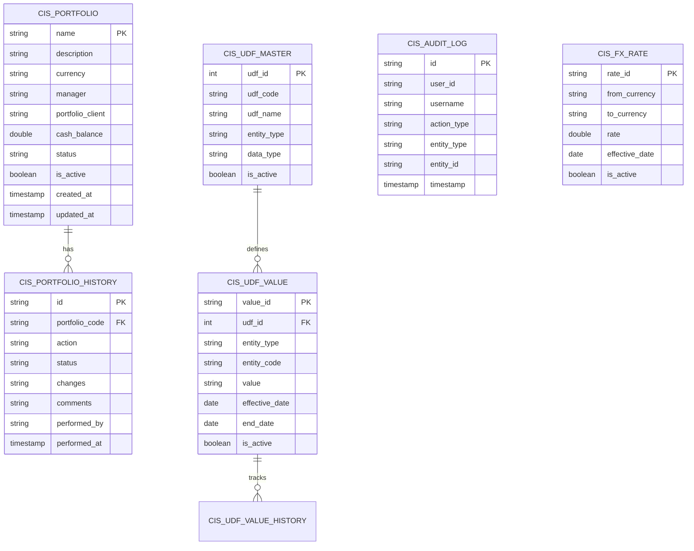

# Database Schema Documentation

## Overview

CisTrade uses **Apache Kudu** as the primary data store, accessed via **Impala** SQL queries. All tables are stored in the `gmp_cis` database schema in Kudu and queried using Impala.

!!! warning "No Django ORM"
    This system does **NOT** use Django ORM for data operations. All database access is through direct SQL queries via the repository pattern.

---

## Database Design Principles

### 1. **Kudu-First Design**
- Tables are optimized for Kudu's columnar storage
- Partitioning by hash for even data distribution
- Primary keys are immutable

### 2. **Audit Trail**
- Every table includes `created_at`, `updated_at` timestamps
- Separate audit log table (`cis_audit_log`) for all actions
- History tables track changes over time

### 3. **Soft Deletes**
- Records are marked `inactive` rather than physically deleted
- `status` field tracks lifecycle (Active/Inactive)
- `is_active` boolean for quick filtering

### 4. **Denormalization**
- Some data is denormalized for query performance
- Avoid complex joins
- Balance between normalization and performance

---

## Database Schema

### Schema Diagram



---

## Table Specifications

### 1. cis_portfolio

**Purpose**: Main portfolio table storing all portfolio records

**Table Definition**:
```sql
CREATE TABLE gmp_cis.cis_portfolio (
    -- Identification
    name STRING NOT NULL,               -- Portfolio name (unique, serves as PK)
    description STRING,                 -- Portfolio description

    -- Financial Information
    currency STRING,                    -- Base currency (USD, EUR, etc.)
    manager STRING,                     -- Portfolio manager name
    portfolio_client STRING,            -- Client name
    cash_balance DOUBLE,                -- Current cash balance

    -- Classification
    cost_centre_code STRING,            -- Cost centre code
    corp_code STRING,                   -- Corporate code
    account_group STRING,               -- Account group classification
    portfolio_group STRING,             -- Portfolio group
    report_group STRING,                -- Report group
    entity_group STRING,                -- Entity group
    revaluation_status STRING,          -- Revaluation status

    -- Status & Lifecycle
    status STRING,                      -- Active, Inactive
    is_active BOOLEAN,                  -- Quick active flag

    -- Audit Fields
    created_at TIMESTAMP,               -- Creation timestamp
    updated_at TIMESTAMP,               -- Last update timestamp
    created_by STRING,                  -- Creator username
    updated_by STRING,                  -- Last updater username

    PRIMARY KEY (name)
)
PARTITION BY HASH(name) PARTITIONS 16
STORED AS KUDU;
```

**Indexes**:
- Primary: `name`
- Common queries on: `status`, `currency`, `manager`

**Sample Data**:
```sql
INSERT INTO gmp_cis.cis_portfolio VALUES (
    'US EQUITY FUND',                   -- name
    'US Equity Portfolio',              -- description
    'USD',                              -- currency
    'John Smith',                       -- manager
    'ABC Corporation',                  -- portfolio_client
    1000000.00,                         -- cash_balance
    'CC001',                            -- cost_centre_code
    'CORP01',                           -- corp_code
    'AG001',                            -- account_group
    'PG001',                            -- portfolio_group
    'RG001',                            -- report_group
    'EG001',                            -- entity_group
    'DAILY',                            -- revaluation_status
    'Active',                           -- status
    true,                               -- is_active
    NOW(),                              -- created_at
    NOW(),                              -- updated_at
    'jsmith',                           -- created_by
    'jsmith'                            -- updated_by
);
```

**Common Queries**:

```sql
-- Get all active portfolios
SELECT * FROM gmp_cis.cis_portfolio
WHERE status = 'Active' AND is_active = true;

-- Search portfolios
SELECT * FROM gmp_cis.cis_portfolio
WHERE name LIKE '%EQUITY%'
   OR manager LIKE '%Smith%';

-- Filter by currency
SELECT * FROM gmp_cis.cis_portfolio
WHERE currency = 'USD' AND status = 'Active';
```

---

### 2. cis_portfolio_history

**Purpose**: Track all changes to portfolios (audit trail)

**Table Definition**:
```sql
CREATE TABLE gmp_cis.cis_portfolio_history (
    -- Identity
    id STRING NOT NULL,                 -- Unique history record ID
    portfolio_code STRING,              -- Portfolio name (FK)

    -- Change Information
    action STRING,                      -- CLOSE, REACTIVATE, UPDATE, CREATE
    status STRING,                      -- New status after action
    changes STRING,                     -- JSON string of changes
    comments STRING,                    -- User comments
    performed_by STRING,                -- Username who performed action
    performed_at TIMESTAMP,             -- When action was performed

    PRIMARY KEY (id)
)
PARTITION BY HASH(id) PARTITIONS 4
STORED AS KUDU;
```

**Sample Data**:
```sql
INSERT INTO gmp_cis.cis_portfolio_history VALUES (
    'hist_001',                         -- id
    'US EQUITY FUND',                   -- portfolio_code
    'CLOSE',                            -- action
    'Inactive',                         -- status
    '{"status": {"old": "Active", "new": "Inactive"}}',  -- changes
    'Month-end reconciliation',         -- comments
    'jsmith',                           -- performed_by
    NOW()                               -- performed_at
);
```

**Common Queries**:
```sql
-- Get history for a portfolio
SELECT *
FROM gmp_cis.cis_portfolio_history
WHERE portfolio_code = 'US EQUITY FUND'
ORDER BY performed_at DESC;

-- Get all close actions in the last 30 days
SELECT *
FROM gmp_cis.cis_portfolio_history
WHERE action = 'CLOSE'
  AND performed_at >= DATE_SUB(NOW(), INTERVAL 30 DAY);
```

---

### 3. cis_audit_log

**Purpose**: Comprehensive audit trail for all system actions

**Table Definition**:
```sql
CREATE TABLE gmp_cis.cis_audit_log (
    -- Identity
    id STRING NOT NULL,                 -- Unique audit ID

    -- User Information
    user_id STRING,                     -- User ID
    username STRING,                    -- Username
    user_email STRING,                  -- User email

    -- Action Information
    action_type STRING,                 -- CREATE, UPDATE, DELETE, APPROVE, etc.
    entity_type STRING,                 -- PORTFOLIO, UDF, FX_RATE
    entity_id STRING,                   -- ID of affected entity
    entity_name STRING,                 -- Name of affected entity
    action_description STRING,          -- Human-readable description

    -- Request Information
    request_method STRING,              -- GET, POST, PUT, DELETE
    request_path STRING,                -- URL path
    ip_address STRING,                  -- Client IP
    user_agent STRING,                  -- Browser user agent

    -- Outcome
    status STRING,                      -- SUCCESS, FAILURE, ERROR
    error_message STRING,               -- Error details if failed

    -- Timestamp
    timestamp TIMESTAMP,                -- When action occurred

    PRIMARY KEY (id)
)
PARTITION BY HASH(id) PARTITIONS 8
STORED AS KUDU;
```

**Sample Data**:
```sql
INSERT INTO gmp_cis.cis_audit_log VALUES (
    'audit_001',                        -- id
    '123',                              -- user_id
    'jsmith',                           -- username
    'jsmith@company.com',               -- user_email
    'CREATE',                           -- action_type
    'PORTFOLIO',                        -- entity_type
    'US EQUITY FUND',                   -- entity_id
    'US EQUITY FUND',                   -- entity_name
    'Created portfolio US EQUITY FUND', -- action_description
    'POST',                             -- request_method
    '/portfolio/create/',               -- request_path
    '192.168.1.100',                    -- ip_address
    'Mozilla/5.0...',                   -- user_agent
    'SUCCESS',                          -- status
    NULL,                               -- error_message
    NOW()                               -- timestamp
);
```

**Common Queries**:
```sql
-- Get recent audit logs
SELECT *
FROM gmp_cis.cis_audit_log
ORDER BY timestamp DESC
LIMIT 100;

-- Get audit logs for a user
SELECT *
FROM gmp_cis.cis_audit_log
WHERE username = 'jsmith'
ORDER BY timestamp DESC;

-- Get failed actions
SELECT *
FROM gmp_cis.cis_audit_log
WHERE status = 'FAILURE'
  AND timestamp >= DATE_SUB(NOW(), INTERVAL 7 DAY);
```

---

### 4. cis_udf_master

**Purpose**: Define user-defined fields (custom fields)

**Table Definition**:
```sql
CREATE TABLE gmp_cis.cis_udf_master (
    -- Identity
    udf_id INT NOT NULL,                -- Unique UDF ID
    udf_code STRING,                    -- UDF code (unique)
    udf_name STRING,                    -- UDF name

    -- Classification
    entity_type STRING,                 -- PORTFOLIO, TRADE, POSITION
    category STRING,                    -- Grouping category
    data_type STRING,                   -- STRING, NUMBER, DATE, BOOLEAN

    -- Validation
    min_value STRING,                   -- Minimum value (for numeric)
    max_value STRING,                   -- Maximum value (for numeric)
    allowed_values STRING,              -- Comma-separated list
    is_mandatory BOOLEAN,               -- Required field?

    -- Display
    display_order INT,                  -- Order in UI
    description STRING,                 -- Help text

    -- Status
    is_active BOOLEAN,                  -- Active/Inactive
    created_at TIMESTAMP,
    updated_at TIMESTAMP,
    created_by STRING,
    updated_by STRING,

    PRIMARY KEY (udf_id)
)
PARTITION BY HASH(udf_id) PARTITIONS 4
STORED AS KUDU;
```

**Sample Data**:
```sql
INSERT INTO gmp_cis.cis_udf_master VALUES (
    1,                                  -- udf_id
    'RISK_RATING',                      -- udf_code
    'Risk Rating',                      -- udf_name
    'PORTFOLIO',                        -- entity_type
    'RISK',                             -- category
    'STRING',                           -- data_type
    NULL,                               -- min_value
    NULL,                               -- max_value
    'LOW,MEDIUM,HIGH',                  -- allowed_values
    true,                               -- is_mandatory
    1,                                  -- display_order
    'Risk rating for the portfolio',    -- description
    true,                               -- is_active
    NOW(),                              -- created_at
    NOW(),                              -- updated_at
    'admin',                            -- created_by
    'admin'                             -- updated_by
);
```

---

### 5. cis_udf_value

**Purpose**: Store actual UDF values for entities

**Table Definition**:
```sql
CREATE TABLE gmp_cis.cis_udf_value (
    -- Identity
    value_id STRING NOT NULL,           -- Unique value ID
    udf_id INT,                         -- Foreign key to cis_udf_master

    -- Entity Reference
    entity_type STRING,                 -- PORTFOLIO, TRADE, etc.
    entity_code STRING,                 -- Entity identifier

    -- Value
    value STRING,                       -- The actual UDF value
    numeric_value DOUBLE,               -- Numeric representation
    date_value DATE,                    -- Date representation

    -- Validity Period
    effective_date DATE,                -- Start date
    end_date DATE,                      -- End date (NULL = current)

    -- Status
    is_active BOOLEAN,
    created_at TIMESTAMP,
    updated_at TIMESTAMP,
    created_by STRING,
    updated_by STRING,

    PRIMARY KEY (value_id)
)
PARTITION BY HASH(value_id) PARTITIONS 4
STORED AS KUDU;
```

**Sample Data**:
```sql
INSERT INTO gmp_cis.cis_udf_value VALUES (
    'val_001',                          -- value_id
    1,                                  -- udf_id (RISK_RATING)
    'PORTFOLIO',                        -- entity_type
    'US EQUITY FUND',                   -- entity_code
    'HIGH',                             -- value
    NULL,                               -- numeric_value
    NULL,                               -- date_value
    '2025-01-01',                       -- effective_date
    NULL,                               -- end_date (current)
    true,                               -- is_active
    NOW(),                              -- created_at
    NOW(),                              -- updated_at
    'jsmith',                           -- created_by
    'jsmith'                            -- updated_by
);
```

---

### 6. cis_fx_rate

**Purpose**: Store foreign exchange rates

**Table Definition**:
```sql
CREATE TABLE gmp_cis.cis_fx_rate (
    -- Identity
    rate_id STRING NOT NULL,            -- Unique rate ID

    -- Currency Pair
    from_currency STRING,               -- Base currency
    to_currency STRING,                 -- Quote currency

    -- Rate
    rate DOUBLE,                        -- Exchange rate
    inverse_rate DOUBLE,                -- 1/rate

    -- Validity
    effective_date DATE,                -- Effective date
    source STRING,                      -- Data source (BLOOMBERG, REUTERS)

    -- Status
    is_active BOOLEAN,
    created_at TIMESTAMP,
    updated_at TIMESTAMP,
    created_by STRING,
    updated_by STRING,

    PRIMARY KEY (rate_id)
)
PARTITION BY HASH(rate_id) PARTITIONS 4
STORED AS KUDU;
```

**Sample Data**:
```sql
INSERT INTO gmp_cis.cis_fx_rate VALUES (
    'rate_001',                         -- rate_id
    'USD',                              -- from_currency
    'EUR',                              -- to_currency
    0.85,                               -- rate
    1.18,                               -- inverse_rate
    '2025-12-27',                       -- effective_date
    'BLOOMBERG',                        -- source
    true,                               -- is_active
    NOW(),                              -- created_at
    NOW(),                              -- updated_at
    'system',                           -- created_by
    'system'                            -- updated_by
);
```

**Common Queries**:
```sql
-- Get current rate for USD/EUR
SELECT rate
FROM gmp_cis.cis_fx_rate
WHERE from_currency = 'USD'
  AND to_currency = 'EUR'
  AND is_active = true
  AND effective_date <= CURRENT_DATE
ORDER BY effective_date DESC
LIMIT 1;
```

---

## Data Types

### Kudu Data Types Used

| Kudu Type | Usage | Example |
|-----------|-------|---------|
| `STRING` | Text fields, codes, names | Portfolio name, currency code |
| `INT` | Integer IDs, counts | UDF ID, display order |
| `DOUBLE` | Decimal numbers, amounts | Cash balance, FX rates |
| `BOOLEAN` | True/false flags | is_active, is_mandatory |
| `TIMESTAMP` | Date and time | created_at, updated_at |
| `DATE` | Date only | effective_date, end_date |

---

## Partitioning Strategy

### Hash Partitioning

All tables use **HASH partitioning** for even data distribution:

```sql
PARTITION BY HASH(primary_key) PARTITIONS N
```

**Partition Counts**:
- Large tables (audit_log, portfolio): 8-16 partitions
- Medium tables (udf_value, fx_rate): 4 partitions
- Small tables (udf_master, history): 4 partitions

**Benefits**:
- ✅ Even data distribution
- ✅ Parallel query execution
- ✅ Scalability
- ✅ Better insert performance

---

## Indexing Strategy

### Primary Keys

All tables have a primary key:
- Unique identifier for each row
- Enables fast lookups by key
- Required for Kudu upserts

### Secondary Indexes

Kudu supports **bloom filter indexes** (not yet implemented):

```sql
-- Future: Add bloom filter for faster lookups
CREATE INDEX idx_portfolio_status
ON gmp_cis.cis_portfolio (status, is_active);
```

---

## Naming Conventions

### Tables
- Prefix: `cis_`
- Lowercase with underscores: `cis_portfolio`, `cis_udf_master`
- Descriptive names

### Columns
- Lowercase with underscores: `portfolio_code`, `created_at`
- Suffix for special types:
  - `_id` for IDs
  - `_at` for timestamps
  - `_by` for users
  - `_date` for dates

---

## Performance Optimization

### Query Best Practices

```sql
-- ✅ Good: Filter on partitioned column
SELECT * FROM cis_portfolio WHERE name = 'US EQUITY FUND';

-- ✅ Good: Use indexed columns in WHERE
SELECT * FROM cis_portfolio WHERE status = 'Active' AND is_active = true;

-- ❌ Bad: Full table scan
SELECT * FROM cis_portfolio WHERE description LIKE '%equity%';

-- ✅ Better: Limit results
SELECT * FROM cis_portfolio WHERE description LIKE '%equity%' LIMIT 100;
```

### Batch Operations

```sql
-- Instead of multiple single inserts:
INSERT INTO cis_audit_log VALUES (...);
INSERT INTO cis_audit_log VALUES (...);

-- Use batch insert:
INSERT INTO cis_audit_log VALUES
    ('id1', ...),
    ('id2', ...),
    ('id3', ...);
```

---

## Backup and Recovery

### Backup Strategy

**Kudu Snapshots**:
- Periodic snapshots of Kudu tablets
- Point-in-time recovery
- Managed by Kudu cluster

**Export to HDFS**:
```sql
-- Export table to Parquet
INSERT OVERWRITE TABLE backup.cis_portfolio_backup
SELECT * FROM gmp_cis.cis_portfolio;
```

### Recovery

```sql
-- Restore from backup
INSERT INTO gmp_cis.cis_portfolio
SELECT * FROM backup.cis_portfolio_backup
WHERE name NOT IN (SELECT name FROM gmp_cis.cis_portfolio);
```

---

## Migration Scripts

### Create All Tables

```sql
-- Run in Impala
SOURCE /path/to/cis_hive_to_kudu_tables_fixed.sql;
```

### Verify Tables

```sql
-- Check table exists
SHOW TABLES IN gmp_cis LIKE 'cis_%';

-- Check row counts
SELECT COUNT(*) FROM gmp_cis.cis_portfolio;
SELECT COUNT(*) FROM gmp_cis.cis_audit_log;
```

---

## Related Documentation

- [Architecture](architecture.md) - System architecture and patterns
- [API Reference](api-reference.md) - Repository layer methods
- [Development Guide](development-guide.md) - Local setup

---

**Last Updated**: 2025-12-27 | **Version**: 1.0.0
